# 全国商用车国内保险特征—8月重卡新能源渗透率48%

- 公開日時: 2026-09-20 15:40（北京時間）
- 出典: [搜狐号・崔东树](https://www.sohu.com/a/1078592557_115312)
- テーマ（自動判定）: 商用車
- 画像: 14枚

---

注：本分析文章仅代表崔东树个人观点，如有异议，请留言。

根据国家金融局交强险数据，2026年8月商用车销量23 万台，同比降7%、环比降1%，1-8 月累计200.5 万台，同比基本持平，远强于消费类乘用车走势。近几年商用车数据展现出客车强卡车弱的明显结构性分化。客车板块增长亮眼，轻客是核心拉动力量，2026 年汇总增速达到22%；而中客、大客需求偏弱，呈现小幅下滑。卡车板块整体承压，轻卡、中卡、皮卡销量同比回落，仅重卡保持10% 的正增长，卡车大盘整体微降。

2026 年8 月新能源商用车销量10.38 万台，同比增41%，环比增1%。纵向对比历年8 月，2026 年8 月销量继续大幅抬升，保持41% 的较高增速。1-8 月累计72.5 万台，同比增长44%。2026年8月商用车新能源渗透率44.8%， 较同期增长15个点，渗透率提升强于乘用车。2026年仍是纯电动增长较强，插混与增程的表现改善较大，氢燃料车的产品技术停滞，补贴仍拉不动增长。卡车板块新能源增长尤为突出，重卡渗透率从27.2% 飙升至47.8%，是拉动大盘的核心；轻卡小幅上行至30.9%，微卡、皮卡、中卡也实现明显提升，卡车汇总渗透率从23.1% 升至34.5%。客车板块新能源基础本就较高，2025 年8 月汇总渗透率63.2%，2026年8 月进一步提升至79.1%。其中轻客渗透率从64.2% 增长到81.2%，增长幅度最大；中客、大客保持稳步提升。

1、全国商用车市场交强险数据分析

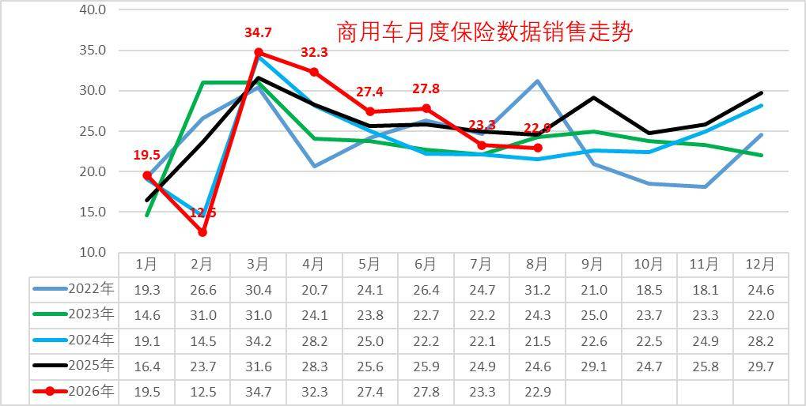

2026年商用车市场呈现明显的阶段性波动特征，走势明显强于乘用车。受春节错峰因素影响，1-2月行业整体销量同比下滑明显。3月市场快速回暖，3-6月销量保持高位，7- 8月走势显著低于历年同期季节性水平，走出独立下行行情。

2026 年8 月商用车销量23 万台，同比 降7%、环比 降1%，相比2025 年8 月高基数（25 万台，同比+ 14%）明显回落。纵向对比历年8 月表现：2022 年8 月31 万（+8%）、2023 年24 万（-22%）、2024 年22 万（-11%）、2025 年25 万（+14%），2026 年8 月销量处于近年中等水平，弱于2022、2025 年，略高于2024 年，结束了去年8 月的高增行情。

从年度节奏看，2026 年呈现“前降后升，8 月回调” 的特征：一季度67 万台（同比- 7%），二季度88 万台（同比+ 10%），1-8 月累计200.5 万台，同比基本持平。对比历年节奏，2022 年是全年深度下行；2023、2024年低位震荡；2025 年持续上行。2026 年不同于2025 年的单边走强，市场动能有所减弱，二季度反弹后8 月再度走弱，全年增长承压。

2、全国新能源商用车市场销量分析

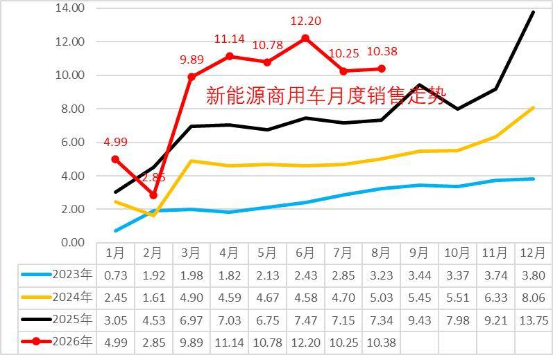

2026年，新能源商用车延续波动上行走势，1月凭借年初采购热潮销量冲高至5万台，创下阶段性高位；2月受春节假期、终端停工等季节性因素影响销量明显回落；3-8月市场迎来爆发式增长，单月销量保持10万台，形成异常超强走势。在整体商用车市场小幅下滑的背景下，新能源赛道逆势高增，成为行业唯一增长板块。

2026 年8 月新能源商用车销量10.38 万台，同比增41%，环比增1%。纵向对比历年8月，2026 年8 月销量继续大幅抬升，保持41% 的较高增速，虽然增速相比2021-2022 年的70%+、2024 年56% 有所回落，但体量上持续扩张。

从年度节奏看，2026 年一季度18 万台（同比+ 22%），二季度34 万台（同比+ 61%），1-8 月累计72.5 万台，同比增长44%。对比历史周期：2021-2022 年是爆发式增长；2023 年阶段性遇冷、全年负增长；2024-2025 重回高增通道。2026 年延续增长态势，二季度动能更强，8 月维持正增长，在传统商用车大盘走弱背景下，新能源商用车依然是行业核心增长引擎，但增速相比2024、2025 年有所放缓。

3、全国商用车市场结构分析

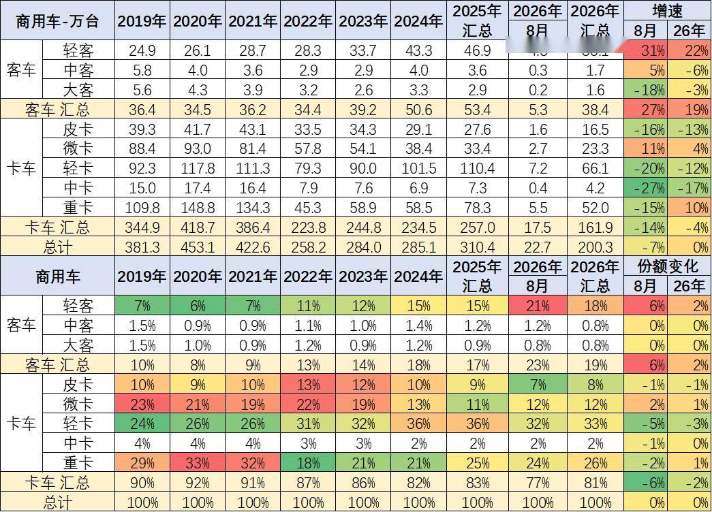

近几年商用车数据展现出客车强卡车弱的明显结构性分化。客车板块增长亮眼，轻客是核心拉动力量，2026 年汇总增速达到22%；而中客、大客需求偏弱，呈现小幅下滑。卡车板块整体承压，轻卡、中卡、皮卡销量同比回落，仅重卡保持10% 的正增长，卡车大盘整体微降。

从结构占比看，卡车依旧是商用车市场主体，占比超八成，但份额持续收缩。客车占比抬升，主要得益于轻客渗透率提升。整体商用车总量2026 年累计增速持平，行业不再普涨，细分赛道冷暖差异显著，市场重心逐步向轻型客车、重卡转移。

4、新能源商用车渗透率

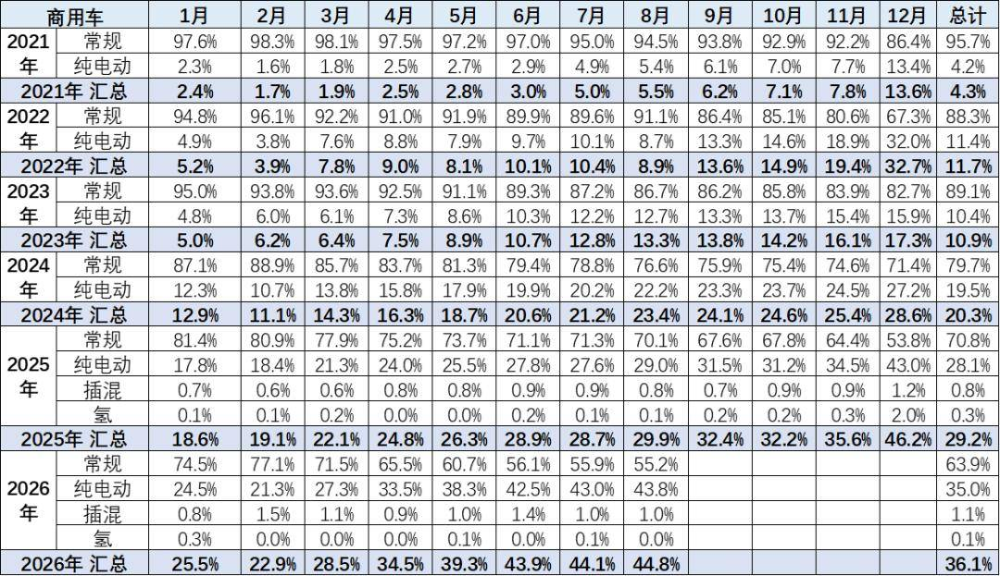

2025年新能源商用车渗透率达到29%的水平，相对于2024年实现了较好提升。2026年1-8月份新能源渗透率达到36.1%，相对于去年1-8月的24%，提升12个百分点，表现相对较好。

2026年8月商用车新能源渗透率44.8%，较同期增长15个点，渗透率提升强于乘用车。2026年仍是纯电动增长较强，插混与增程的表现改善较大，氢燃料车的产品技术停滞，补贴仍拉不动增长。

5、商用车市场变化分析

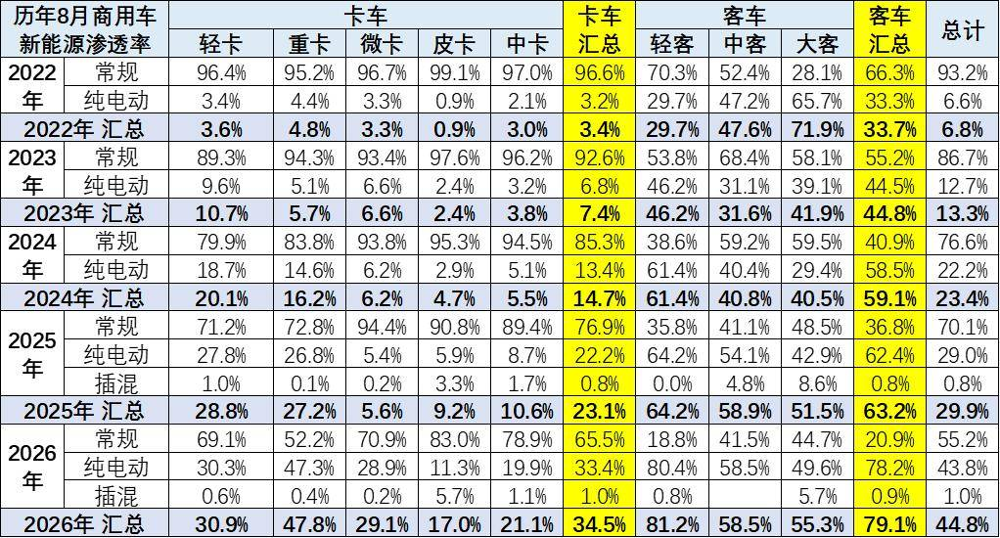

2026 年8 月商用车新能源渗透率同比2025 年8 月大幅抬升，整体渗透率由29.9% 增长至44.8%，提升近15 个百分点，新能源转型节奏明显加快。卡车板块增长尤为突出，重卡渗透率从27.2% 飙升至47.8%，是拉动大盘的核心；轻卡小幅上行至30.9%，微卡、皮卡、中卡也实现明显提升，卡车汇总渗透率从23.1% 升至34.5%。

客车板块新能源基础本就较高，2025 年8 月汇总渗透率63.2%，2026年8 月进一步提升至79.1%。其中轻客渗透率从64.2% 增长到81.2%，增长幅度最大；中客、大客保持稳步提升。插混车型在皮卡、大客等细分市场开始落地，商用车新能源路线从纯电单一方向逐步走向多元。

6、商用车竞争结构变化分析

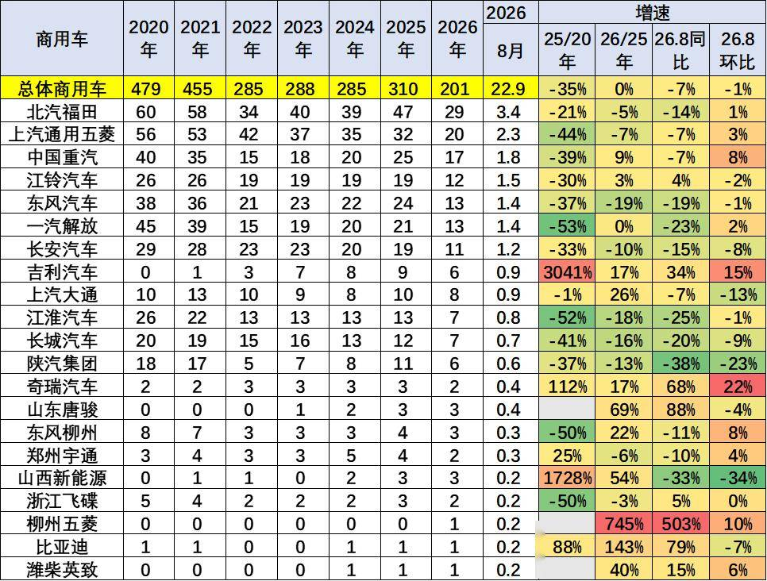

当前国内商用车市场销量核心由轻卡、重卡两大细分赛道支撑，行业头部企业格局稳固，同时新晋品牌快速突围，市场竞争呈现“头部稳固、新锐崛起”的特征。2026 年商用车累计销量201 万台，相比2025 年持平，8 月单月22.9万台，同比下滑7%、环比微降1%，行业整体处于调整期。头部企业格局稳固，北汽福田、上汽通用五菱、中国重汽位居前三，但多数老牌车企2026 年累计销量同比回落，东风、江淮、长城等企业降幅明显，传统厂商承压。

新能源相关企业增长亮眼，吉利、奇瑞、山东唐骏、比亚迪等实现大幅增长，柳州五菱更是爆发式提升。2026 年8 月单月看，奇瑞、吉利、中国重汽同比正增长，是市场为数不多的亮点。新旧力量分化加剧，传统燃油商用车企业份额持续被新能源品牌挤压。

7、中重型卡车区域市场结构

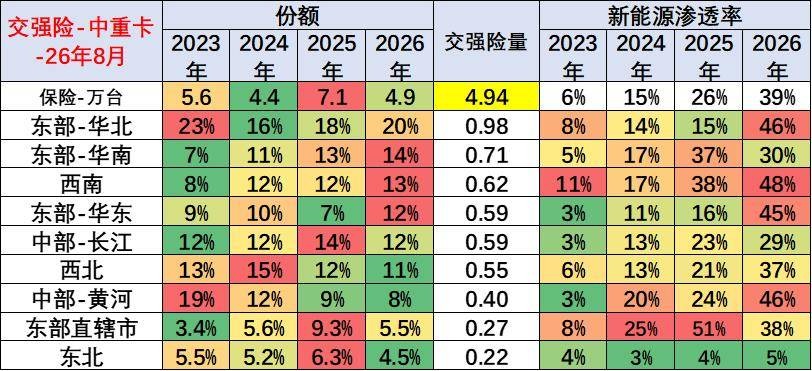

2026 年8 月交强险口径中重卡合计4.94 万台，新能源渗透率达到39%，较2023 年6% 实现跨越式提升，电动化转型提速。区域份额出现明显迁移，中部黄河区域份额持续回落，华北、华南、西南市场份额稳步抬升，市场重心向南方及东部沿海转移。

区域新能源渗透率分化显著，西南、华北、黄河中部地区渗透率突破45%，西南更是高达48%，基建与矿山场景带动强；长江中部、华南相对偏低。东北市场渗透率仍处于低位，电动化潜力尚待释放。区域场景差异，造成中重卡新能源转型进度不均衡。

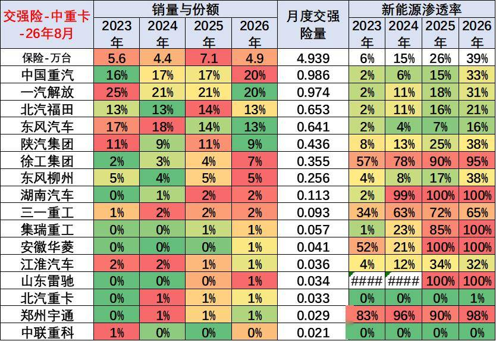

2026 年8 月交强险口径中重卡4.939 万台，行业新能源渗透率39%，较2025 年26% 大幅提升，电动化转型提速。市场格局上，重汽份额提升至20%，反超解放，行业龙头地位更替；福田、东风份额小幅下滑，传统头部格局重塑。

企业新能源渗透率分化显著，徐工、集瑞、湖南汽车、宇通等新势力渗透率接近或达到100%，产品以新能源为主。传统大厂陕汽38%、重汽33%、解放31% 稳步跟进，北汽福田和东风转型滞后。传统龙头保有规模优势，新能源企业依靠高电动化率快速抢占细分场景市场。

8、轻型卡车区域市场结构

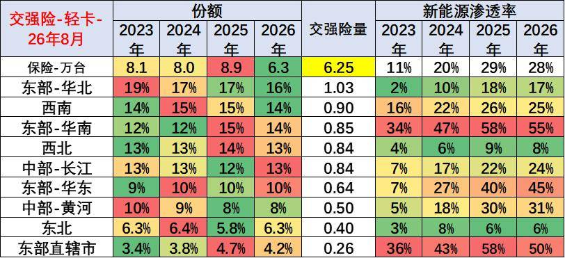

国内轻卡市场需求与区域物流活跃度高度绑定，传统优势区域集中在华北、华南、西南地区，上述区域城乡物流、短途运输、商超配送需求旺盛，支撑轻卡稳定销量。2026 年8 月交强险口径轻卡销量6.25 万台，新能源渗透率28%，较2025 年的29% 小幅回落，增长阶段性放缓。区域份额结构相对稳定，华北仍是轻卡最大市场，黄河中游区域份额持续萎缩，华南市场占比提升，需求逐步向南方物流集散区域倾斜。

各区域新能源渗透率分化明显，华南、东部直辖市渗透率超50%，城市配送场景电动化基础扎实；华东也达到45%。西北、东北渗透率仅8%、6%，北方短途城配电动化推进缓慢。轻卡新能源转型高度依赖城市政策与短途物流场景，南北市场差距持续拉大。

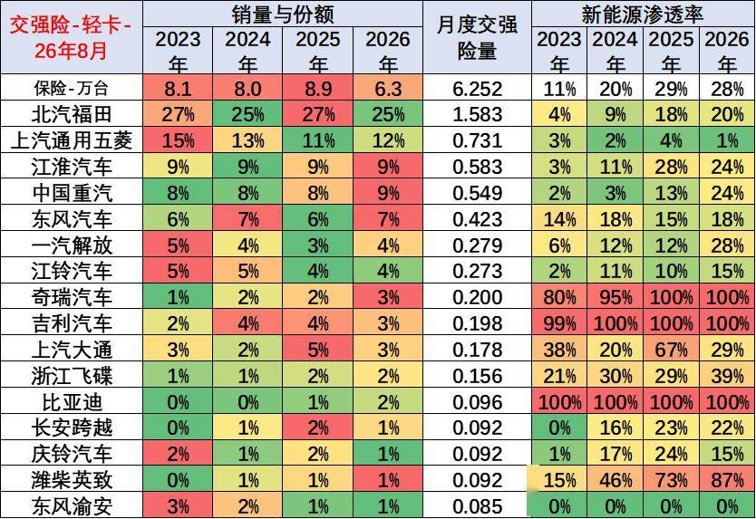

2026 年8 月交强险口径轻卡6.252 万台，行业新能源渗透率28%，相比2025 年29% 小幅回落，电动化进入平台调整阶段。市场格局稳定，北汽福田保持25% 份额稳居第一，上汽五菱、江淮、重汽紧随其后，头部企业排位基本不变。

企业新能源路线分化明显，奇瑞、吉利、比亚迪坚持纯电路线，渗透率达到100%，专注新能源轻卡赛道。传统主流厂商渗透率偏低，福田仅20%、五菱仅1%，燃油基盘大拖累整体转型速度。浙江飞碟、潍柴英致等企业渗透率较高，依托城配细分场景发力，新旧企业赛道差异清晰。

9、轻型客车区域市场结构

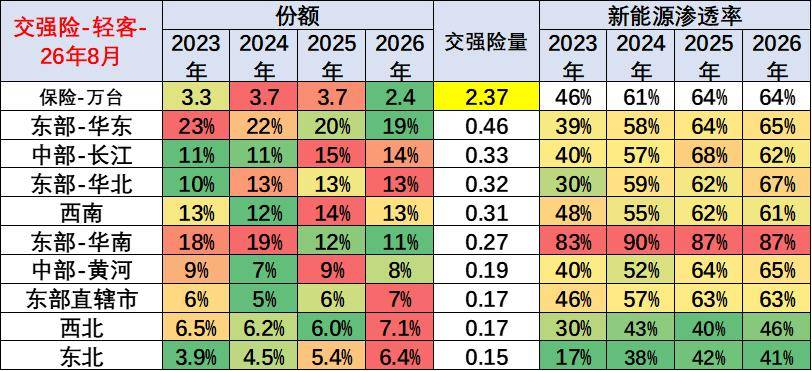

轻型客车主要适配城市通勤、同城配送、商旅出行等场景，需求高度集中于经济发达区域。2026 年8 月交强险口径轻卡（轻客）销量2.37 万台，新能源渗透率维持64%，相比2025 年持平，行业电动化进入高位平台期。区域份额方面，华东仍是轻客最大市场，但份额持续缓慢回落；华北、西北、东北占比有所抬升，市场逐步由东南向北方拓展。

区域新能源渗透率差异显著，华南渗透率高达87%，城市物流与客运场景基本完成电动替代。华东、华北、黄河流域渗透率也达到65% 左右。西北、东北渗透率仅46%、41%，北方市场仍有较大渗透空间。轻客整体电动化已处于商用车最高水平，后续增长将更多依靠存量替换。

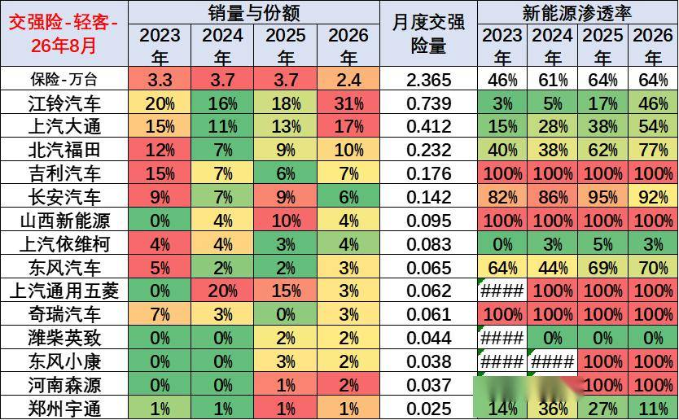

企业竞争维度，国内轻客市场主力企业包括江铃汽车、上汽大通、长安汽车、吉利商用车、上汽通用五菱等。传统车企深耕燃油轻客市场，保有量优势明显。

2026 年8 月交强险口径轻客2.365 万台，行业新能源渗透率64%，与2025 年持平，轻客已是商用车电动化程度最高板块。市场格局发生明显变化，江铃汽车份额大幅提升至31%，稳居行业首位；上汽大通17% 位居第二，头部集中度抬升。

企业赛道分化显著，吉利、山西新能源、奇瑞等品牌坚持纯电路线，新能源渗透率100%。江铃、大通这类传统龙头依托燃油存量，新能源渗透率分别为46%、54%；北汽福田、东风转型速度更快，渗透率达到77%、70%。轻客城配场景电动化基本普及，竞争焦点转向产品迭代与成本控制。

10、大中型客车区域市场结构

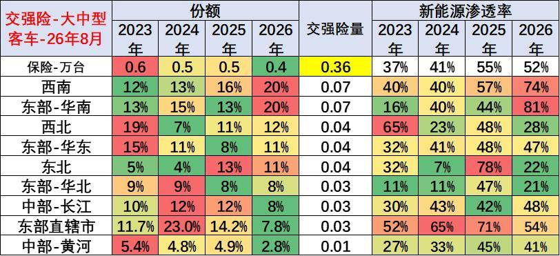

2026年大中型客车行业整体表现疲软，市场需求波动较大，区域分化、动力类型分化特征十分显著。行业呈现“政策驱动新能源、市场支撑燃油车”的差异化发展格局：新能源大中型客车主要依靠地方公交更新、政府采购政策拉动，市场化需求偏弱；燃油大中型客车依托长途客运、团体通勤、旅游出行等市场化刚需，销量走势相对稳健。

区域分布上，新能源大中型客车渗透率南方地区整体高于北方地区，南方城市公交更新迭代速度更快、绿色出行政策落地更彻底，支撑新能源大中客需求。北方及部分中部地区需求高度依赖地方专项补贴政策，政策落地节奏直接影响区域销量。2026年华南地区加大公交电动化改造力度，区域新能源公交客车采购量大幅提升，带动大中客新能源市场份额显著回升。

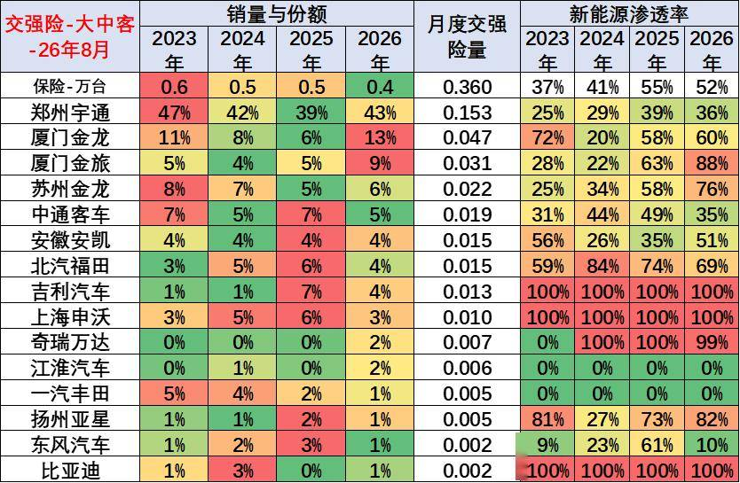

企业格局方面，宇通客车、中通客车、苏州金龙等传统龙头企业持续主导大中型客车市场，品牌力、产品力、售后体系优势显著。2026 年8 月交强险口径大中型客车0.36 万台，行业新能源渗透率52%，较2025 年55% 小幅回落。市场格局方面，宇通以43% 份额稳居龙头，龙头地位稳固；厦门金龙、金旅份额明显回升，二线品牌竞争力增强，行业集中度有所修复。

企业新能源表现分化明显，吉利、申沃、比亚迪等品牌实现100% 新能源渗透率，专注电动客车赛道。金旅、苏州金龙、亚星渗透率较高，达到76%~88%；行业龙头宇通渗透率仅36%，燃油客车存量订单拖累整体水平。大中型客车受地方公交、旅游客车采购周期影响，各企业电动化节奏差异较大。

附：近日信息合集
