# 新能源车锂电池市场分析-2026年8月

- 公開日時: 2026-09-21 16:12（北京時間）
- 出典: [搜狐号・崔东树](https://www.sohu.com/a/1079036468_115312)
- テーマ（自動判定）: 電池
- 画像: 12枚

---

注：本分析文章仅代表崔东树个人观点，如有异议，请留言。

8月，我国动力和其它电池合计产量为237GWh，同比增长33%；1-8月，我国动力和其它电池合计产量为1524GWh，同比增长32%。今年电池增速从60%以上降到32%。2026年8月动力电池的产量中装车的比例下降到33%，其中三元电池装车率27%，磷酸铁锂装车率35%。

2026年8月锂电池装车79GWh，同比增26%。2026年1-8月锂电池装车489GWh，同比增17%。2026年8月新能源车国内市场的装车115万台、同比下降3%，其中纯电动乘用车76万台、同比增4%；插混乘用车31万台、同比下降22%；纯电动货车7.1万台增32%。

纯电动车目前主力电池能量密度区间在125到160之间。尤其2026年3季度表现比较突出的是140到160的电池占比达到51%，同比上升14个百分点。2026年3季度的电池能量密度160以上的车型占比9%，相对于2025年同期的7%出现了明显的回升，这主要还是三元的高端需求有所回升。而125以下的能量密度的产品2026年下降到了0%的比例。

宁德时代的2026年7-8月占比上升到42.3%，比亚迪的国内电池需求占比从2020年的15%上升到2023年的26.9%，随后下降到今年3季度的20.3%，其它电池企业的占比也出现了明显分化的态势。电池企业形成了头部企业聚集效应放缓的特征，宁德和比亚迪头两家企业从2022年的72%的比例，到2026年仍保持63%的比例，其它企业有超36%左右的空间。今年国轩高科、中创新航、吉利耀宁、楚能新能等表现较强。

1、动力电池的总体生产特征分析

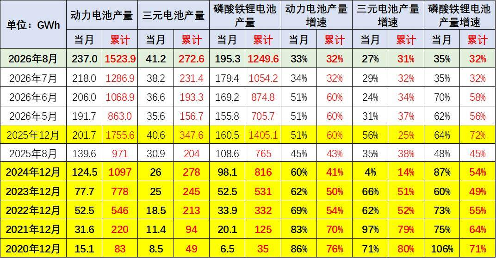

8月，我国动力和其它电池合计产量为237GWh，同比增长33%；1-8月，我国动力和其它电池合计产量为1524GWh，同比增长32%。今年电池增速从60%以上降到32%，由于动力电池需求低迷，加之出口退税调整，电池需求逐步降速。

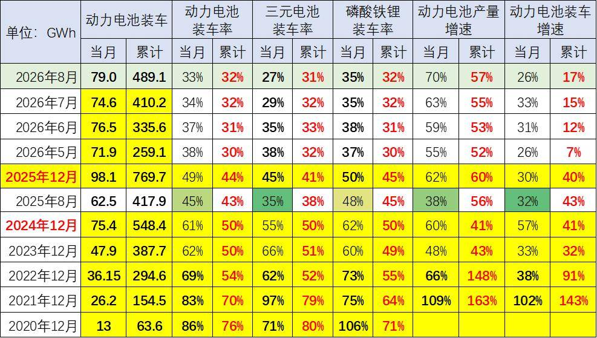

目前动力电池的产量中装车的比例在不断地降低，2021年动力电池装车的生产电池装车率达到70%；2022年是54%；2023年是50%；2024年动力电池的产量中装车的比例保持到50%；2025年动力电池的产量中装车的比例下降到44%，2026年8月动力电池的产量中装车的比例下降到33%，其中三元电池装车率27%，磷酸铁锂装车率35%。

今年动力电池装车景气度达到历史低位，随着货车补贴的启动，今年的装车占比逐步提升。

随着储能等产业的发展，尤其是俄乌危机带来的世界能源危机，储能等产业的电池需求增长很快，导致装车的电池占比下降较明显，但年初的市场回落带来占比的下降。动力电池和储能电池都是生产过剩和库存相对表现压力较大的。2021年和2022年动力电池的增速低于整车增速，2023年和2024年的动力电池装车偏低，电池产量持平于装车增速。2026年电池生产较多，装车起步较低，2026年2月装车率降到近期低位，8月恢复较好。

2、内销车型合格证电池装车的三元占比回暖

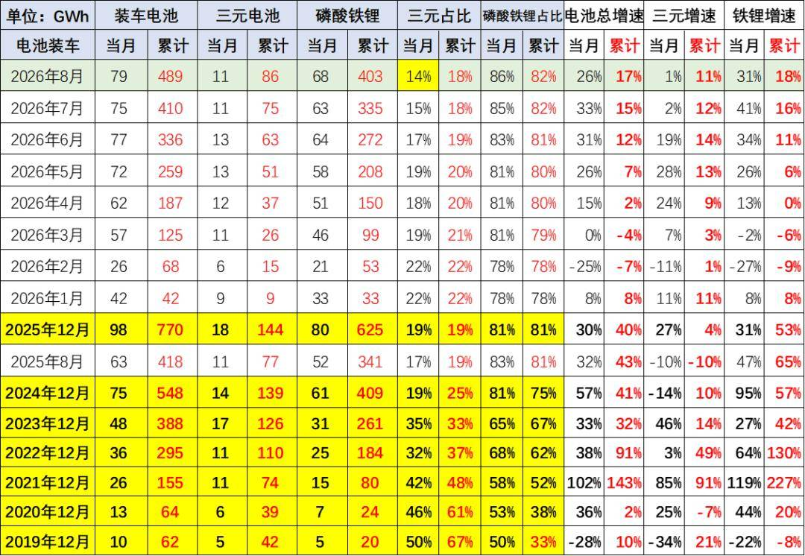

动力电池装车的需求增长是超强增速的。2019年需求增长10%；2020年内销车型动力电池装车64GWh，需求增长2%；2021年动力电池装车155GWh,需求增长143%；2022年装车295GWh，需求增长91%；2023年装车388GWh，需求增长32%；2024年锂电池装车548GWh，同比增长41%；2025年锂电池装车770Wh，同比增长40%。2026年8月锂电池装车79GWh，同比增26%。2026年1-8月锂电池装车489GWh，同比增17%。

3、汽车电池需求增长放缓

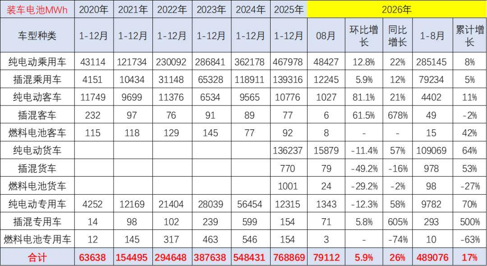

乘用车电池需求增长持续较强，2025年纯电动乘用车的电池需求增长29%，而插混乘用车的电池需求增长17%，持续较强增长。纯电动货车的电池需求也是大幅增长，达到169%。

2026年1-8月的电池装车增长增17%，其中商用车增长较强，尤其是8月的纯电动货车猛涨57%，而纯电动乘用车电池用量增长22%。

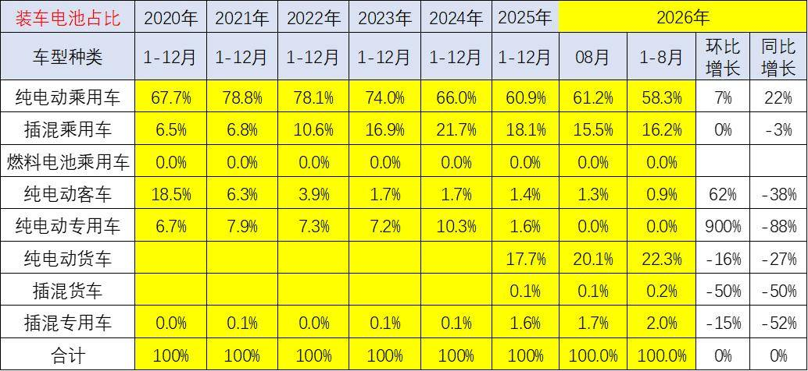

从电池装车占比看，近几年动力电池的需求结构在快速变化之中。2020年还是纯电动乘用车第一，纯电动客车第二，纯电动专用车第三的格局，而插电混动乘用车只是第四位的状态。而到了2026年，纯电动乘用车仍然保持第一位，而插电混动乘用车下降到第三位，纯电动货车上升到第二位，插混专用车维持第四位的水平，纯电动客车下降到第五位。

近几年，纯电动客车市场剧烈的下降，而纯电动专用车保持用电池量上升较快。目前来看，纯电动乘用车和插混乘用车的电池用量大幅下降，而重卡的电池用量大增，新能源补贴带来的重卡高补贴优势导致电池差异化的走势。

4、汽车合格证产量

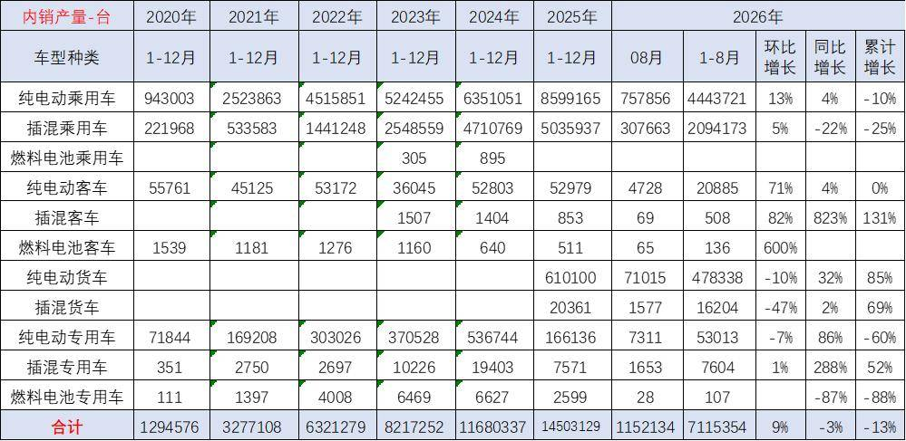

根据合格证电池量测算， 2025年新能源车国内合格证1450万台、同比增24%较强，其中纯电动乘用车860万台、同比增35%；插混乘用车503万台、同比增7%；纯电动专用车和货车78万台，这样的产量数据表现很强。

2026年8月新能源车国内市场的装车115万台、同比下降3%，其中纯电动乘用车76万台、同比增4%；插混乘用车31万台、同比下降22%；纯电动货车7.1万台增32%，这样的产量数据分化严重。

5、配套电池企业远未充分竞争

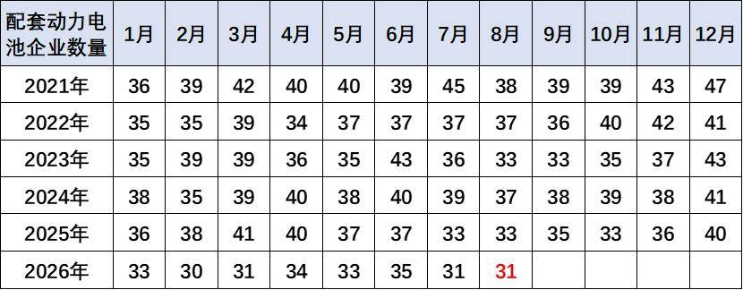

过去几年，电池市场的竞争格局并没有发生明显的变化。2026年8月配套电池企业是达到31家的年内低位。由于动力电池市场的价格有所差异，而规模增长特征相对明显，加之储能等新产业需求发展，因此电池企业获得了较强的生产和装车数量增长的特征。

6、各类车型配套电池带电量分化

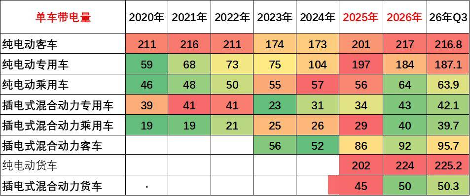

随着电池价格下跌，电动车续航里程不断增长。目前电动汽车市场高端化的需求十分强烈，而是类似于“老头乐”升级为小微型汽车、政策压力较大，导致高端化明显。2024年下半年，随着以旧换新等政策推动，小车市场回暖，微型电动车火爆，带动装机电池下降。随着电动车的成本优势体现，纯电动专用车的结构向重卡发展，带动带电量暴增。

就供应链问题来看，未来整车企业将日益强大，对电池企业、对上游产业链的控制能力会进一步加强，同时对下游的品牌营销能力的掌控也在进一步加强。在新能源的体系下，“整车为王”的特征将进一步持续体现。

7、高能量密度的电池需要回升

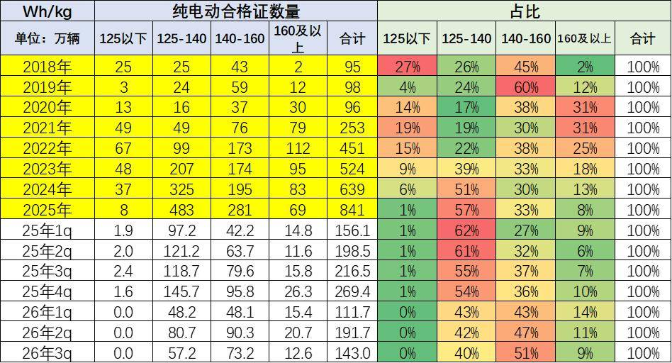

纯电动车目前主力电池能量密度区间在125到160之间。尤其2026年3季度表现比较突出的是140到160的电池占比达到51%，同比上升14个百分点。

2026年3季度的电池能量密度160以上的车型占比9%，相对于2025年同期的7%出现了明显的回升，这主要还是三元的高端需求有所回升。而125以下的能量密度的产品2026年下降到了0%的比例。

8、电池企业格局

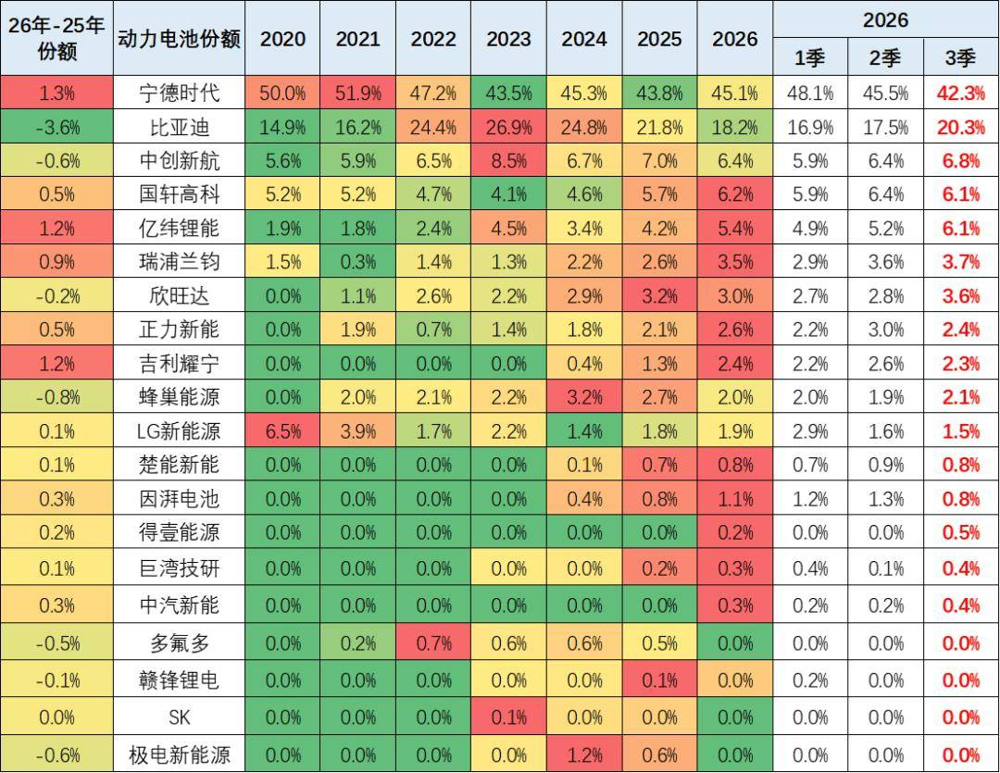

电池企业的竞争格局形成宁德时代和比亚迪两者相对较强的特征。宁德时代的2026年7-8月占比上升到42.3%，比亚迪的国内电池需求占比从2020年的15%上升到2023年的26.9%，随后下降到今年3季度的20.3%，其它电池企业的占比也出现了明显分化的态势。电池企业形成了头部企业聚集效应放缓的特征，宁德和比亚迪头两家企业从2022年的72%的比例，到2026年仍保持63%的比例，其它企业有超36%左右的空间。今年国轩高科、中创新航、吉利耀宁、楚能新能等表现较强。

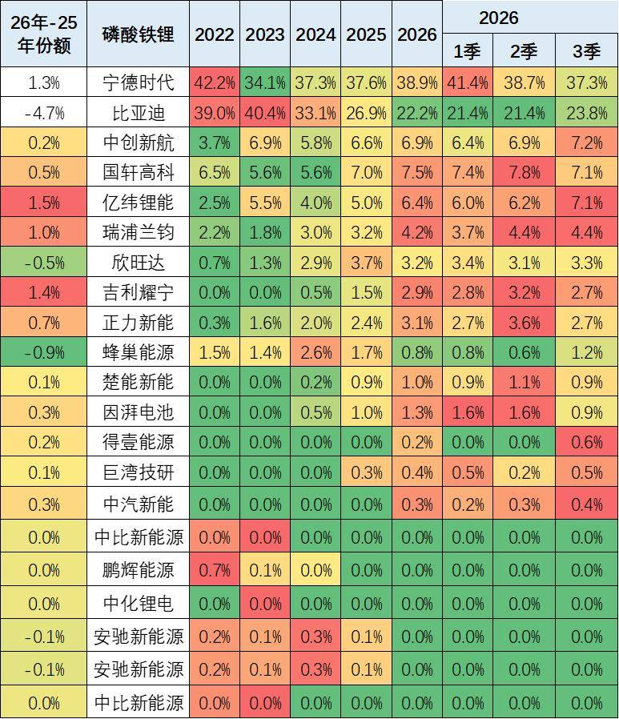

磷酸铁锂电池的产品差异优势明显。比亚迪仍然相对优秀，但今年年初处于国内调整期，出口表现很强，但没有统计到。宁德时代的磷酸铁锂电池的占比份额从2024年已经反超比亚迪。2026年比亚迪持续下行，份额较2025年下降4.7个百分点。亿纬锂能和国轩高科表现较强。瑞浦兰钧、吉利耀宁提升明显。

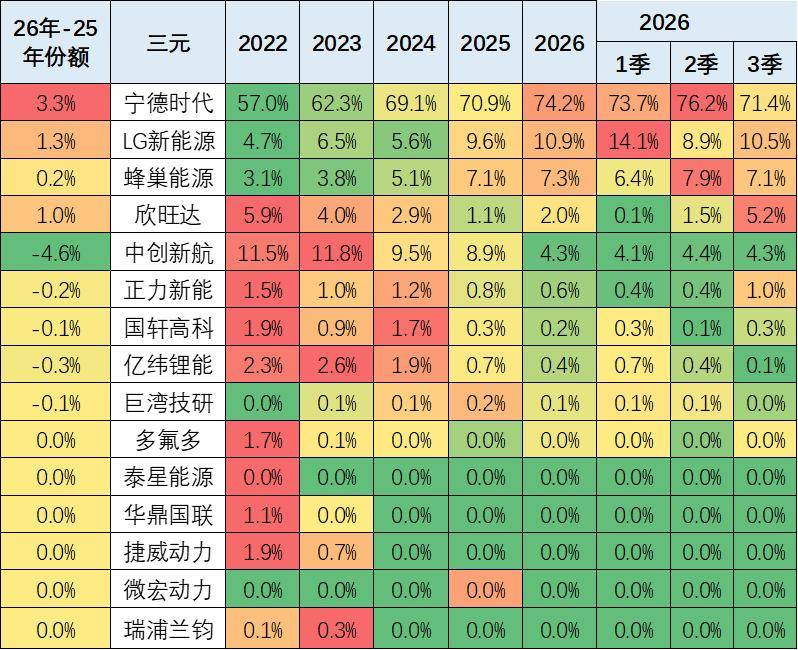

由于比亚迪全面转型磷酸铁锂电池，因此宁德时代、蜂巢、欣旺达、LG等前四家的三元电池优势更加明显，近期长城汽车的蜂巢能源表现较好。LG新能源因为特斯拉内销比例下降而统计表现偏低。

附：近日信息合集
