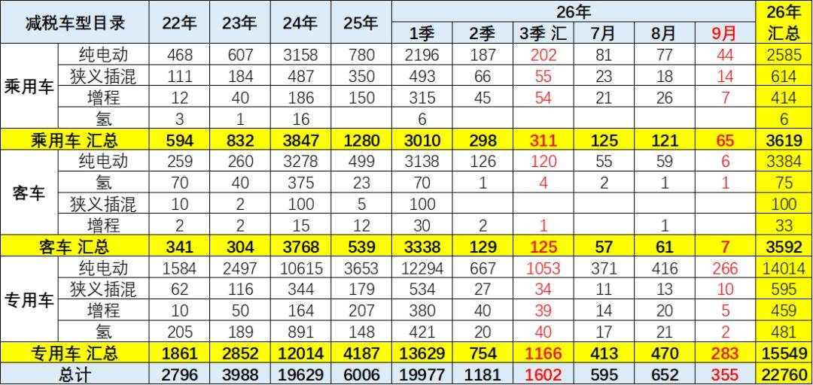
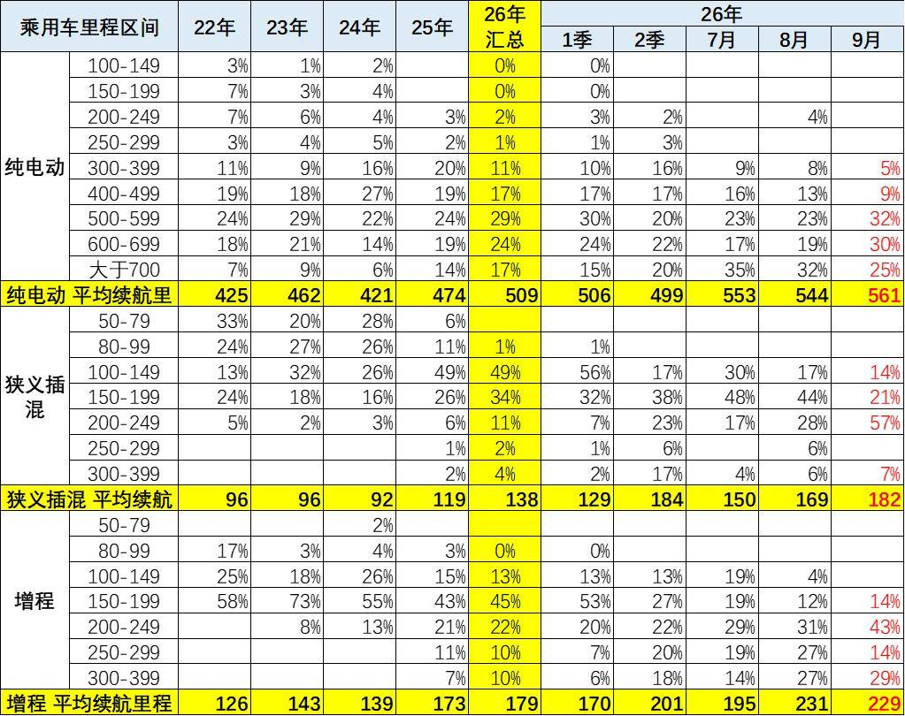
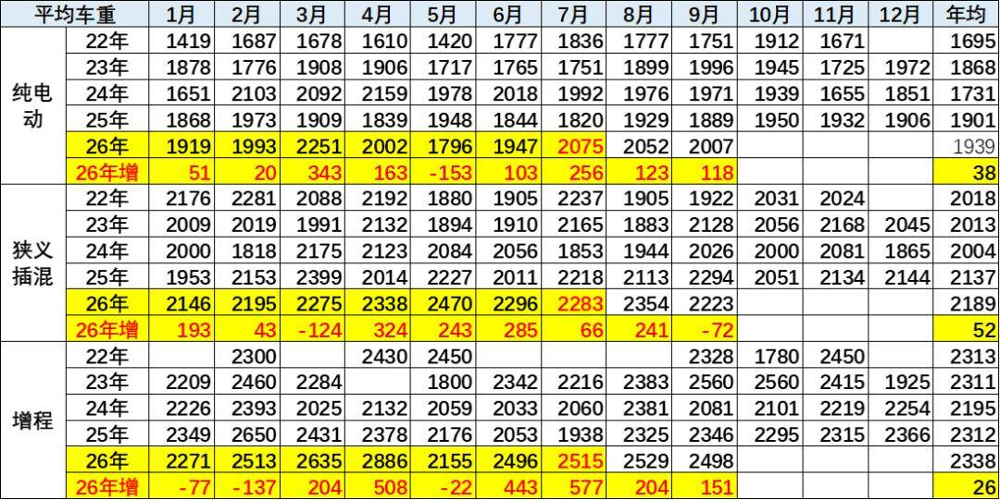
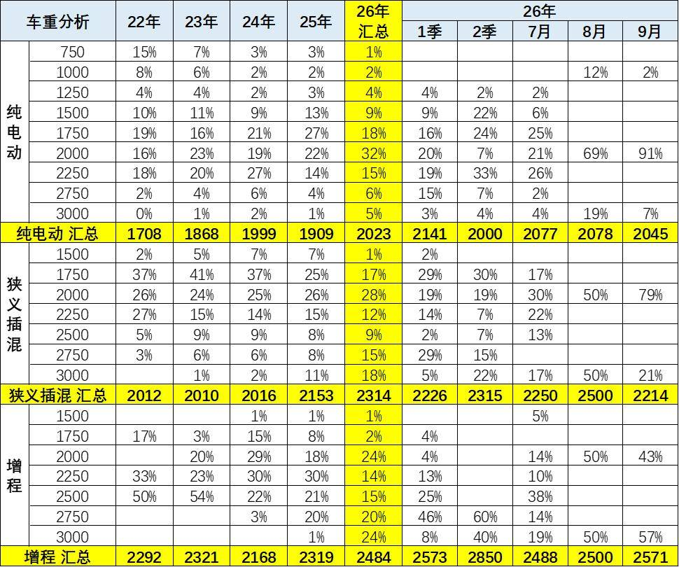
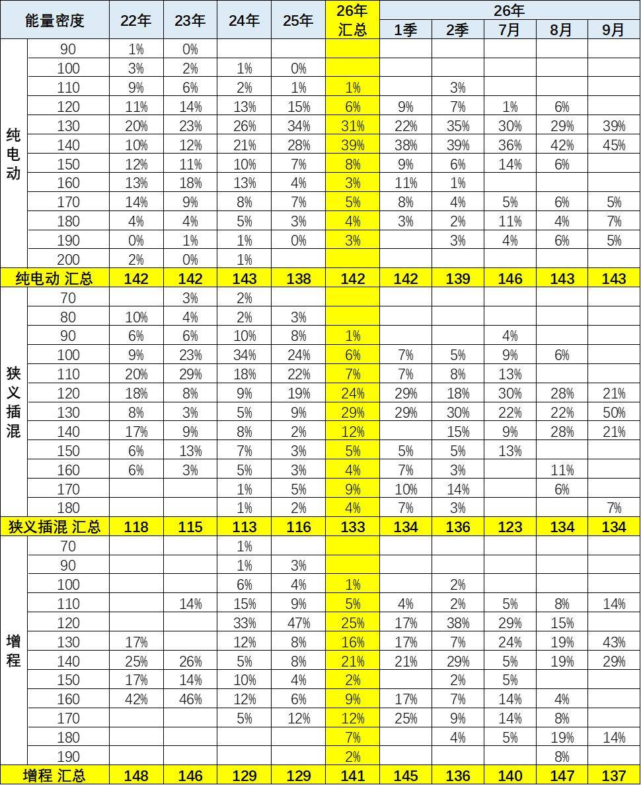
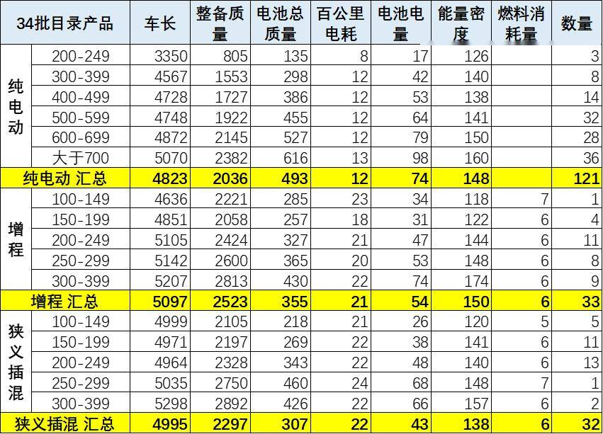
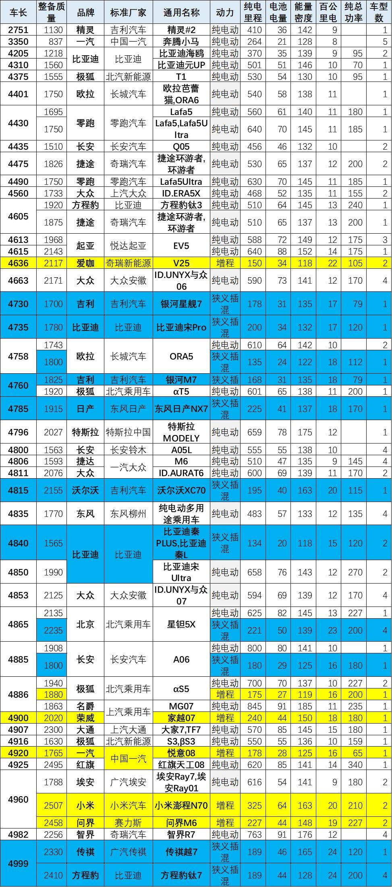
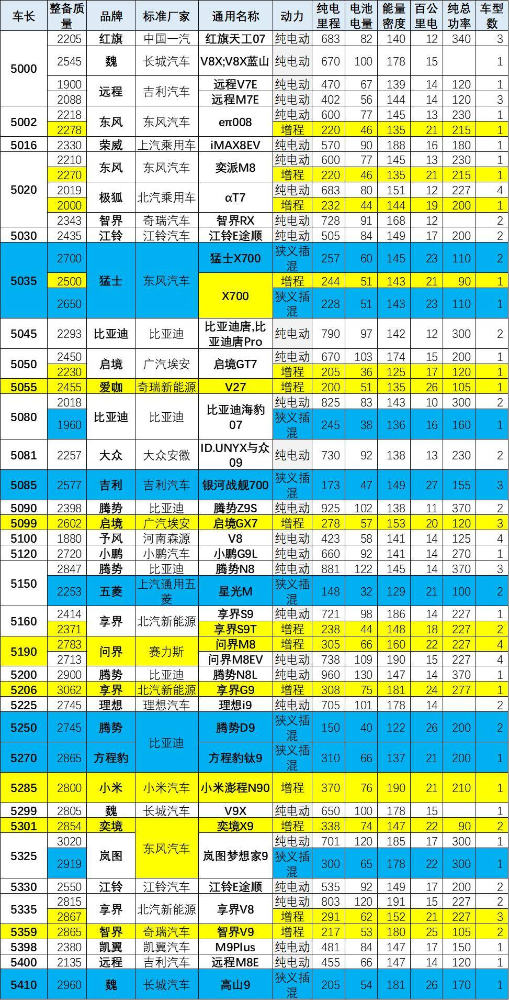

# 9月新能源新品与技术线路跟踪

- 公開日時: 2026-09-22 20:44（北京時間）
- 出典: [搜狐号・崔东树](https://www.sohu.com/a/1079610268_115312)
- テーマ（自動判定）: NEV新製品・技術
- 画像: 8枚

---

注：本分析文章仅代表崔东树个人观点，如有异议，请留言。

2026年1-9月新能源车免税目录共有22760款，其中9月有355款新车型，相对近三年同期处于高位。2-9月的目录资源相对2025年同期相近数量，乘用车新品多、补贴少、市场低迷。卡车新品少补贴高市场好。9月免税目录新增车型355 款，环比8 月652 款大幅下滑。分品类看：乘用车仅65 款，纯电、插混、增程申报款数同步收缩；客车仅7 款，投放显著降温。专用车为当月主力，合计283 款，其中纯电动266 款，占到当月总款数七成以上。9 月车型申报结构分化明显，乘用、客车新车申报节奏放缓，专用车依旧是免购置税目录的核心支撑。

9 月新增换电车型目录16 款，环比8 月16 款持平。分品类看，乘用车仅1 款纯电换电车型申报，投放持续低迷；专用车贡献15 款，全部为纯电动车型，是本月换电目录的绝对主力。

9 月纯电乘用车平均续航达561公里，较8月544 公里继续提升；500公里以上区间合计占比87%。2026 年9 月纯电动车型平均车重2007kg，远高于往年同期，新车电池搭载量维持高位。狭义插混平均车重2223kg，相对偏重。

5 米以上中大型新品密集申报，增程赛道热度突出，小米澎程N90、问界M9T/M8EV、享界S9T、启境GX7、爱咖V27、东风猛士X70 等重磅增程车型集中亮相。纯电方面腾势N8/N9、理想i9、小鹏G9L、魏牌V9X 等旗舰车型申报，电池容量普遍突破100kWh，续航向700km + 乃至900km + 迈进。大尺寸车型车重普遍突破2.5 吨，增程纯电续航持续走高，插混车型也向更长纯电续航升级，高端化趋势明显。

1、2026年免税目录总体情况

2026年1-9月新能源车免税目录共有22760款，其中9月有355款新车型，相对近三年同期处于高位。2-9月的目录资源相对2025年同期相近数量，乘用车新品多、补贴少、市场低迷。卡车新品少补贴高市场好。

近几年的新能源车目录逐步丰富。2024-2026年的新能源乘用车的目录应该说是总体数量较多的。随着免车购税指标的发布，今年的新能源车的高端新车产品仍是蓬勃发展。

2、新车动力结构变化

由于超高的氢燃料的补贴因素，前期的氢能源商用车的表现超强，近期氢能国内外均走弱。近期乘用车氢燃料可以忽略不关心，短期没有发展空间。

9月免税目录新增车型355款，环比8月652款大幅下滑。分品类看：乘用车仅65款，纯电、插混、增程申报款数同步收缩；客车仅7款，投放显著降温。专用车为当月主力，合计283款，其中纯电动266款，占到当月总款数七成以上。9月车型申报结构分化明显，乘用、客车新车申报节奏放缓，专用车依旧是免购置税目录的核心支撑。

3、换电车型跟踪

9月新增换电车型目录16款，环比8月16款持平。分品类看，乘用车仅1款纯电换电车型申报，投放持续低迷；专用车贡献15款，全部为纯电动车型，是本月换电目录的绝对主力。对比历史数据，换电车型申报主力长期在专用车领域，乘用车换电新车申报节奏偏弱，9月换电车型整体新增款数维持低位，行业新品投放偏谨慎。

4、2026年纯电动乘用车续航里程

9月纯电乘用车平均续航达561公里，较8月544公里继续提升；500公里以上区间合计占比87%，其中500-599公里占32%为最大区间，大于700公里占25%，长续航化趋势明确。狭义插混平均续航升至182公里，200-249公里区间占比57%，一跃成为主力段。增程平均续航229公里，200-249公里占43%为最大区间。整体看，三类技术路线均向更高续航区间迁移，纯电高端化、插混和增程长续航化趋势同步强化。

5、2026年新能源车的车辆整备质量

2026年9月纯电动车型平均车重2007kg，环比8月2052kg小幅下降，但仍高于往年同期，新车电池搭载量维持高位。狭义插混平均车重2223kg，同比9月2294kg回落72kg。增程车型平均车重2498kg，同比9月2346kg上升151kg。整体看，9月纯电、插混、增程新车的平均整备质量仍处于偏高区间，长续航配置推高整车重量的特征明显。

9月纯电车型，2000kg区间占比高达91%，成为绝对主力，轻量化车型占比极低，平均车重维持高位。狭义插混车型2000kg区间占79%，是核心重量段。增程车型3000kg 区间占57%，2000kg区间占43%，大重量车型主导。从结构可见，9月申报新车普遍偏重，纯电集中在2吨级，插混以2吨为主，增程大量突破3吨，长续航与大容量电池持续推高整车整备质量。

6、电池的能量密度

9月纯电动车型电池平均能量密度143Wh/kg，环比8月143Wh/kg持平，130-140Wh/kg区间占比最高，是主流区间。狭义插混平均能量密度134Wh/kg，环比8月134Wh/kg 不变，130Wh/kg占比达50%，成为绝对主力。增程车型平均能量密度137Wh/kg，环比8月147Wh/kg回落，130Wh/kg 区间占43%。整体来看，9月申报新车电池能量密度进入稳定平台期，插混电池能量密度提升明显，纯电技术迭代节奏放缓。

7、2026年各类车型的综合对比

第34批目录中纯电车型共121款，平均车长4823mm、整备质量2036kg，电池电量74kWh、能量密度148Wh/kg，随续航提升，电池容量、车重同步上升；增程车型33款，平均车长5097mm，整备质量2523kg，电池电量54kWh；狭义插混32款，平均车长4995mm，整备质量2297kg。长续航车型普遍尺寸更大、车重更高，纯电百公里电耗稳定在12度，增程、插混燃料消耗维持6L，体现大尺寸新能源车型能耗特征。

8、5米以下纯电动乘用车分析

9月第34批目录申报新品丰富，纯电仍是主力，同时多款重磅增程车型亮相，包括小米澎湃N70、问界M6、荣威家越07、爱咖V25、极狐αS5、一汽悦意08。比亚迪、大众、吉利、极狐、长安等车企申报车型数量较多。纯电新品续航普遍在500km以上，部分车型突破800km；增程车型电池容量大幅提升，纯电续航普遍达到150km以上。车型尺寸覆盖紧凑到中大型区间，大尺寸、高续航车型占比提升，技术迭代集中在电池容量与续航升级。

9、5米以上新车跟踪

第34批目录中5米以上中大型新品密集申报，增程赛道热度突出，小米澎程N90、问界M9T/M8EV、享界S9T、启境GX7、爱咖V27、东风猛士X70 等重磅增程车型集中亮相。纯电方面腾势N8/N9、理想i9、小鹏G9L、魏牌V9X等旗舰车型申报，电池容量普遍突破100kWh，续航向700km + 乃至900km + 迈进。大尺寸车型车重普遍突破2.5吨，增程纯电续航持续走高，插混车型也向更长纯电续航升级，高端化趋势明显。

附：近日信息合集
