# 1-8月中国汽车出口745万辆增51%，全年预计近1200万辆

- 公開日時: 2026-09-24 16:58（北京時間）
- 出典: [搜狐号・崔东树](https://www.sohu.com/a/1080474555_115312)
- テーマ（自動判定）: 輸出
- 画像: 33枚

---

注：本分析文章仅代表崔东树个人观点，如有异议，请留言。

2026年1-8月中国汽车实现出口745万辆，同比2025年同期增速51%，8月中国汽车实现出口105万辆，同比增37%，环比降4%，同比走势总体较强, 环比走势暂时受阻。今年的主要动力仍是高油价和中国产品竞争力提升和全球南方国家市场的持续增长。8月的英国和澳大利亚、菲律宾出口环比回落较大。

2026年8月中国汽车出口总量的前10国家：俄罗斯96650辆、墨西哥56549辆、巴西53223辆、比利时50842辆、英国45259辆、澳大利亚38166辆、阿联酋30146辆、意大利29091辆、哈萨克斯坦27538辆、菲律宾26983辆，其中本期较同期增量增大的前五个是：俄罗斯38025辆、巴西34851辆、比利时22560辆、墨西哥17755辆、英国16438辆。2026年1-8月累计整车出口总量的前10国家：俄罗斯638224辆、巴西480403辆、英国365672辆、澳大利亚326938辆、比利时322562辆、墨西哥320844辆、菲律宾214359辆、意大利209258辆、阿联酋196117辆、阿尔及利亚190045辆，其中本期较同期增量增大的前五个是：俄罗斯351617辆、巴西287195辆、英国168659辆、澳大利亚128153辆、意大利112246辆。

今年全年海关各类车型增速分化，乘用车出口增速逐步回升到53%，客车出口增长26%，货车出口增长42%，货车的增速慢于乘用车，相对于国内的燃油货车平稳走势，近期电动货车出口较好。乘用车内部的几类主力车型表现较均衡，2026年乘用车出口表现较强的是9座以下小客车，2026年9座以下客车占比45%，其中8月达到49%。虽然特斯拉出口回落的影响较大，低速车车口放缓，但8月自主的电动车出口增长较好。

2026年8月中国新能源汽车出口50万辆，同比增长58%；1-8月累计出口346万台，增70%的表现很好，8月新能源车出口环比7月降8%。2026年8月中国汽车出口中纯电动占比28%（同比-1%），插混占比20%（同比7%），混动占比7%（同比1%），纯汽油车占比37%（同比-6%）。

2026年8月中国新能源汽车出口总量的前10国家：比利时48740辆、英国37419辆、巴西30570辆、澳大利亚29564辆、菲律宾25265辆、泰国21119辆、德国20341辆、西班牙17791辆、韩国17136辆、意大利14762辆，其中本期较同期增量增大的前五个是：巴西22542辆、比利时21493辆、英国17984辆、澳大利亚14547辆、泰国9811辆。2026年1-8月中国新能源汽车出口总量的前10国家：巴西337104辆、比利时307357辆、英国270090辆、澳大利亚237140辆、菲律宾188170辆、泰国175741辆、德国115917辆、韩国110354辆、意大利109100辆、西班牙106409辆，其中本期较同期增量增大的前五个是：巴西207158辆、澳大利亚137390辆、英国136346辆、比利时104694辆、泰国90935辆。

一、中国汽车出口总体走势

1、汽车出口历年走势

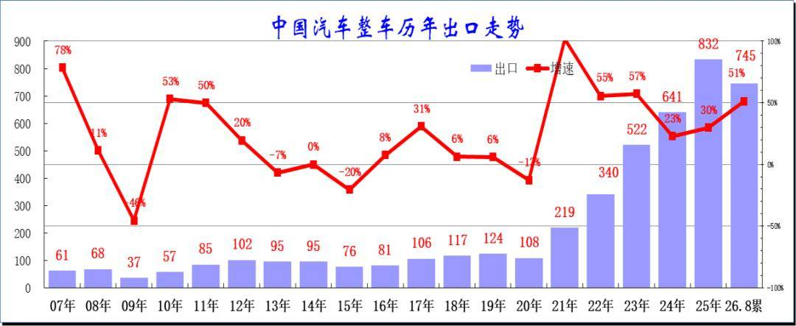

中国汽车出口历经多年百万量级的平台期后，于2021年实现突破。在2013 - 2016年世界经济低迷的大环境下，汽车出口出现剧烈下滑。2017 - 2020年，出口增速逐步企稳并有所改善，年度出口量维持在100万辆左右的水平。2020年出口量达到108万辆，同比下降13%，随后进入2021年以来的高增长期。

中国汽车出口自2021年突破百万量级后持续高增长（2021年增102%，2022-2023年增50%+，2024-2025年增速回落至30%左右），2026年1-8月出口745万辆（同比2025年增51%），延续增长态势。近期中国汽车出口呈现超高速增长态势，未来只要国际市场环境稳定，中国汽车出口发展仍具有巨大空间。

2、整车出口月度走势

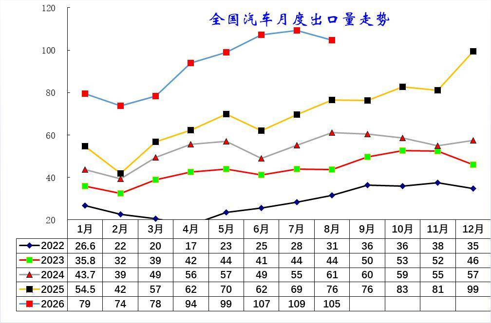

从月度走势看，近几年的中国汽车出口仍呈现惯性持续走强特征，近期呈现出口走高与国内低迷反差走势特征。2026年1-8月出口增速相对很强，延续持续增长动力。虽然有美伊战争的爆发，但由于市场分散，中国汽车出口增速受外部环境影响较小,2026年以来持续拉升。

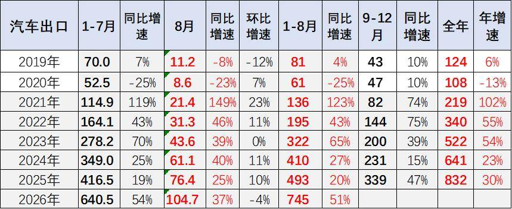

2026年1-8月中国汽车实现出口745万辆，同比2025年同期增速51%，8月中国汽车实现出口105万辆，同比增37%，环比降4%，同比走势总体较强, 环比走势暂时受阻。今年的主要动力仍是高油价和中国产品竞争力提升和全球南方国家市场的持续增长。

从月度走势来看，近几年的中国汽车出口仍呈现出季节性特征，有夏季走高与国内反差的走势特点。2026年1-8月出口增速相对强劲，主要也是国内市场低迷，企业对应海外市场动力和能力增强。

3、汽车整车出口结构特征

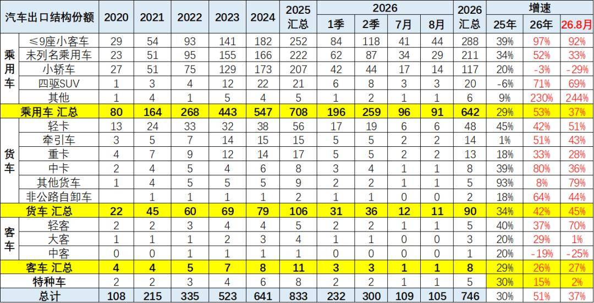

2020年前的中国汽车出口维持在百万规模，随后持续高速增长到2025年的833万辆。乘用车出口持续走强，货车和客车出口也持续较好增长。

今年全年海关各类车型增速分化，乘用车出口增速逐步回升到53%，客车出口增长26%，货车出口增长42%，货车的增速慢于乘用车，相对于国内的燃油货车平稳走势，近期电动货车出口较好。

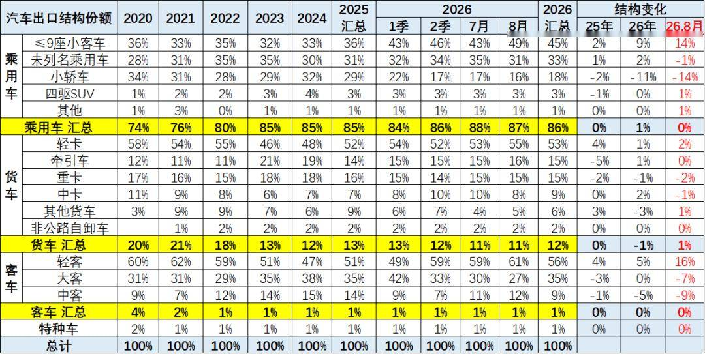

从结构看，乘用车出口占比逐步稳定，到2023年达到85%，随后相对稳定。货车出口因电动卡车而明显提升。近几年客车的出口占比持续回落到较低水平。由于乘用车是贸易焦点，出口的货车和客车比例总体达到13%，稍低于国内的商用车占比。

乘用车内部的几类主力车型表现较均衡，2026年乘用车出口表现较强的是9座以下小客车，2026年9座以下客车占比45%，其中8月达到49%。虽然特斯拉出口回落的影响较大，低速车车口放缓，但8月自主的电动车出口增长较好。

货车8月份额表现较差。皮卡8月增长提升，重卡出口表现高位回落，其它卡车市场走势较强。客车中的大中型客车表现偏弱，轻型客车出口占比8月回升到61%。

4、出口动力结构特征

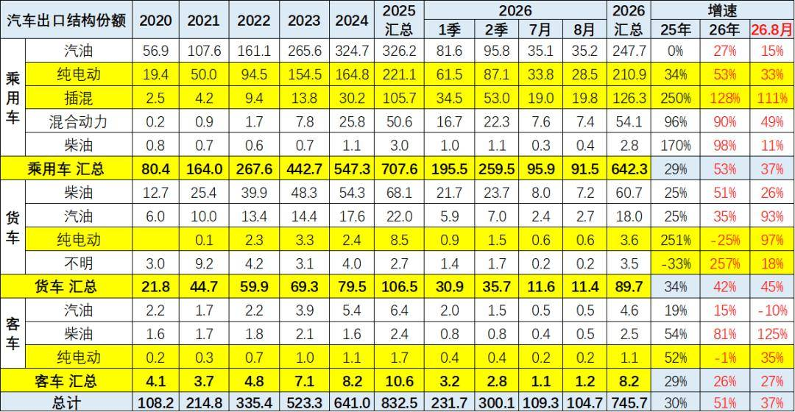

出口动力结构特征方面，2025年乘用车的出口增速回落较大，其中汽油车的出口均增速偏低，今年混合动力乘用车的出口很强，而插混的乘用车出口增速最强。今年货车和客车出口平稳，乘用车出口俄罗斯和欧洲的波动是核心增长推动。

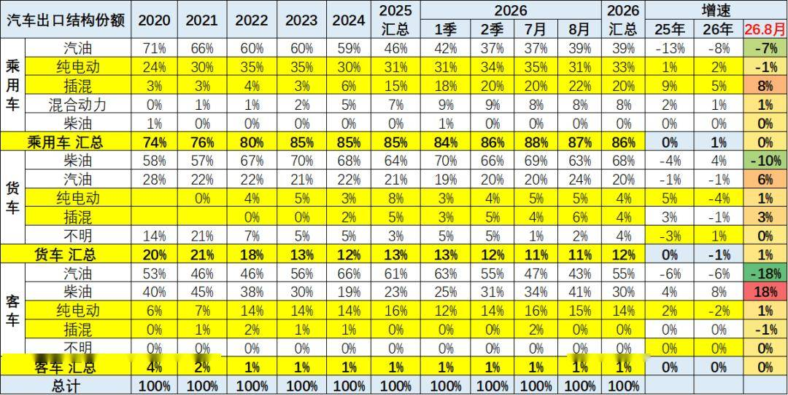

2026年1-8月乘用车的新能源的占比回升，燃油车占比下降明显，混合动力异军突起。汽油乘用车和柴油货车、汽油客车出口下降较大。8月的插混乘用车、柴油卡车和混动乘用车出口较好增长。

二、汽车出口市场格局

1、出口厂家国内区域特征

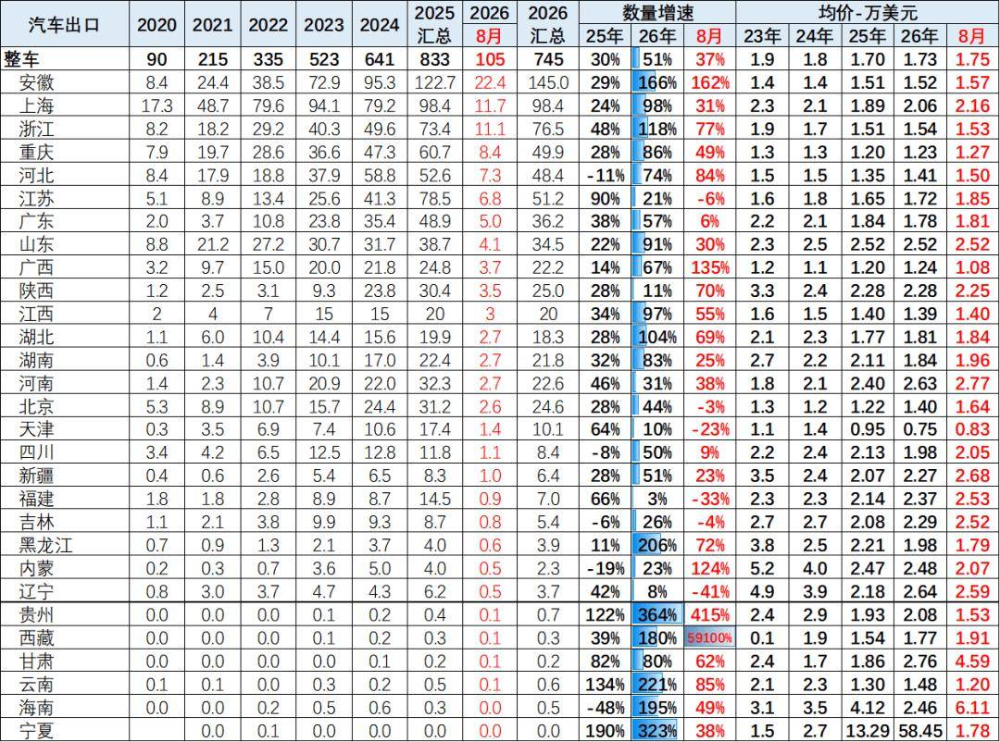

2024年开始上海出口的全国汽车龙头地位被安徽替代，2026年安徽仍保持出口第一的地位。上海对中国出口的重要意义极其明显，实际是长四角的龙头，辐射效应强。2026年1-8月安徽汽车出口增速166%，这主要是由于安徽本地的企业相对比较优秀，加之比亚迪等企业落户合肥。上海企业出口档次高，上汽乘用车和特斯拉两家企业，出口均价较高。

近两年安徽的出口表现相对较强，主要也是奇瑞和江淮的出口表现相对较强，但俄罗斯的市场波动巨大，因此近期安徽出口多元化较好。2026年的重庆、山东、江西的汽车出口贡献度上升较大。

2、出口区域特征

中国汽车出口总体表现较强，其中欧盟和非洲暴增，美加市场低基数高增长，针对日韩和非洲以及大洋洲的出口表现相对优秀。而针对东南亚地区、大洋洲出口表现压力较大。

前期的中国汽车出口在中南美洲和欧盟占比高，东南亚以及南亚等亚洲其它地区表现较强，目前逐步转到以中南美、欧洲、俄国中亚现相对较强的特征，日韩和美国出口也有改善。近期南亚低端市场相对低迷，尤其8月受到美伊战争影响，中东出口受阻明显。

3、整车出口分国别走势分析

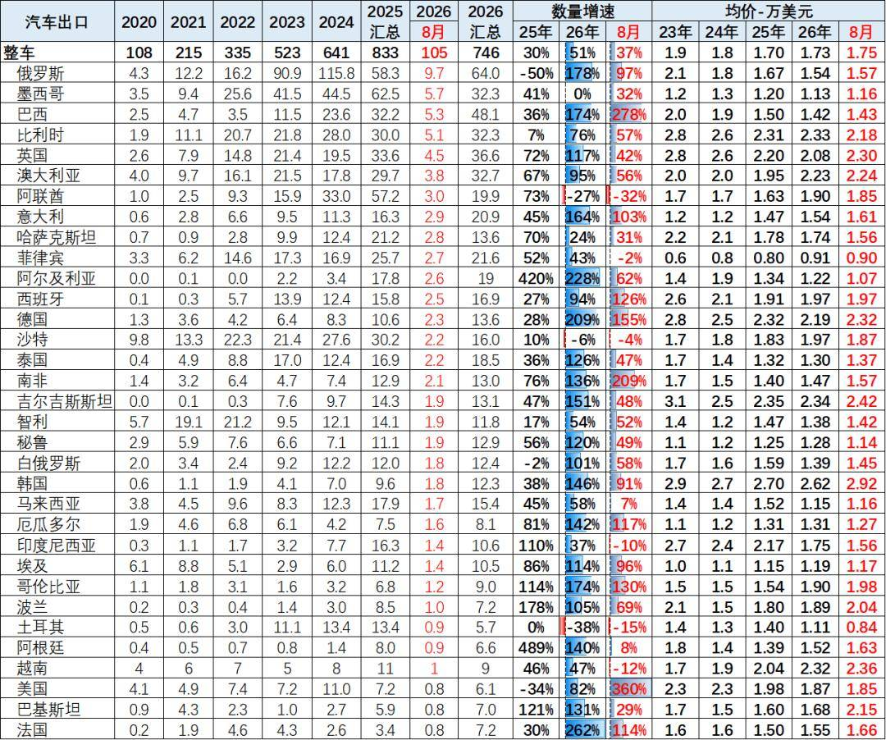

出口均价下降有利于出口增长，随着人民币升值，出口美元价格保持稳定，2026年中国汽车出口价格竞争力较强。前期俄罗斯市场巨变，其它外资退出，因此2023年以来中国对俄罗斯的出口也较多，2025年去库存,2026年回归正常状态。去年出口是对比利时的出口车较多，今年欧洲关系改善，出口表现也有改善。

8月我们对阿联酋市场出口下滑32%，其他中东国家萎缩也较严重。

近期的巴西市场表现较强，中国汽车走进入的本土化建厂取得一定成效。英国、泰国等车市今年有所恢复。

4、整车出口月度增减量走势

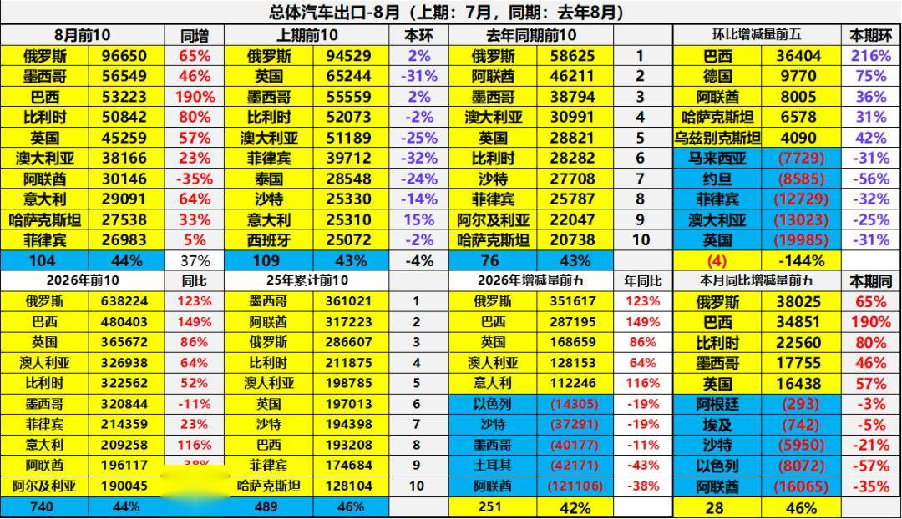

2026年8月中国汽车出口总量的前10国家：俄罗斯96650辆、墨西哥56549辆、巴西53223辆、比利时50842辆、英国45259辆、澳大利亚38166辆、阿联酋30146辆、意大利29091辆、哈萨克斯坦27538辆、菲律宾26983辆，其中本期较同期增量增大的前五个是：俄罗斯38025辆、巴西34851辆、比利时22560辆、墨西哥17755辆、英国16438辆。

俄罗斯市场中国车企防风险意识提升，2025年俄罗斯国内销量下滑不大，但我们出口去库存力度很大。2026年1-8月我们对俄罗斯的出口恢复较大。

2026年1-8月累计整车出口总量的前10国家：俄罗斯638224辆、巴西480403辆、英国365672辆、澳大利亚326938辆、比利时322562辆、墨西哥320844辆、菲律宾214359辆、意大利209258辆、阿联酋196117辆、阿尔及利亚190045辆，其中本期较同期增量增大的前五个是：俄罗斯351617辆、巴西287195辆、英国168659辆、澳大利亚128153辆、意大利112246辆。

5、历年出口主力国家变化分析

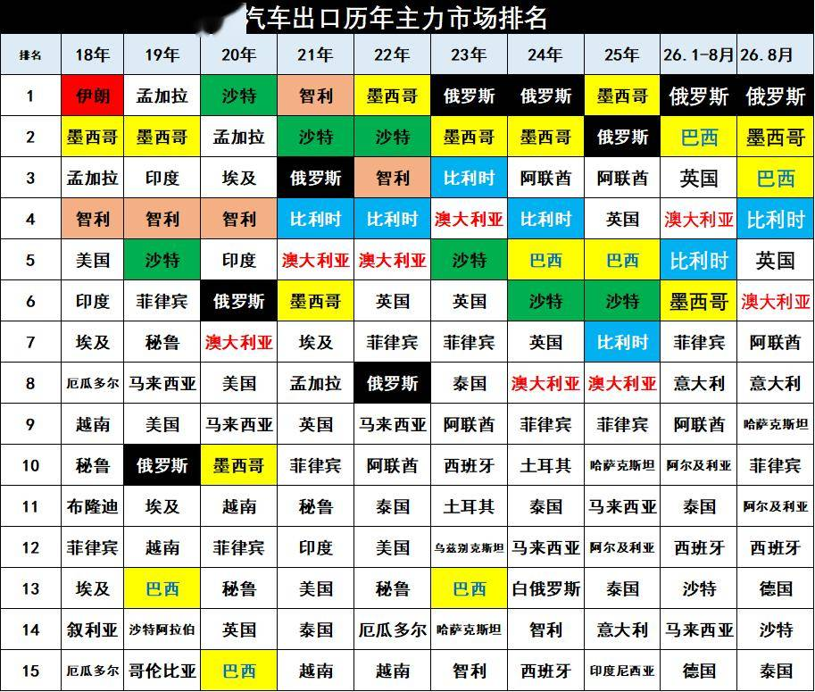

前期汽车出口的海外根据地效果并不理想，主力市场波动较大。2023 - 2024年汽车出口主要市场来自俄罗斯、墨西哥、比利时、澳大利亚、沙特、英国等国家，欧美市场走势较强。近期阿联酋、英国等相对发达国家表现改善。

2026年1-8月汽车出口结构变化，俄罗斯回升到出口第一地位，英国市场增长很强，阿联酋的出口同比下降较大。8月对俄罗斯出口表现较好，主要是基数较低。

6、对俄罗斯出口变化分析

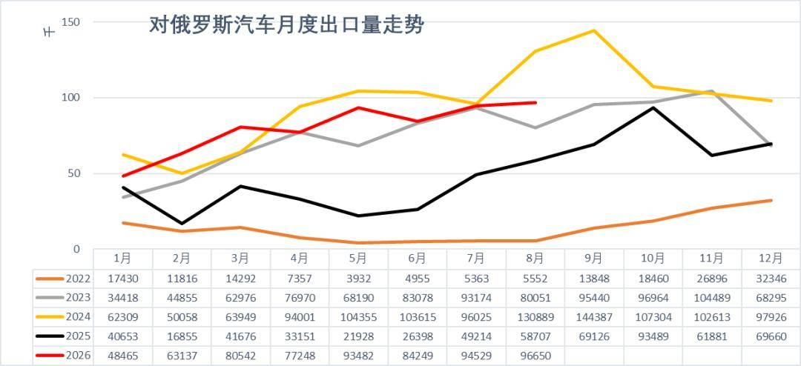

近期由于其它国家汽车企业退出俄罗斯，2023年中国车企迅速保证了俄罗斯的车辆供给需求，前期的中国车企在俄罗斯应该暂时是安全的。

俄罗斯的进口规则根据供需不断调整，2024年俄罗斯汽车销量已经是近几年的最高水平，因此需求提前透支后的2025年下跌是必然的。2025年以来的中国对俄罗斯的新能源车的出口剧烈波动，今年全年的俄罗斯国内需求逐步企稳，中国汽车出口在逐步回升。

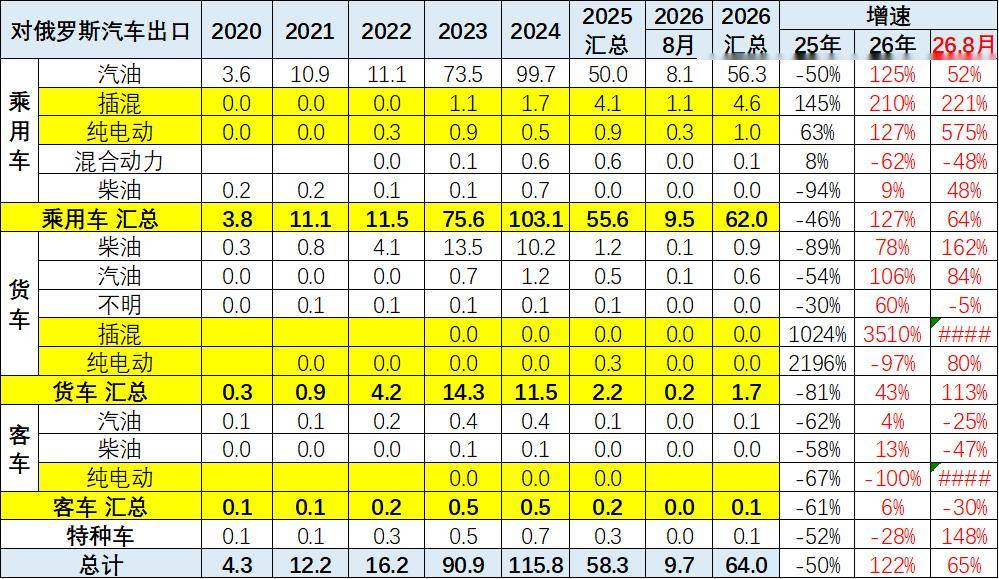

2023年以来俄罗斯突然变成中国汽车出口第一大市场，这是时隔15年后中国汽车再一次的出口巨变。2008年中国自主品牌进军俄罗斯的市场表现很好，但随着俄罗斯对中国汽车巨额加征关税政策，当年中国汽车车企大面积退出俄罗斯，2025年上半年下滑有些类似2009年的走势，但2026年开局因低基数而暴增。

三、新能源车出口走势

1、历年新能源汽车整车出口特征

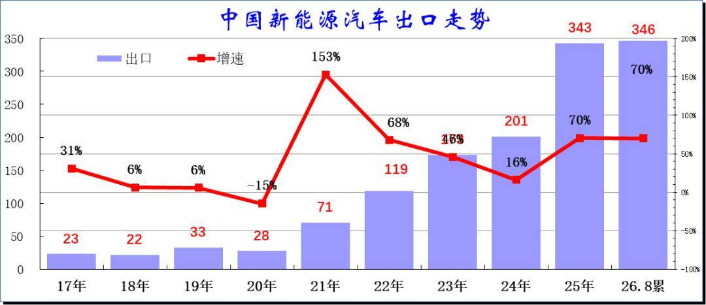

随着中国国内新能源车市场从补贴驱动向市场驱动的转型，中国新能源汽车的市场竞争力大幅增长。中国新能源汽车出口自2021年实现爆发增长，随后进入持续的高增长区间。虽然2024年受到欧盟出口新能源的政策干扰，但2024年全年中国新能源汽车出口仍达到201万辆，同比增长16%。2025年出口新能源车343万辆，同比增长70%，表现良好。2026年1-8月出口新能源车346万辆，同比增长70%，表现良好。

2、历年新能源汽车月度出口特征

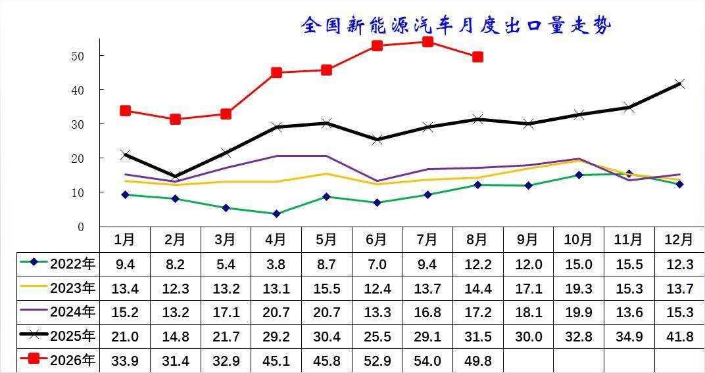

因欧盟加征关税，2024年下半年中国新能源出口走势低迷，市场压力较大。2025年3月开始的新能源车出口暴增的走势超强。2026年1-8月新能源出口持续历史高位，国内低迷推动出口热情更高。

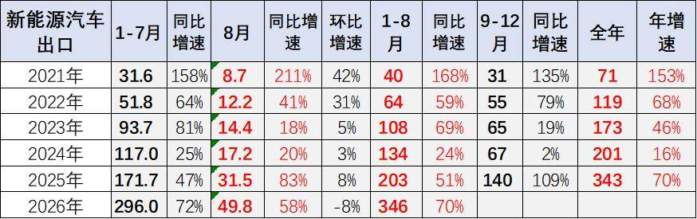

在连续高增长后，2024年全年新能源汽车累计出口量201万辆，同比增长16%。2025年全国新能源汽车出口量343万辆，同比增长70%，增速高于2024年全年的16%较多。2026年8月中国新能源汽车出口50万辆，同比增长58%；1-8月累计出口346万台，增70%的表现很好，8月新能源车出口环比7月降8%。

3、汽车整车出口结构变化

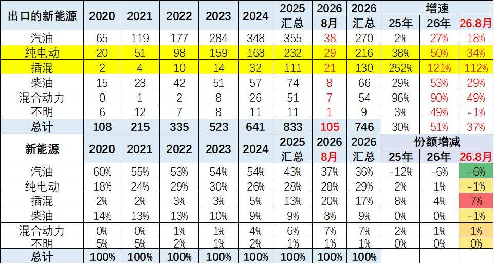

2026年8月中国汽车出口中纯电动占比28%（同比-1%），插混占比20%（同比7%），混动占比7%（同比1%），纯汽油车占比37%（同比-6%）。

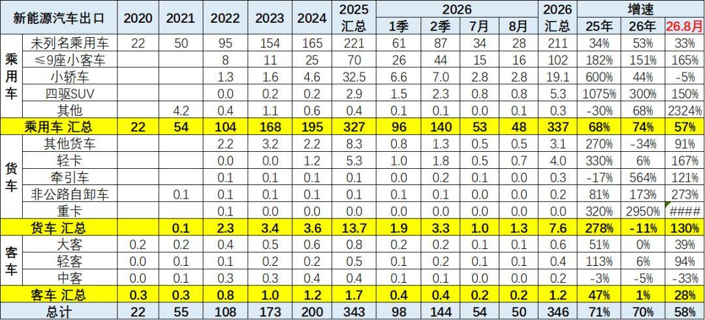

新能源车出口的98%都是乘用车，商用车占比较小，新能源货车表现好于客车。电动化导致的未列名乘用车占比保持高位。

4、新能源出口地区变化分析

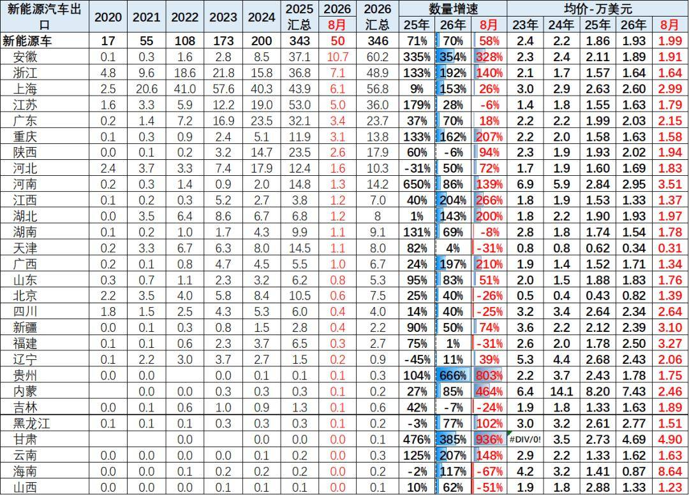

随着特斯拉进入中国，中国汽车出口格局改变，前几年上海长期第一。随着国产车崛起，自主成为新能源出口核心，近期安徽等崛起，8月安徽、上海、浙江的新能源出口表现较好，江苏出口较差。

2026年新能源汽车出口均价相对稳定上升，出口表现较好。

5、历年新能源乘用车整车出口国家特征

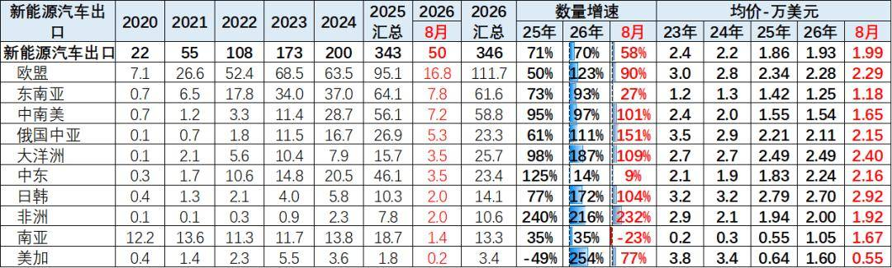

新能源车出口获得更多的突破，2026年仍是欧盟最强，美加和日韩增速表现较高，东南亚还相对平稳增长。

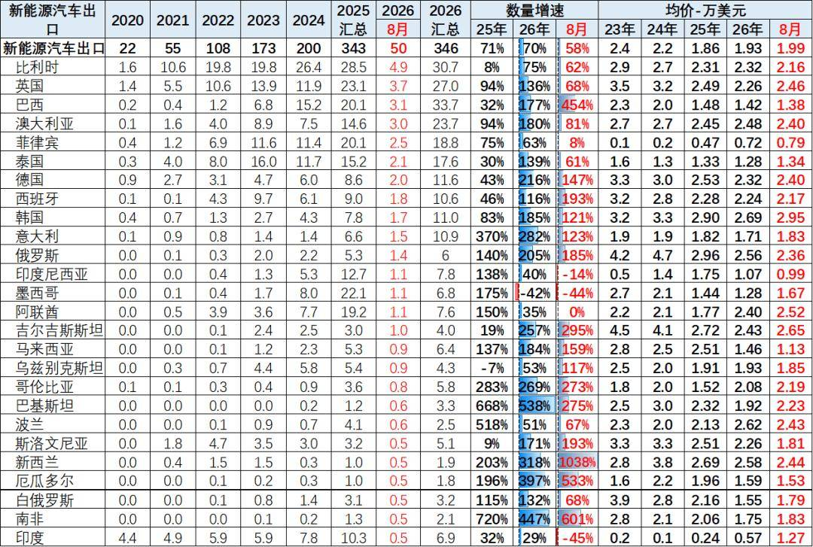

2026年新能源汽车出口同比增长分化。新能源汽车出口主要是欧洲、亚洲两大市场，今年8月的英国超越比利时成为新能源车出口的第一大市场，巴西建厂推动巴西出口上半年暴增，8月开始深度调整。8月的墨西哥新能源出口持续暴跌。

今年新能源车出口的主力市场基本都有较好增长。德国、意大利等市场新能源车出口增长表现突出，墨西哥市场走弱，泰国市场走势回暖。

6、2026年新能源汽车整车出口变化分析

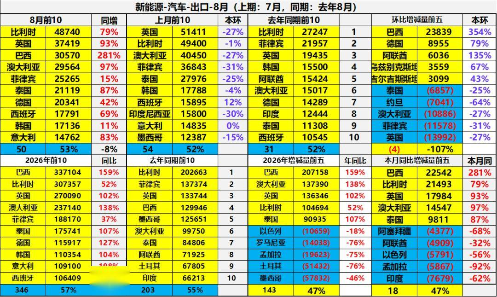

2026年8月中国新能源汽车出口总量的前10国家：比利时48740辆、英国37419辆、巴西30570辆、澳大利亚29564辆、菲律宾25265辆、泰国21119辆、德国20341辆、西班牙17791辆、韩国17136辆、意大利14762辆，其中本期较同期增量增大的前五个是：巴西22542辆、比利时21493辆、英国17984辆、澳大利亚14547辆、泰国9811辆。

2026年1-8月中国新能源汽车出口总量的前10国家：巴西337104辆、比利时307357辆、英国270090辆、澳大利亚237140辆、菲律宾188170辆、泰国175741辆、德国115917辆、韩国110354辆、意大利109100辆、西班牙106409辆，其中本期较同期增量增大的前五个是：巴西207158辆、澳大利亚137390辆、英国136346辆、比利时104694辆、泰国90935辆。

2026年出口巴西、比利时、英国等欧盟是几大主力方向。近期的土耳其、墨西哥等市场出口较弱。

7、燃油车分动力整车出口变化分析

2024年全年中国汽油燃油车出口348万辆、增22%；2025年中国汽油燃油车出口355万辆、增2%；2026年1-8月中国汽油燃油车出口270万辆、增27%。

今年中国对俄罗斯、非洲、南亚等市场的燃油车市场较强，其它市场总体表现一般，尤其是欧盟、大洋洲等市场的燃油车出口下降，高质量发展特征明显。

今年柴油车出口好于汽油车，实现柴油车在非洲、中南美的较强增长局面。8月的日韩和美加、中东的出口表现较差。

今年混合动力车型对欧洲和中南美、亚洲其它市场的增量超强，体现了中国乘用车竞争力的全面提升。但中东销量剧烈下滑，俄国中亚地区的混合动力表现一般。

8、2026年新能源汽车整车出口变化分析

2024年全年中国纯电动车型出口168万辆、增6%；2025年中国纯电动车出口232万辆、增38%；2026年1-8月中国纯电动车出口216万辆、增50%，8月增长34%也是很好的。

目前纯电动的欧盟市场仍是绝对主力市场，东南亚市场和中南美等市场的需求相对波动较大，日韩市场上升明显，但中东市场损失巨大。由于国外基础设施缺乏，加之中国纯电动过于追求高端，大型化特征明显，小型电动车缺乏好产品，纯电动的出口仍有提升空间。

2026年1-8月中国插混车型出口130万辆、增121%，其中8月插混出口21万辆、增112%。除了美加等地区的插混需求很少，其它地区的中国插混表现都很突出。而欧盟地区的中国插混车型需求爆发增长，中东的插混出口总体算是增长。

四、乘用车分类别出口走势

1、乘用车分排量出口

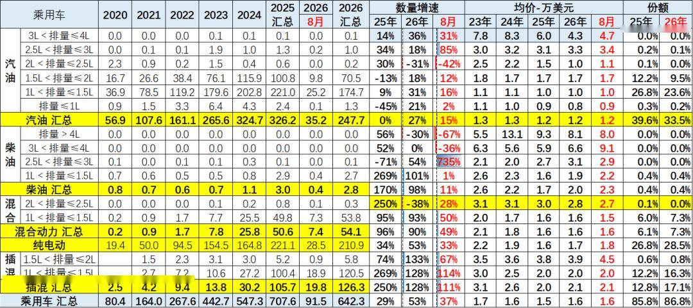

乘用车出口主要靠插混和混合动力乘用车，纯电动表现也很强，燃油车出口保持较好走势。燃油车的排量在1升-1.5升区间为主体，这也是中国自主乘用车的产品综合优势。2025年的1.5-2升车型下滑剧烈。今年1.5-2升车型出口恢复较快，说明俄罗斯等更需求中国的高端高价SUV车型，柴油乘用车基本没啥市场。

而电动车车型的产品档次分化，高端电动车出口改善较大，而入门级插混出口增长较好。

2、乘用车整车出口结构特征

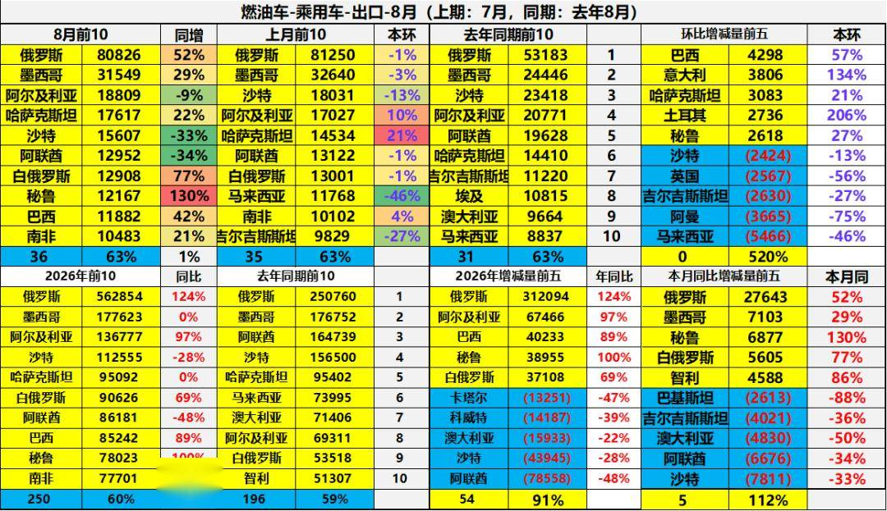

中国燃油乘用车2026年8月出口规模最多的是俄罗斯80826辆、墨西哥31549辆、阿尔及利亚18809辆、哈萨克斯坦17617辆、沙特15607辆、阿联酋12952辆、白俄罗斯12908辆、秘鲁12167辆、巴西11882辆、南非10483辆，其中本期较同期增量增大的前五个是：俄罗斯27643辆、墨西哥7103辆、秘鲁6877辆、白俄罗斯5605辆、智利4588辆。

中国燃油乘用车2026年1-8月出口规模最多的是俄罗斯562854辆、墨西哥177623辆、阿尔及利亚136777辆、沙特112555辆、哈萨克斯坦95092辆、白俄罗斯90626辆、阿联酋86181辆、巴西85242辆、秘鲁78023辆、南非77701辆，其中今年较去年同期增量增大的前五个是：俄罗斯312094辆、阿尔及利亚67466辆、巴西40233辆、秘鲁38955辆、白俄罗斯37108辆。

中国纯电动乘用车2026年8月出口主要是比利时32538辆、澳大利亚22067辆、巴西20154辆、泰国17718辆、英国17297辆、菲律宾16505辆、韩国16352辆、德国13474辆、印度尼西亚10423辆、哥伦比亚7437辆，其中本期较同期增量增大的前五个是：巴西15707辆、比利时14057辆、澳大利亚11341辆、泰国7042辆、印度尼西亚5701辆。

中国纯电动乘用车2026年1-8月出口主要是比利时213001辆、巴西171046辆、澳大利亚168940辆、泰国166702辆、菲律宾141156辆、英国135470辆、韩国106989辆、印度尼西亚72549辆、德国67465辆、印度67223辆，其中今年较去年同期增量增大的前五个是：巴西125654辆、澳大利亚105128辆、泰国86178辆、比利时68353辆、韩国54906辆。

2026年8月出口插混乘用车的主要英国20033辆、比利时15714辆、意大利11497辆、俄罗斯10588辆、西班牙10535辆、巴西10127辆、阿联酋9317辆、菲律宾8380辆、德国6819辆、吉尔吉斯斯坦6733辆，其中本期较同期增量增大的前五个是：英国15524辆、俄罗斯7294辆、比利时7274辆、菲律宾7061辆、意大利6813辆。

2026年1-8月出口插混乘用车的主要是巴西164357辆、英国133077辆、比利时91171辆、意大利67992辆、阿联酋63055辆、西班牙62281辆、澳大利亚52946辆、德国47876辆、俄罗斯45514辆、菲律宾45330辆，其中今年较去年同期增量增大的前五个是：英国90397辆、巴西80974辆、意大利50474辆、比利时36502辆、澳大利亚35966辆。

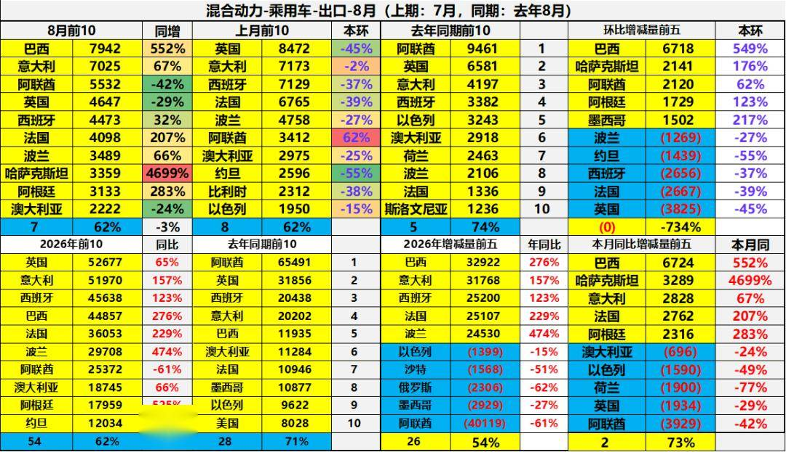

2026年8月出口乘用车普通混合动力的主要是巴西7942辆、意大利7025辆、阿联酋5532辆、英国4647辆、西班牙4473辆、法国4098辆、波兰3489辆、哈萨克斯坦3359辆、阿根廷3133辆、澳大利亚2222辆，其中本期较同期增量增大的前五个是：巴西6724辆、哈萨克斯坦3289辆、意大利2828辆、法国2762辆、阿根廷2316辆。

2026年1-8月出口乘用车普通混合动力的主要是英国52677辆、意大利51970辆、西班牙45638辆、巴西44857辆、法国36053辆、波兰29708辆、阿联酋25372辆、澳大利亚18745辆、阿根廷17959辆、约旦12034辆，其中今年较去年同期增量增大的前五个是：巴西32922辆、意大利31768辆、西班牙25200辆、法国25107辆、波兰24530辆。

五、货车分类别出口走势

1、货车出口

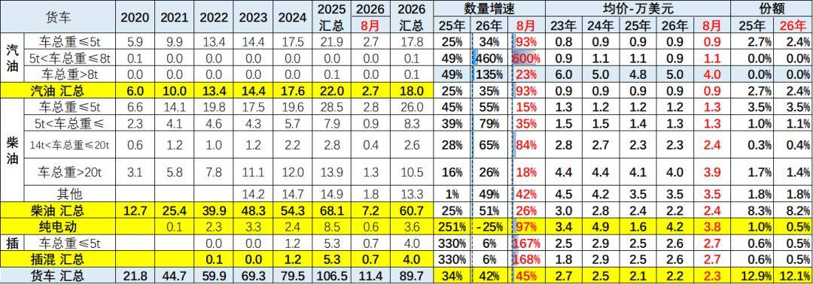

货车市场出口近几年增速不强，在汽车出口市场占比表现处于持续小幅萎缩状态，但2026年因纯电动和柴油轻卡表现较强，拉动出口占比改善。货车市场主力是5吨以下汽油和柴油货车较强，5-14吨和20吨以上柴油重卡货车总体来看也有较强需求。

2、货车出口市场变化特征

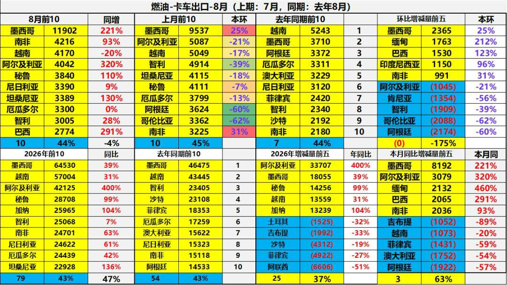

燃油货车出口市场：墨西哥11902辆、南非4216辆、越南4170辆、阿尔及利亚4042辆、秘鲁3840辆、尼日利亚3390辆、坦桑尼亚3389辆、厄瓜多尔3300辆、智利3005辆、巴西2774辆，其中本期较同期增量增大的前五个是：墨西哥8192辆、阿尔及利亚3079辆、缅甸2132辆、巴西2065辆、南非2036辆，前几位总体表现稳定。

2026年1-8月燃油货车主力出口市场：墨西哥64530辆、越南57004辆、阿尔及利亚42125辆、秘鲁28708辆、加纳25965辆、智利25068辆、南非24701辆、尼日利亚24622辆、厄瓜多尔24439辆、坦桑尼亚22928辆，其中今年较去年同期增量增大的前五个是：阿尔及利亚33707辆、墨西哥18055辆、秘鲁14256辆、越南13559辆、加纳13239辆，表现较好。

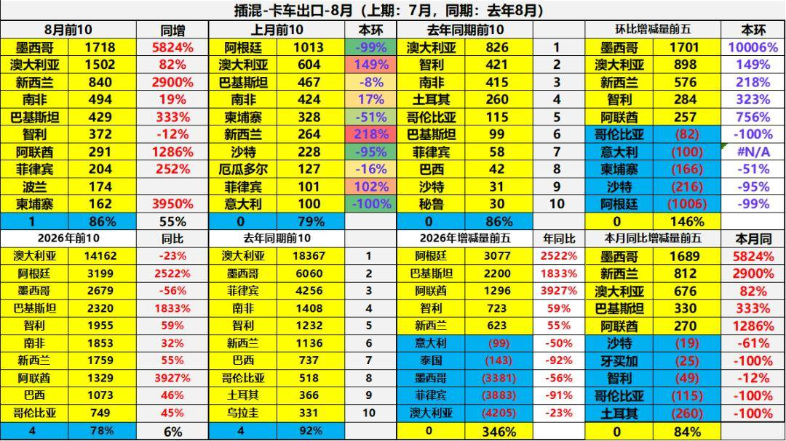

插混的货车出口市场近期较强，这主要是皮卡的乘用车属性的增量，在海外市场形成插混的野外场景便利和使用成本优势。

目前8月出口市场墨西哥1718辆、澳大利亚1502辆、新西兰840辆、南非494辆、巴基斯坦429辆、智利372辆、阿联酋291辆、菲律宾204辆、波兰174辆、柬埔寨162辆，其中本期较同期增量增大的前五个是：墨西哥1689辆、新西兰812辆、澳大利亚676辆、巴基斯坦330辆、阿联酋270辆。

目前全年累计出口的前十是：澳大利亚14162辆、阿根廷3199辆、墨西哥2679辆、巴基斯坦2320辆、智利1955辆、南非1853辆、新西兰1759辆、阿联酋1329辆、巴西1073辆、哥伦比亚749辆，其中今年较去年同期增量增大的前五个是：阿根廷3077辆、巴基斯坦2200辆、阿联酋1296辆、智利723辆、新西兰623辆。

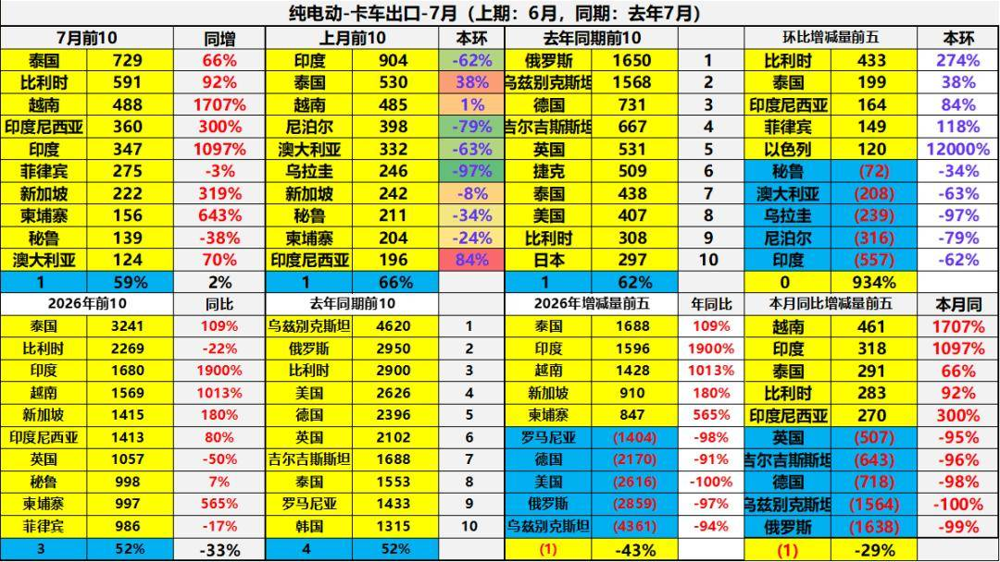

纯电动的货车出口市场近期暴增，这主要是特殊用车属性的暴增，在海外市场形成超强的场景便利和使用成本优势。

六、客车分类别出口走势

1、客车出口总体

近期世界客车需求出现一定下降，导致前两年的中国客车出口持续萎缩，从2019年的6.4万辆下降到2022年的4.8万辆。2023年以来的世界需求恢复，中国客车2025年的全年达到10.6万辆。

2026年1-8月纯电动客车出口1.1万辆，下降1%的表现一般，柴油客车低基数出口增长较大，汽油大中型客车出口较强。

2、客车出口市场变化特征

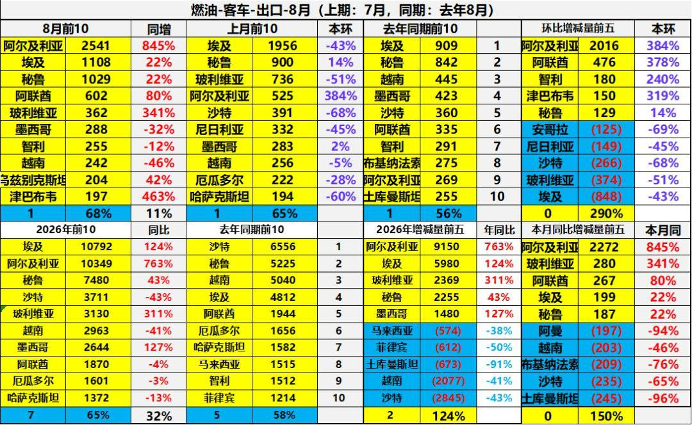

中国燃油客车出口主要市场比较分散，8月的前10位是：阿尔及利亚2541辆、埃及1108辆、秘鲁1029辆、阿联酋602辆、玻利维亚362辆、墨西哥288辆、智利255辆、越南242辆、乌兹别克斯坦204辆、津巴布韦197辆，其中本期较同期增量增大的前五个是：阿尔及利亚2272辆、玻利维亚280辆、阿联酋267辆、埃及199辆、秘鲁187辆，属于欠发达国家为主，市场比较复杂，难以有序持续开展出口。

1-8月出口最多的是：埃及10792辆、阿尔及利亚10349辆、秘鲁7480辆、沙特3711辆、玻利维亚3130辆、越南2963辆、墨西哥2644辆、阿联酋1870辆、厄瓜多尔1601辆、哈萨克斯坦1372辆，其中今年较去年同期增量最多的前五个是：阿尔及利亚9150辆、埃及5980辆、玻利维亚2369辆、秘鲁2255辆、墨西哥1480辆。

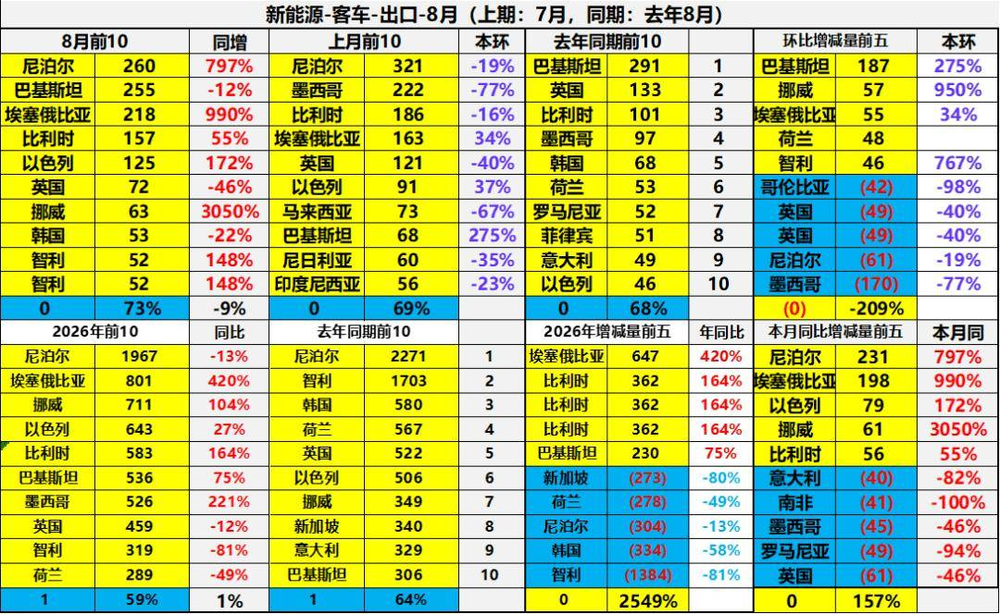

纯电动客车出口市场较小，数据波动较大，今年8月的出口主力是：尼泊尔260辆、巴基斯坦255辆、埃塞俄比亚218辆、比利时157辆、以色列125辆、英国72辆、挪威63辆、韩国53辆、智利52辆，其中本期较同期增量增大的前五个是：尼泊尔231辆、埃塞俄比亚198辆、以色列79辆、挪威61辆、比利时56辆。

纯电动客车今年全年的出口主力是：尼泊尔1967辆、埃塞俄比亚801辆、挪威711辆、以色列643辆、比利时583辆、巴基斯坦536辆、墨西哥526辆、英国459辆、智利319辆、荷兰289辆，其中今年较去年同期增量增大的前五个是：埃塞俄比亚647辆、比利时362辆、巴基斯坦230辆。

附：近日信息合集
