# 【乘联分会论坛】2026年8月皮卡市场分析

- 公開日時: 2026-09-26 21:39（北京時間）
- 出典: [搜狐号・崔东树](https://www.sohu.com/a/1081215640_115312)
- テーマ（自動判定）: 商用車
- 画像: 12枚

---

本文全文共3729字，阅读全文约需12分钟

皮卡产销：2026年8月份皮卡市场销售5.4万辆，同比增长37%，环比下降4%，处于近5年的当月高位水平。1-8月销量45.4万辆，增长22%。

国内市场和出口市场格局差异化明显。长城汽车持续保持强势皮卡领军地位，国内外表现均较平稳。受出口持续同比增长促进，上汽大通、江淮汽车、郑州日产、长安汽车表现较强。在国内皮卡零售市场，长城汽车、江铃汽车、郑州日产、雷达汽车、江西五十铃等表现较好，国内“皮卡一超多强”格局继续保持。

皮卡出口：皮卡的海外市场远大国内市场需求，不要指望国内市场的不切实际的增长预期，出海是皮卡企业高增长的唯一选择。2026年8月全国皮卡出口3.8万辆，同比增长82%，环比下降5%；2026年1-8月全国皮26.6万辆，同比增长45%，行业出口占比继续保持高位。2024年皮卡出口占皮卡总销量的45%，2025年皮卡出口达到50%，2026年累计皮卡出口达到55%，2026年8月皮卡出口达到70%，中国自主皮卡出口提升较好。

新能源皮卡：2024年全国新能源皮卡销量2.12万辆，同比增长170%；2025年新能源皮卡7.3万辆，增长243%，2026年8月新能源皮卡0.9万辆，同比增长150%，环比下降2%；2026年1-8月新能源皮卡6.2万辆，同比增长18%；形成年初新能源皮卡稍弱于燃油皮卡总体增速的走势。

随着电动化和乘用化的发展，皮卡市场的空间仍将逐步改善。8月新能源皮卡销量中：比亚迪皮卡海外销量4,300辆、吉利雷达电动皮卡2,202辆、郑州日产1,058辆、长安增程皮卡606辆，其它皮卡企业的新能源车也有一定规模。伴随着国内新能源皮卡市场启动，逐步培育市场，预计中国皮卡未来将会更快的发展来满足国内外需求。

一、皮卡市场总体分析

1、历年皮卡市场逐月走势

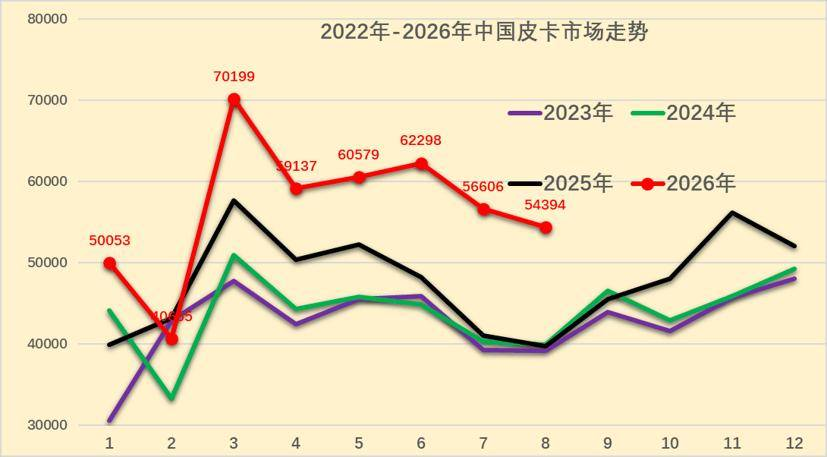

2025年皮卡批发市场走势不断变化，年末走强明显。相对于历年的春节早，因此2025年2-8月的皮卡走势因春节较晚因素获得增量，4-8月的皮卡销量逐步下滑，10-11月出口销量回升明显。由于政策影响不明显，2026年1月皮卡实现较强增长，2月春节因素的皮卡销量稍有下降,3月皮卡厂商季度末冲刺力度超强，4-6月皮卡仍保持强势增长，8月销量仍保持较强走势。

皮卡属于生产资料车型，在春节之前一般购买皮卡相对较少，春节之后的3-5月皮卡销售进入旺季，这也是房地产、工程项目和单位购买的需求增长点。

乘用车的销量代表了中国消费者的生活品质以及追求，但是商用车的销量代表了中国小企业、小私营业主的发展状况，只有商用车的需求上来了，基础民生问题得到解决，乘用车市场才能有恢复的可能。

皮卡市场也是直接反应了小私营业主的发展情况，以长城汽车为代表的皮卡市场，已经成为疫情后汽车市场回暖的先头兵。但随着房地产低迷，第三产业运营压力较大，皮卡市场回暖也艰难。由于海外皮卡出口市场的快速活跃，皮卡市场日益复杂。

随着中年群体的潮玩文化，自驾和郊野游的空间增大，大家更多选择皮卡游玩。因此皮卡进城的难度大，自由的小城游玩生活和野外工作是主要需求。

2、全国皮卡市场8月走势对比

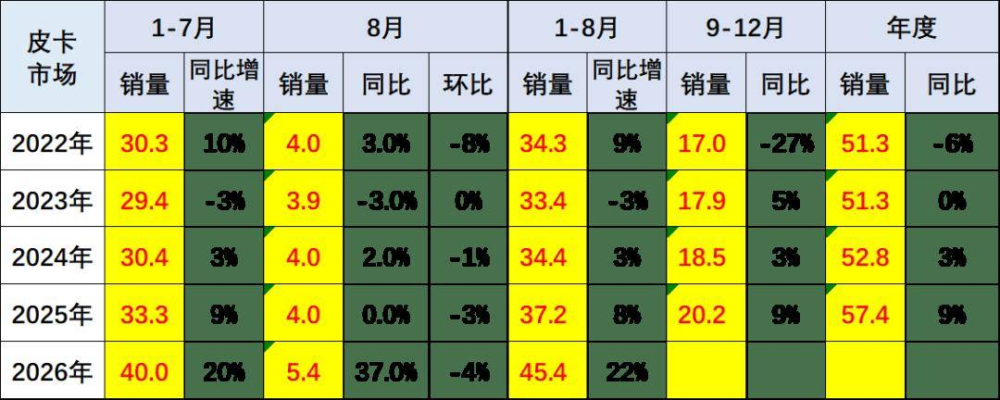

2026年8月份皮卡市场销售5.4万辆，同比增长37%，环比下降4%，处于近5年的当月高位水平。1-8月销量45.4万辆，增长22%。

皮卡市场持续总体平稳，国内需求走弱，但出口强增长。由于皮卡的增量在出口，轻卡增量在电动化，皮卡相对于轻卡等走势仍属较好。

3、皮卡出口表现强

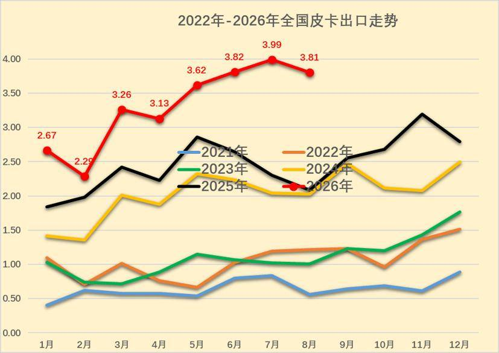

2026年8月的皮卡出口达到3.8万辆，近几个月出口持续较强，2024年-2026年的出口皮卡走势相对较强，今年的3-8月表现相对前两年更是较强。

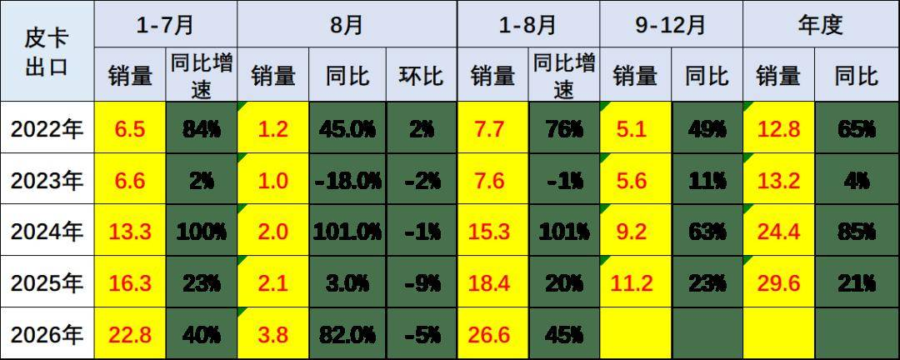

全国皮卡市场2024年累计出口24.4万辆，增速85%。2025年全国皮卡出口30万辆，同比增长21%。以长城汽车为代表的皮卡总体行业出口超强，2026年8月全国皮卡出口3.8万辆，同比增长82%，环比下降5%；2026年1-8月全国皮26.6万辆，同比增长45%，行业出口占比继续保持高位。

2024年皮卡出口占比皮卡总销量的45%，2025年皮卡出口达到50%。2026年累计皮卡出口达到皮卡总销量的55%，2026年8月皮卡出口达到厂家总量的71%，中国自主皮卡出口提升较好。作为国际化车型的皮卡，已成为我国商用车出口中的最强品类。

4、皮卡新能源走势

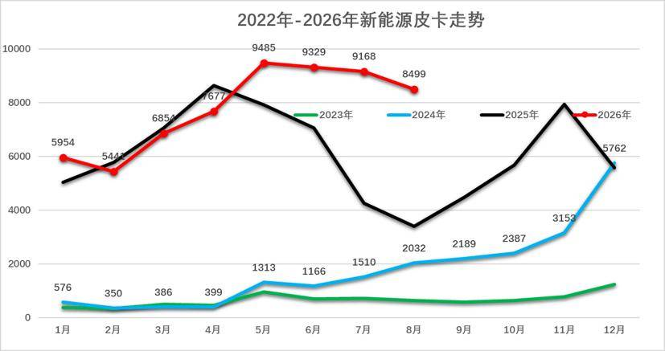

前期的新能源皮卡与新能源商用车有类似的补贴特色的波动增长特征。随着特斯拉皮卡的火爆，近期新能源皮卡逐步走向消费特征，比亚迪海外新能源皮卡走势较强，吉利雷达等推动皮卡私人消费较好。

全国新能源皮卡市场逐步崛起，随着特斯拉的皮卡热卖，中国的新能源皮卡也逐步进入规模化发展。

2024年全国新能源皮卡销量2.12万辆，同比增长170%；2025年新能源皮卡7.3万辆，增长243%，2026年8月新能源皮卡0.85万辆，同比增长150%，环比下降2%；2026年1-8月新能源皮卡6.2万辆，同比增长36%；形成年初新能源皮卡稍弱于燃油皮卡总体增速的走势。

二、皮卡市场销售区域特征

1、皮卡市场区域变化

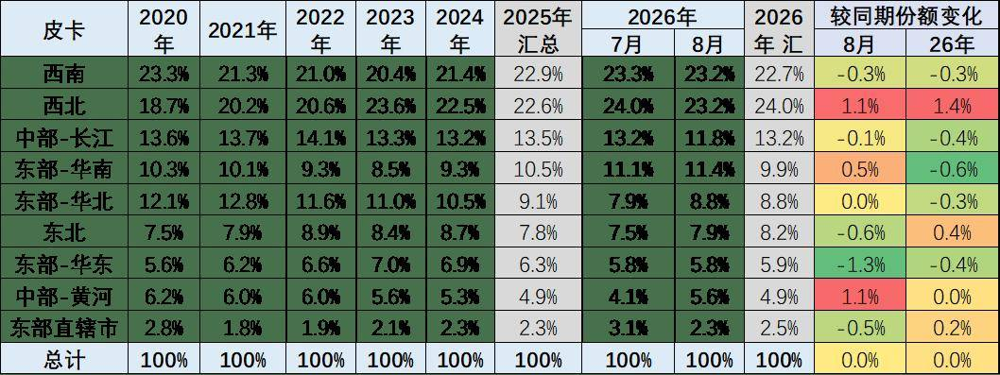

皮卡市场的主力区域在西南、西北为主，近期西北地区的皮卡需求较大，而东部发达地区的新能源皮卡带动市场增长较好。目前来看，2026年8月西南、西北地区的皮卡需求占到总体需求的47%左右，成为两大核心市场，其中今年西北市场规模较大。

随着中国西部的降雨量增大，西北经济活跃，带动西部市场近期保持相对稳定的态势，东部地区回落。虽然经济活跃，但中部地区、华北、华中地区的皮卡市场并没有大幅的增长。

皮卡还是北方和西部市场表现相对较强，这也是因为北方和西部市场经济相对不活跃，主要是靠种植和工程建设为主拉动需求。

私人乘用化皮卡的发展有突破，随着电动化和乘用化的发展，广东的皮卡销量在今年有一定恢复，近期的纯电动和插混皮卡仍值得期待。

2、皮卡销售区域分析

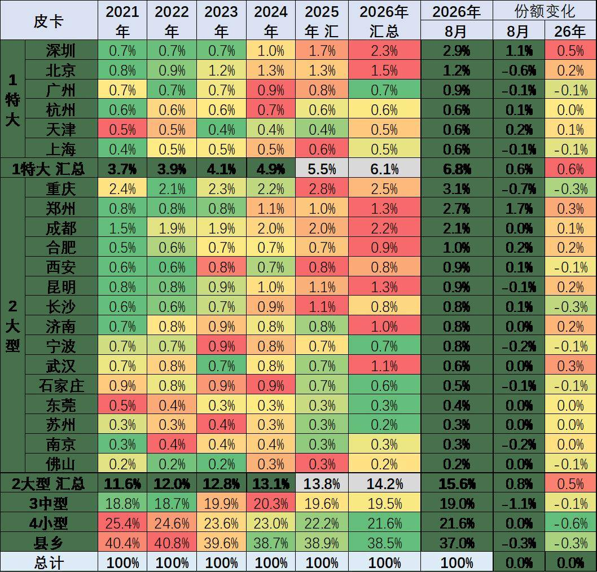

皮卡市场主力销售区域还是在以中小城市和县乡市场为主，但随着电动化皮卡和乘用化皮卡推出，大城市需求得到改善。2026年8月深圳等限购市场表现较好，而县乡市场近期走弱，燃油皮卡的大城市市场目前来看市场并没有明显的突破特征。8月的县乡市场的表现相对偏弱。

特大城市的市场逐步处于传统皮卡的萎缩特征之中，而限购城市市场中，北京市场因牌照紧张而皮卡表现较好。前期表现相对较强的深圳、天津等市场表现春节前后属于偏弱的一个状态。郑州、济南、武汉等表现相对较强。杭州作为全国地域面积大于北京的超大型城乡市场，其茶农市场的皮卡需求较好。

三、中国皮卡市场竞争分析

1、皮卡厂商表现分析

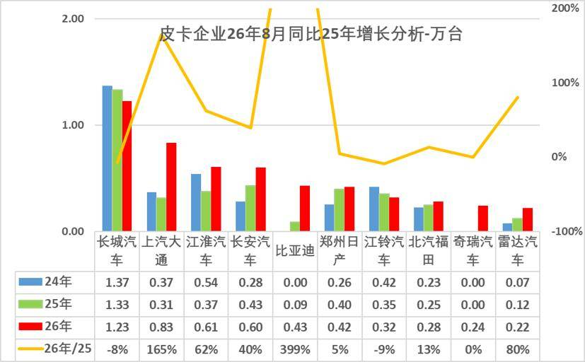

2026年皮卡市场主力厂商表现仍较好，长城汽车皮卡保持较强的绝对优势地位，长安汽车、比亚迪、上汽大通、江淮汽车等8月走势较强。

随着皮卡出口市场的暴增，比亚迪、上汽大通、长安汽车、江淮汽车的皮卡快速崛起，形成中间企业挤压尾部企业销量的特征。

近期传统大集团的皮卡强势厂商都很强，尤其是上汽大通、江淮等出口表现突出。长城汽车的皮卡国内外表现都很好，新品上市的活力较强。长安凯程皮卡的回暖较好。相对属于新势力的雷达和奇瑞汽车的皮卡表现较好。

2、皮卡厂家国内份额走势

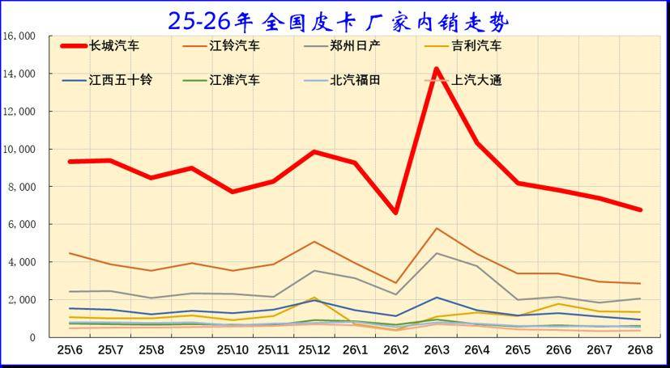

2026年国内保险数据的皮卡市场依旧保持1超多强的走势特征，但开始逐步体现分化的趋势。长城汽车的皮卡销量一枝独秀，奇瑞皮卡等逐步进入。

今年8月长城汽车皮卡内销份额以近50%领先，江铃汽车、郑州日产等保持较强地位，吉利皮卡本月超越江西五十铃逐步进入主流行列，电动化推动国内市场竞争格局逐步升级。近期很多厂商的出口表现较强，因此皮卡市场因出口拉动而总体较强，国内与出口的表现反差巨大。

3、皮卡厂家出口走势

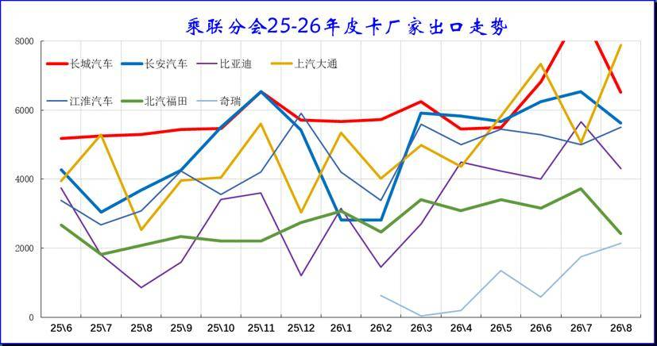

8月的部分厂商环比7月出口增长较猛，长城汽车皮卡出口历年累计仍是第一。近期长安汽车、江淮皮卡、比亚迪等皮卡出口表现超强。由于上汽集团的出口基础好，自身出口体系强，因而上汽大通的出口增长较强。

4、皮卡市场销量月度走势

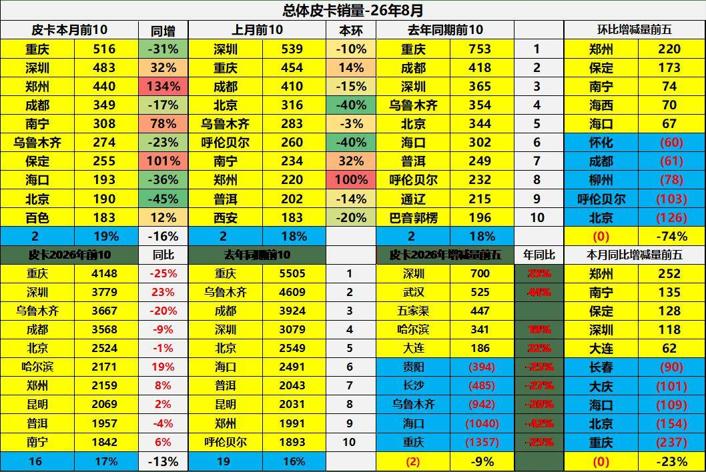

8月全国皮卡主力城市是重庆、深圳、郑州、成都、南宁、乌鲁木齐等城市较强。尤其是随着电动皮卡推出，深圳等东部大城市的新能源皮卡需求释放较强。

5、皮卡8月月度区域走势

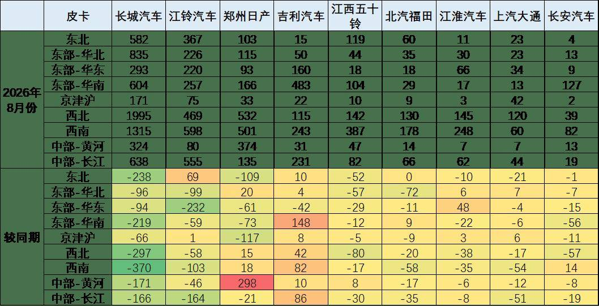

近几年，伴随电动化升级，皮卡产品更新迭代速度加快，近两年皮卡进入市场调整期。根据皮卡市场跟踪，长城汽车占据国内近50%的绝对主导地位，长城汽车在西北地区和西南地区份额突出。

国内市场皮卡1超3强的总份额达到近70%，其中江铃汽车在华东和长江流域份额表现较强；郑州日产在西北和中部长江等地区很好；江西五十铃在西南和东北地区的表现很强。雷达电动皮卡的市场逐步拓展，实现对江西五十铃的超越，其他皮卡企业的竞争表现仍相对平稳。

由于皮卡进城效果不明显，目前皮卡增量主要来自西部市场。销量主要是工程建筑、市政电力、农林牧渔、批发零售业原有的领域以及高端化、乘用化、越野玩车的这类全新客户。随着中国老龄化加剧，农民工老龄化趋势明显，农民工回乡趋势明显，带动小城市和县乡市场恢复。传统主流车企的主力车型表现很强，长城汽车的产品创新效果很好，金刚炮等新品表现突出。

近期的皮卡电动化加速，华南地区的皮卡走势较强，其中雷达电动皮卡和长安插混皮卡的贡献巨大，未来随着比亚迪皮卡的国内上市，皮卡市场的新能源趋势会进一步明显。
