# 2026年8月中国汽车进口2.3万辆降51%

- 公開日時: 2026-09-27 20:02（北京時間）
- 出典: [搜狐号・崔东树](https://www.sohu.com/a/1081478423_115312)
- テーマ（自動判定）: 輸入
- 画像: 16枚

---

注：本分析文章仅代表崔东树个人观点，如有异议，请留言。

2026年8月进口车进口2.3万辆，同比下滑51%，环比下降48%.降幅惊人。2026年1-8月进口汽车27万辆，同比下降17%。2026年1-8月乘用车中的进口轿车占比49%，但8月进口占比降到38%；进口9座以下小客2026年1-8月占比24%的表现较好；今年进口四驱SUV进口占比25%，8月回升到乘用车进口的46%。2026年1-8月进口混动增8%的表现很好，纯电动乘用车降37%，插混降62%，进口新能源乘用车表现较弱。

8月进口车下滑压力仍较大。2026年8月进口最高的前10国家是：德国7393辆、美国4972辆、斯洛伐克3645辆、英国2366辆、日本2173辆、墨西哥681辆、意大利335辆、奥地利306辆、泰国246辆、波兰67辆，其中本期较同期增量增大的前五个是：美国2070辆、墨西哥258辆、泰国246辆、泰国246辆、奥地利124辆。

2026年1-8月进口最高的前10国家是：日本129253辆、德国59183辆、美国27559辆、斯洛伐克19004辆、英国16315辆、墨西哥4156辆、奥地利3838辆、泰国2260辆、意大利696辆、瑞典675辆，其中本期较同期增量增大的前五个是：日本3825辆、泰国2021辆、奥地利1841辆、墨西哥1269辆、中国530辆。

在进口车近几年持续下滑的背景下，2026年8月雷克萨斯的进口豪车市场零售份额44.6%，高于2025年的37.6%约7个百分点。宝马、保时捷、路虎的表现总体相对稍好。

总体国产与进口豪华车市场的需求总体偏弱，其中北京、宁波、杭州、成都等传统富裕地区的豪华车市场压力较大。

一、中国汽车进口总体走势

1、汽车进口增速特征

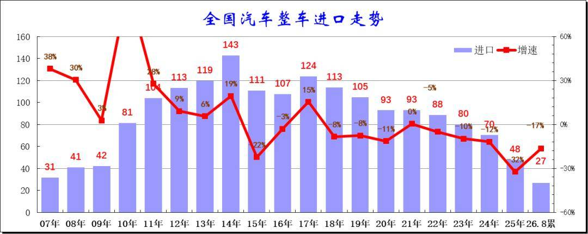

在2014年进口车达到143万辆峰值后下行，2016-2017年进口增速稍有企稳改善，2018年以来至今持续下滑，2024年进口规模持续锐减，全年进口仅有70万辆，同比下降12%。而2025年进口汽车48万辆，同比下降32%，进口车持续萎缩压力较大。2026年1-8月进口汽车27万辆，同比降17%，低基数下的2026年进口车进口量下滑仍较剧烈。

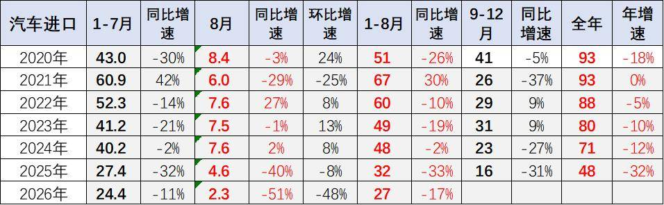

2026年8月进口车进口2.3万辆，同比下滑51%，环比下降48%.降幅惊人。2026年1-8月进口汽车27万辆，同比下降17%。2026年初仍是近期少见的1-8月较好表现，主要原因是因为2025年末的低基数。但由于2025年1月基数低，虽然美国与伊朗战争导致运输受阻，2026年进口车总体下降较小。随着国产车的崛起和国际品牌本土化加速，近几年汽车进口持续低迷，进口车持续3年负增长，如果熨平波动，则是连续8年的负增长。

2、整车进口月度走势

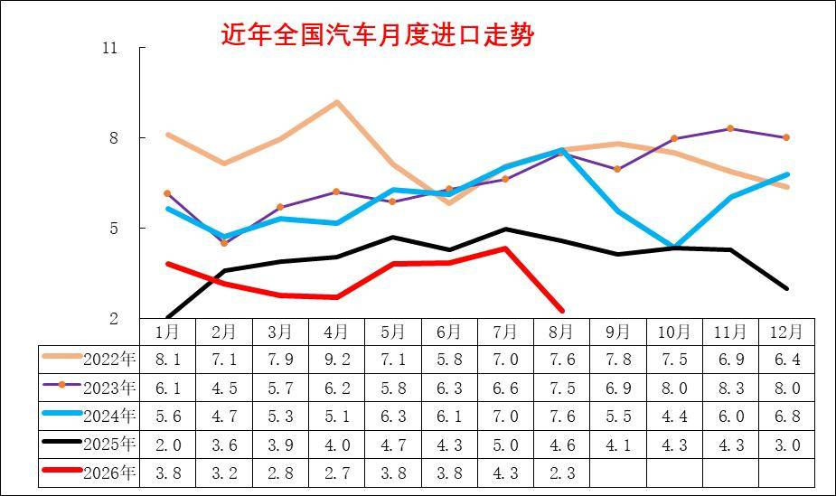

2025年初的进口下滑幅度惊人，随着中美贸易的逐步可预期，2025年进口车逐步回升，7月创出当年新高,但随着自主高端崛起，8-11月进口车持续低迷，2025年12月异常下滑回落，推动2026年1月的增长。

2026年8月的进口暴跌是由于日本进口的剧烈下滑。燃油车市场回归沉闷的平缓下滑趋势。

3、汽车整车进口结构特征

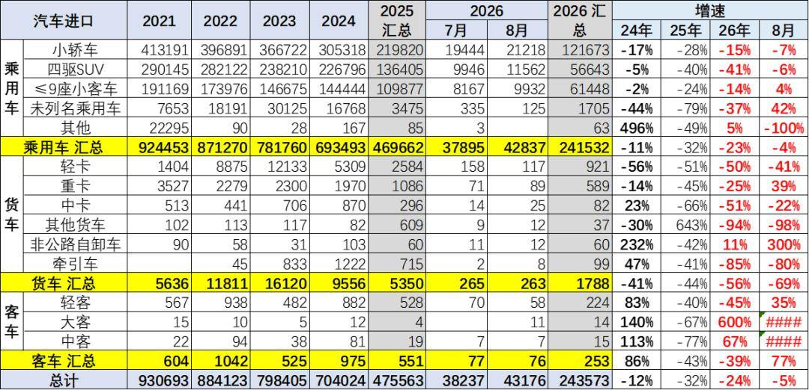

2019年以来各类进口车型全面下滑。传统的卡车目前快速回落明显。2026年8月乘用车的进口小于需求，库存有所下降。

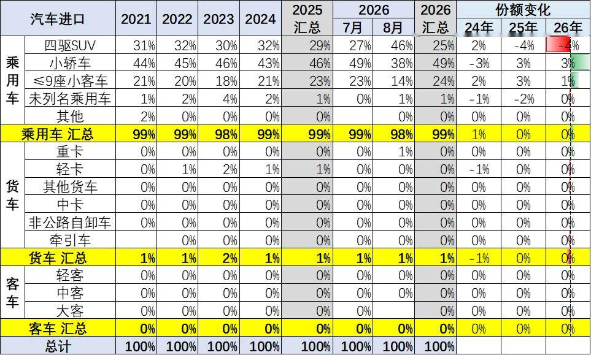

今年汽车进口结构中的乘用车占到超99%的绝对主力地位，如果包含轻卡中的皮卡，则乘用车数量占比更高。

2026年1-8月乘用车中的进口轿车占比49%，但8月进口占比降到38%；进口9座以下小客2026年1-8月占比24%的表现较好；今年进口四驱SUV进口占比25%，8月回升到乘用车进口的46%；而未列名机动车进口占比1%。2026年的商用车进口表现一般，尤其是轻卡进口下滑不大，近期的进口皮卡也很弱。

4、新能源汽车整车进口结构特征

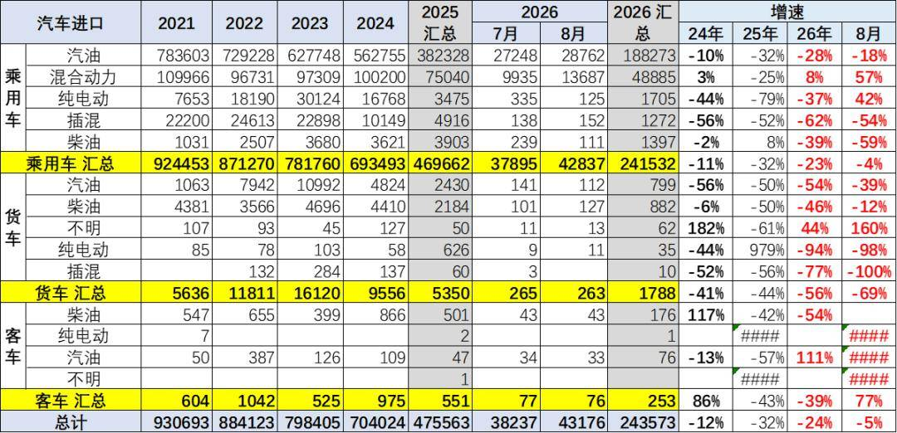

2021-2023年进口新能源乘用车实现持续高增长，2025年出现剧烈下滑。2026年1-8月进口混动增8%的表现很好，纯电动乘用车降37%，插混降62%，进口新能源乘用车表现较弱。

乘用车的传统燃料进口车市场回升较大，混合动力占比回升。而汽油货车的占比下降，与牵引车需求相关。

2026年的高端汽油皮卡进口表现较差。近期国内新能源皮卡市场表现相对较强，但进口纯电动皮卡车市场表现相对较差。

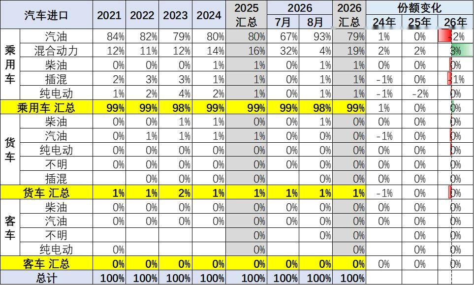

2024年进口乘用车新能源进口占比达到3%，2026年1-8月进口新能源车占比下降到2%，纯电动较去年有大幅下降，燃油乘用车仍是绝对主力。货车中的汽油车比例仍是较高的，纯电动货车下滑巨大。

5、乘用车整车进口排量结构特征

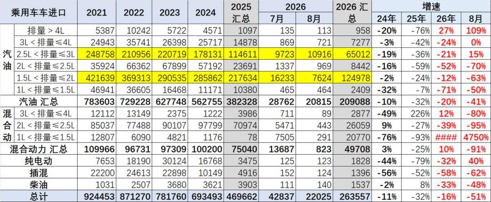

乘用车的进口车型排量集中于2升以下汽油车型，去年3-4升抗跌能力较好，今年1.5-2升相对较好。

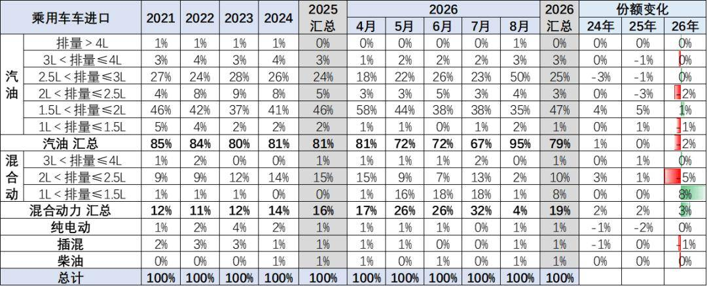

乘用车的进口车型排量集中于2升以下汽油车型，2026年1-8月占比整个进口车的进口量的过半比例，较去年基本持平。

混动进口车型从2.5升降到1.5升的趋势明显。

二、汽车进口市场格局

1、分国别进口特征

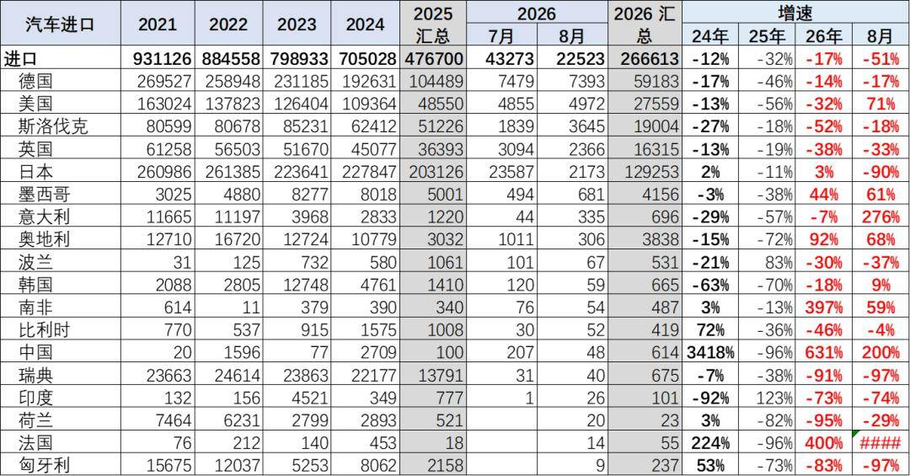

中国乘用车的进口国别仍以德国、斯洛伐克、美国、英国等为核心，近期日本进口表现剧烈变化，8月的日本车进口损失较大。

2、整车进口月度走势

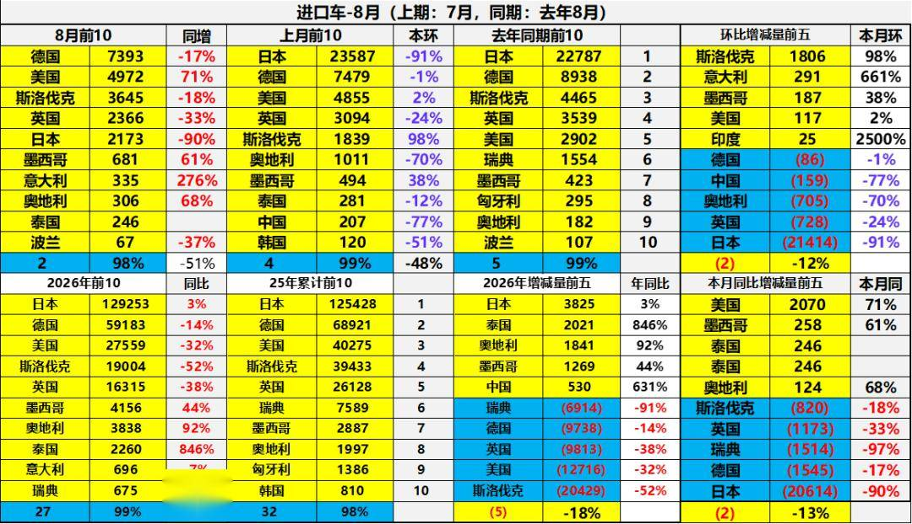

8月进口车下滑压力仍较大。2026年8月进口最高的前10国家是：德国7393辆、美国4972辆、斯洛伐克3645辆、英国2366辆、日本2173辆、墨西哥681辆、意大利335辆、奥地利306辆、泰国246辆、波兰67辆，其中本期较同期增量增大的前五个是：美国2070辆、墨西哥258辆、泰国246辆、泰国246辆、奥地利124辆。

2026年1-8月进口最高的前10国家是：日本129253辆、德国59183辆、美国27559辆、斯洛伐克19004辆、英国16315辆、墨西哥4156辆、奥地利3838辆、泰国2260辆、意大利696辆、瑞典675辆，其中本期较同期增量增大的前五个是：日本3825辆、泰国2021辆、奥地利1841辆、墨西哥1269辆、中国530辆。

3、新能源汽车整车进口国家特征

2025年国产车竞争力较强，进口主力国家的新能源车进口下滑50%。2026年进口新能源乘用车压力进一步加大，德国进口车很差，日本和美国进口新能源基本没有销量。

三、汽车市场销量格局

1、进口车总体销量

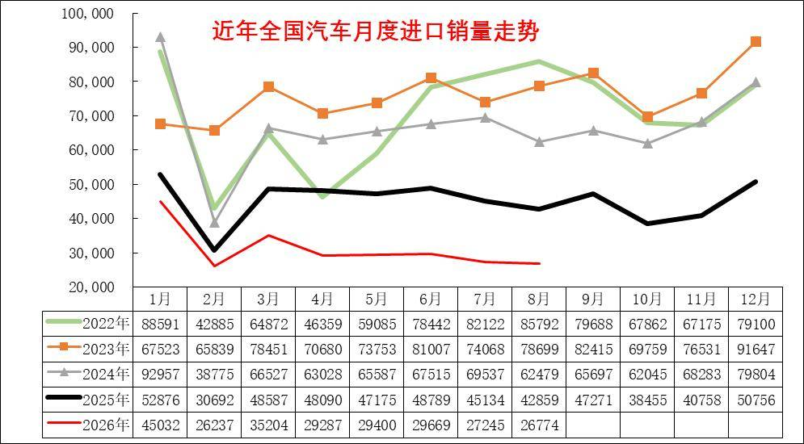

进口车在1-8月均稍低于去年走势，下滑幅度小于前几年走势，年初进口燃油车表现较好,2季度销量较差,8月走势持续下行。

由于中国自主车企强大，进口车销量表现持续走差，也弱于国内国产豪华车市走势。

2022-2024年进口车的销量在80-90万辆徘徊，市场压力逐步加大。2025年进口车交强险数据为54万辆，同比下降33%。由于2025年初低基数的促进，今年1-8月进口车零售25万辆，下滑32%的表现较差，8月下降到2.7万辆降38%的表现很差，未来压力仍大。

2、进口车品牌特征

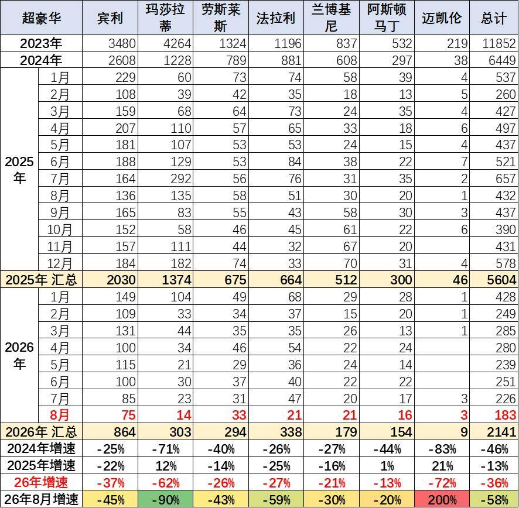

过去几年进口超豪华车持续增长，但2023年以来出现较大的下滑，2024年加速下滑，2026年1-8月下滑仍较严峻。超豪华的走势出现巨大波动，2025年玛莎拉蒂的走势总体异常较高，2026年回落。宾利和劳斯莱斯的走势低迷，但回归超豪华领军地位。兰博基尼和法拉利表现较坚挺。超豪华总体走弱，体现超高端消费群体的购买力暂时放缓，前期抛售带来的超豪华车销量异常，市场价格合理回归。

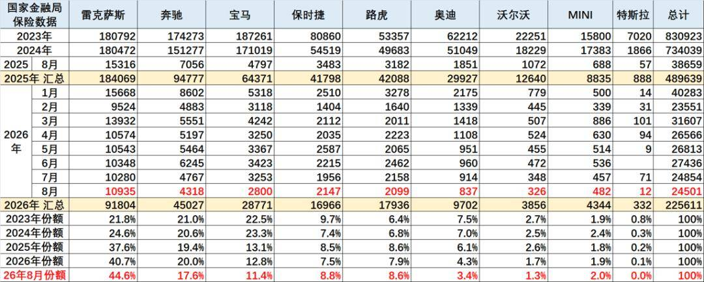

目前进口车主要靠豪华车的需求支撑，非豪华进口车剧烈萎缩。进口车中的主力进口豪华车占比大幅增长。合资品牌进口车快速萎缩，欧系的大众进口车等部分品牌进口车萎缩剧烈。

2025年的雷克萨斯的进口保险零售数据18.4万辆，同比增长2%，份额达到进口豪华车的37.6%，并且雷克萨斯2025年销量高于2022年销量，在2022-2024年连续三年保持在18万辆水平基础上。

2026年8月雷克萨斯的进口豪车市场零售份额44.6%，高于2025年的37.6%约7个百分点。宝马、保时捷、路虎的表现总体相对稍好。

3、进口超豪华车品牌区域变化特征

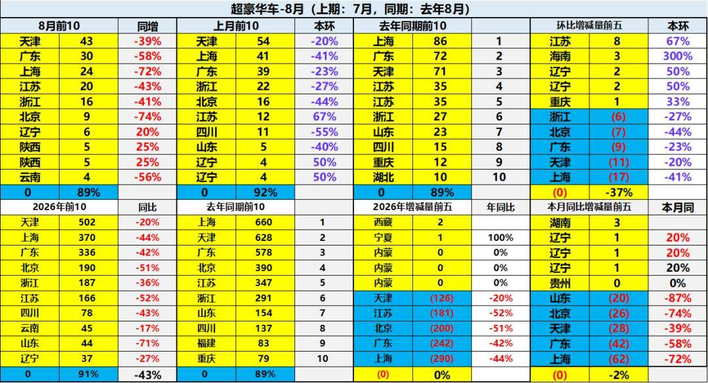

进口车超豪华市场的需求总体偏弱，天津保持超豪华第一，近期北京下滑较大。

北京、西安、苏州、厦门、福州等传统富裕地区的进口超豪华车市场压力较大。新能源车对超豪华的影响体现，由于超豪华的市场萎缩，市场的需求总体不佳，价格体系压力大。

4、豪华车区域变化特征

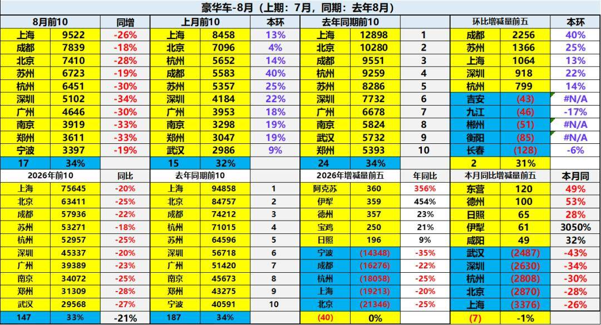

总体国产与进口豪华车市场的需求总体偏弱，其中北京、宁波、杭州、成都等传统富裕地区的豪华车市场压力较大。今年的新疆、山东等北方和中西部产石油地区较强。

附：近日信息合集
