# 2026年1-8月汽车行业利润率3.6%、收入增2.9%、成本增4%、利润降16%

- 公開日時: 2026-09-28 16:44（北京時間）
- 出典: [搜狐号・崔东树](https://www.sohu.com/a/1081896680_115312)
- テーマ（自動判定）: 利益・収益
- 画像: 13枚

---

注：本分析文章仅代表崔东树个人观点，如有异议，请留言。

一、核心数据观点

2026年1-8月，以人工智能为推动的电子行业利润1.1倍增长，上游原材料行业利润高增长，对行业总体利润改善促进巨大，汽车行业面临成本上涨和需求不强的双重压力，盈利表现较差。2026年8月汽车生产270万台，销售收入9281亿元增4.2%，成本8313亿元增5.3%，利润371亿元增24%，销售利润率4%。2026年1-8月汽车生产2031万台同比降3%，收入70062亿元同比增2.9%，成本62370亿元同比增4%，利润2534亿元同比降16%，销售利润率3.6%。

2026年各地大力度推动“两新”政策落地实施，逐步有效释放内需活力，但汽车行业效益改善明显落后其它消费品。随着国家反内卷工作持续推进，汽车行业受上游挤压严重，价格问题严重，油价暴涨，有色金属、半导体利润暴增，终端用户购车观望心态严重，车企运行压力持续加大，高质量发展受到上游的巨大冲击。

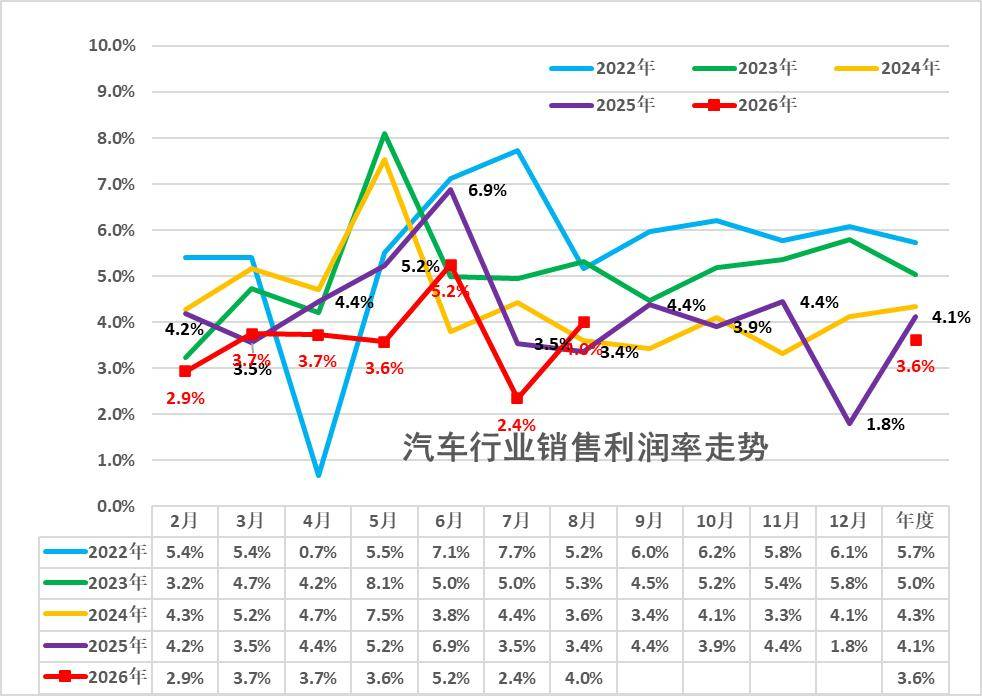

从历年销售利润率走势来看，2024年汽车行业利润表现已显疲软，销售利润率仅4.3%，较历史正常水平大幅下降；2025年行业销售利润率降至4.1%。2026年1-8月行业销售利润率进一步降至3.6%，8月4%，好于2025年12月1.8%的最低月度表现。历年8月一般是利润率较低的时候，今年8月燃油车生产稍有改善，但盈利压力仍巨大。

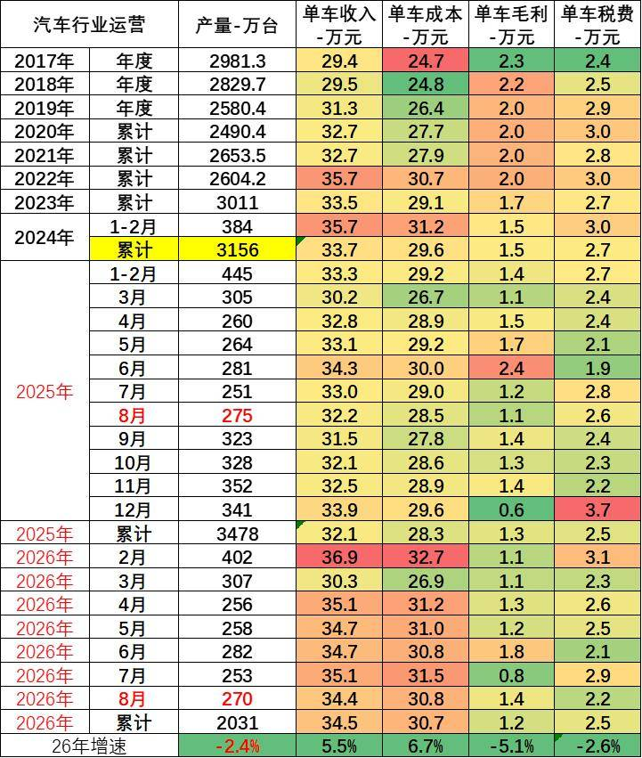

由于汽车行业的产销基本是一致的，统计口径一致，产销差距不大，因此我们用国家统计局产量测算统计局单车经济指标。

1-8月总体工业企业单位成本增长压力大。内存暴涨、碳酸锂价格翻一倍，大宗商品价格高位运行，中下游行业原料成本压力有所加大。1-8月汽车行业产业链的总体单车收入34.5万元（有产业链的重复计算）增5.5%，单车成本30.7万元增6.7%，单车税费2.5万元降2.6%，产业链单车毛利润1.2万元降5.1%。

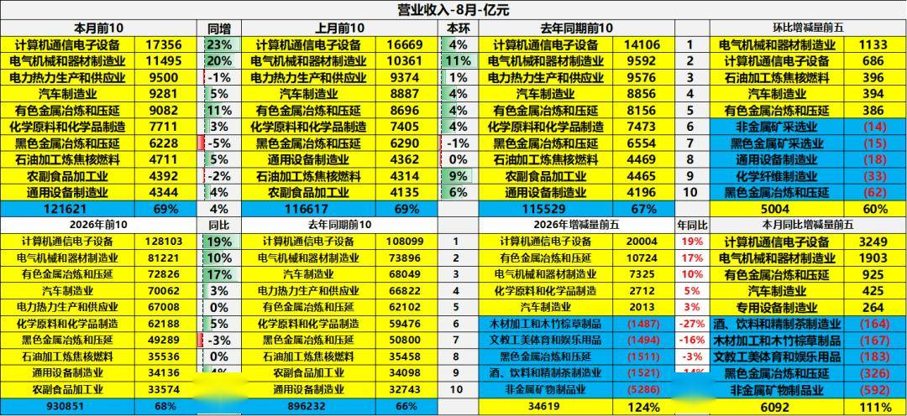

8 月规模以上工业营收数据体现出行业冷热分化。计算机通信、电气机械两大赛道增速亮眼，同比增23%、20%，拉动工业大盘增长。汽车制造业当月营收9281 亿元，同比增5%、环比增4%，实现稳步回升，位列行业第四，但对比电子、电气行业，汽车增长力度明显偏弱。从前8 个月累计看，汽车营收70062 亿元，同比仅增长3%，增长动能不足。上游黑色金属等行业营收下滑，原材料压力有所缓解。汽车行业营收端虽然保持正增长，但持续价格战压缩盈利空间，呈现典型的增收不增利。行业营收回暖，但盈利修复滞后，盈利压力仍需要持续关注。

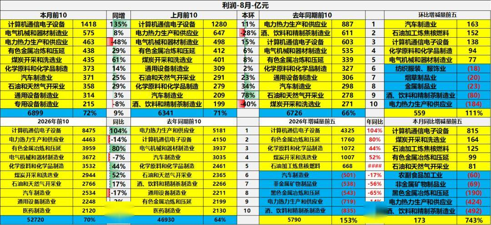

8 月汽车行业利润环比大幅修复，但累计利润依旧同比下滑17%，盈利压力仍未根本缓解。汽车行业同时受到两端挤压，一方面内存、芯片等电子零部件价格走高，另一方面有色金属等原材料成本抬升，持续侵蚀车企利润。对比来看，计算机通信行业受益芯片周期上行，利润爆发式增长；而汽车是芯片、有色金属的下游消费方，成本端被动承压。虽然8 月汽车利润短期反弹，更多是阶段性促销退潮带来的改善，并非基本面反转。芯片、有色价格波动，叠加行业价格战，仍是制约汽车行业盈利持续回升的核心因素。

二、具体分析

1、各类经济体的收入和利润结构

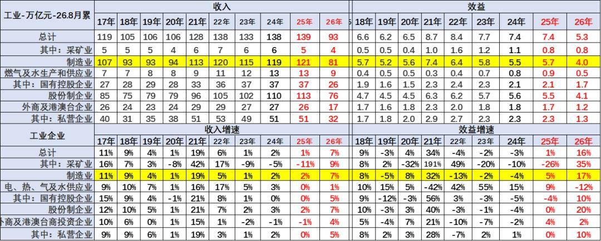

2017-2025 年工业累计营业收入长期维持在105万亿- 139万亿元区间，制造业始终是绝对支柱，营收体量长期占据九成左右。分所有制看，股份制企业营收规模领跑，私营企业营收规模稳步抬升，外商及港澳台企业体量小幅收缩；2026 年1-8月整体总量93万亿元，各行业、各所有制营收均对应折半收缩，营收同比整体回升至7%，制造业同样保持7% 的营收增速，修复力度较强。

盈利效益端，2018 至2025 年工业整体效益在6.2-8.7 万亿元波动，2026 年1-8月效益回落至5.3万亿元，但效益增速大幅反弹至16%，其中采矿业增35%，制造业效益增速达17%，成为盈利修复核心。分板块来看，采矿业效益增速高至35%，电力热力水供应业小幅转负；所有制维度股份制企业效益增速20% 领跑，国企、私企盈利同步回暖，外商投资企业增速仅2%，不同主体盈利修复力度分化明显。

今年总体工业领域的收入增长平稳，利润表现也是相对分化，其中近几年的国有企业的收入和利润波动较大。上游利润挤压下游，采矿企业的表现较好，利润增速很强。

注意：基础数据解读

规模以上工业企业利润总额、营业收入等指标的增速均按可比口径计算。报告期数据与上年所公布的同指标数据之间有不可比因素，不能直接相比计算增速。其主要原因是：（一）根据统计制度，每年定期对规模以上工业企业调查范围进行调整。每年有部分企业达到规模标准纳入调查范围，也有部分企业因规模变小而退出调查范围，还有新建投产企业、破产、注（吊）销企业等变化。（二）加强统计执法，对统计执法检查中发现的不符合规模以上工业统计要求的企业进行了清理，对相关基数依规进行了修正。（三）加强数据质量管理，剔除跨地区、跨行业重复统计数据。根据国家统计局最新开展的企业组织结构调查情况，2017年四季度开始，对企业集团（公司）跨地区、跨行业重复计算进行了剔重。（四）“营改增”政策实施后，服务业企业改交增值税且税率较低，工业企业逐步将内部非工业生产经营活动剥离，转向服务业，使工业企业财务数据有所减小。（五）根据第四次全国经济普查单位全面清查结果，对规模以上工业企业调查单位进行了核实调整。

2、收入利润结构变化

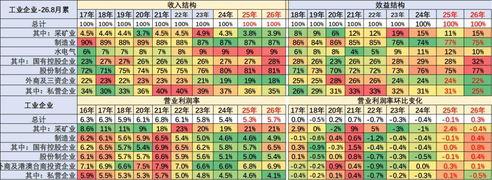

目前看国有企业表现很好，收入和利润占比持续增长，利润占比达到32%，增4个点。私营企业的利润占比达到25%降6个点，营业利润率4.1%的水平较低，私营企业较去年利润下滑较明显。

营业收入的利润率指标K型分化，主要是采矿业和煤水电等国有企业指标数值较高，私营企业利润率很差，制造业的利润占比75%，剔除半导体近期明显下降。

三、具体行业分析

1、采矿业利润分化

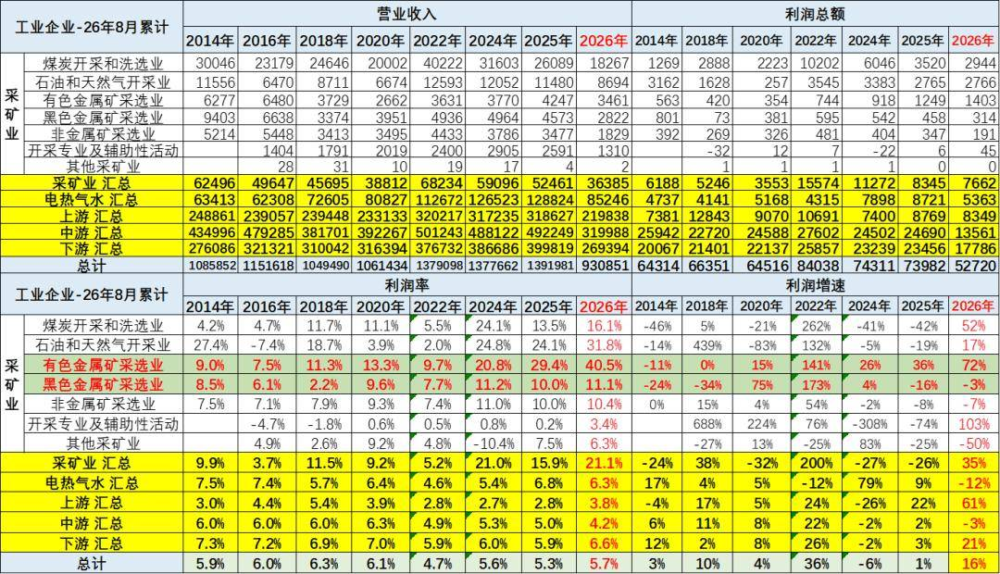

2026年1-8月的高基数和价格走高下，采矿利润增35%仍有很好利润，采矿业1-8月利润率在21.1%水平也是很好的。

2026年1-8月，有色行业利润率暴增到40.5%，石油行业利润率31.8%，近期的石油业的利润率增长惊人。总体采矿行业利润保持高位。对下游的冲击较大。

2、水电气行业利润保持高位

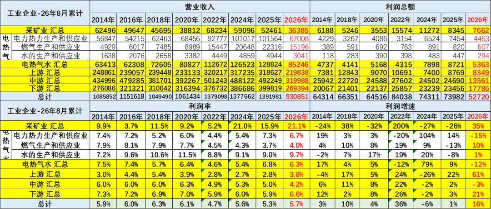

2026年利润率6.3%，电热气水是高利润服务行业，其中电力行业的利润率6.7%，处于历史高位。2026年电力的利润下降15%，水的处理行业利润增1%，燃气行业利润增10%。

3、上游利润改善

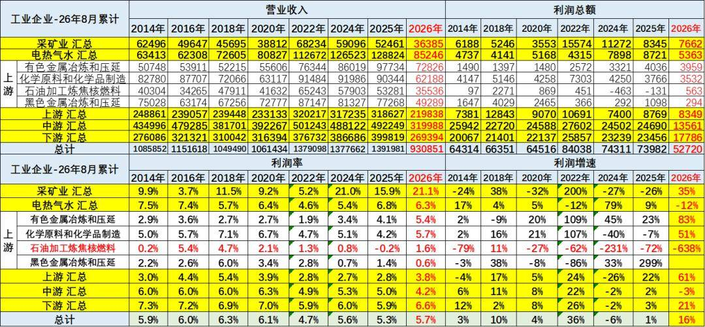

2026年上游行业的销售收入和利润都是出现高增长，尤其是利润率下降到3.8%。其中有色金属等为代表的销售利润率逐步冲到高位，钢铁行业今年利润率0.6%仍是较差。化工原料和有色金属冶炼等行业利润还算较好。

4、中游利润表现较好

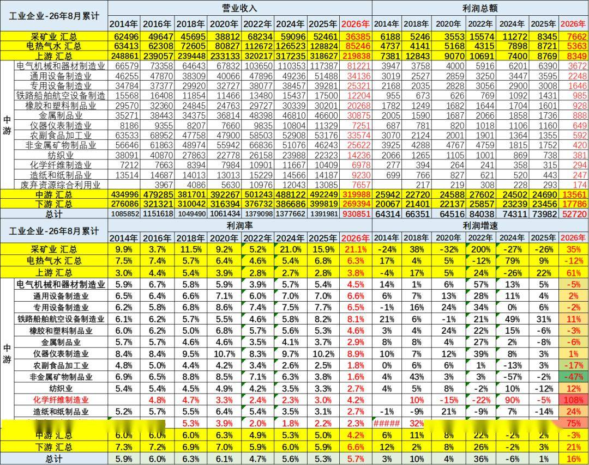

2026年1-8月中游行业的销售收入和利润增长较好。中游行业销售利润率从2018年6%下降到2026年的4.2%，近期企稳。2026年主要中游行业的销售利润率也有所下降，造船铁路等效益好，报废更新补贴带来废弃物资利用和非金属矿物制品业利润增长较大。

5、下游利润逐步改善

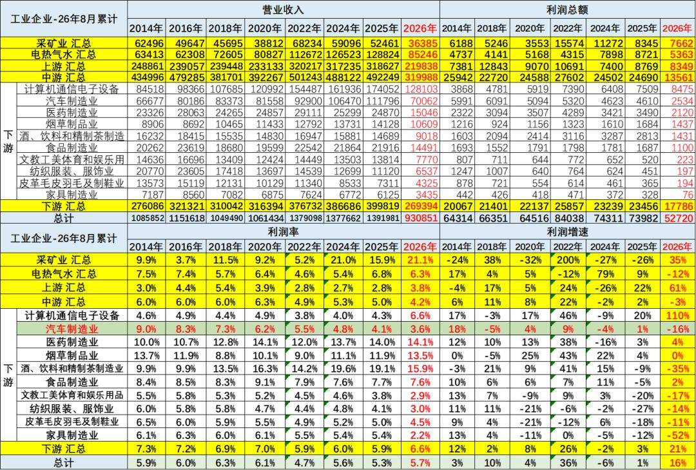

2026年1-8月总体下游工业利润增21%，计算机通讯行业利润出现增110%的异常良好的增长态势。而汽车业利润降16%，销售利润率3.6%（2014年9%），仍低于下游总体6.6%的利润水平，也大幅低于烟、酒、药等其它下游企业。

目前高利润的主要还是烟草、酒类、医药行业，酒类行业的利润大幅高于其他行业。食品行业盈利不强，但也同比提升明显。

四、汽车行业分析

1、汽车行业规模持续扩大

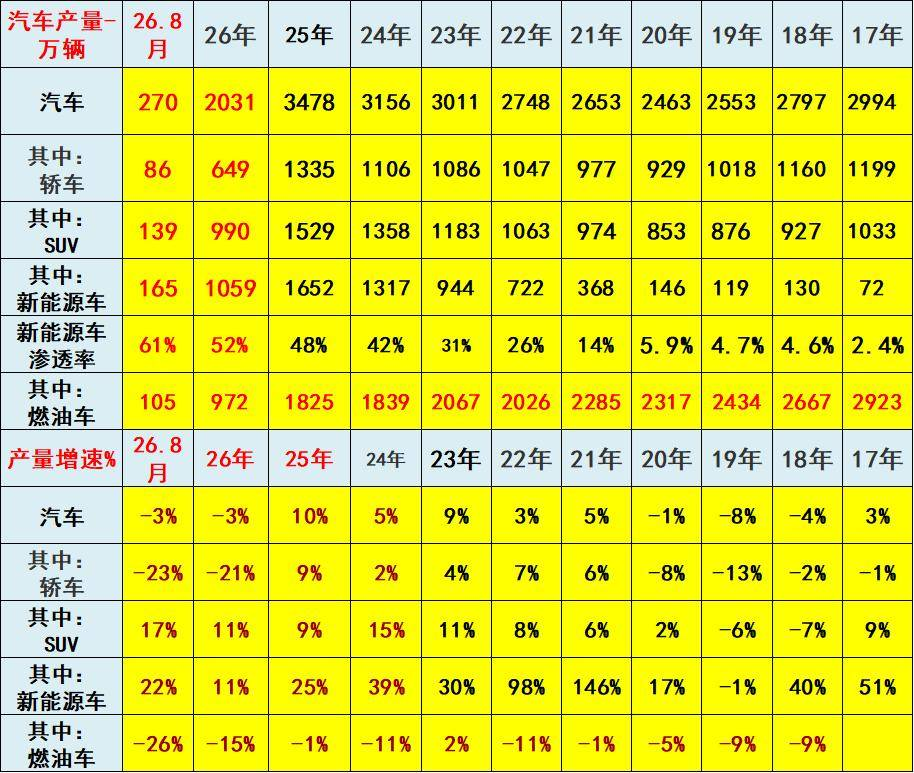

2022年汽车生产2748万台，产量同比增长3%；新能源汽车生产722万，增长98%，渗透率26%；燃油车生产2026万台，降11%。

2023年汽车生产3011万台，同比增9%；新能源汽车生产944万台，同比增30%，渗透率31%；燃油车生产2067万台，增2%。

2024年汽车生产3156万台，同比增长5%；新能源汽车生产1317万台，同比增39%，渗透率42%；燃油车生产1839万台，降11%。

2025年汽车生产3478万台，同比增10%；新能源汽车生产1652万台，同比增25%，渗透率48%；燃油车生产1825万台，同比降1%。

2026年1-8月汽车生产2031万台，同比降3%；新能源汽车生产1059万台，同比增11%，渗透率52%；燃油车生产972万台，同比降15%。

2026年8月汽车生产270万台，同比降3%；新能源汽车生产165万台，同比增22%，渗透率61%；燃油车生产105万台，同比降26%。

2、汽车行业效益压力较大

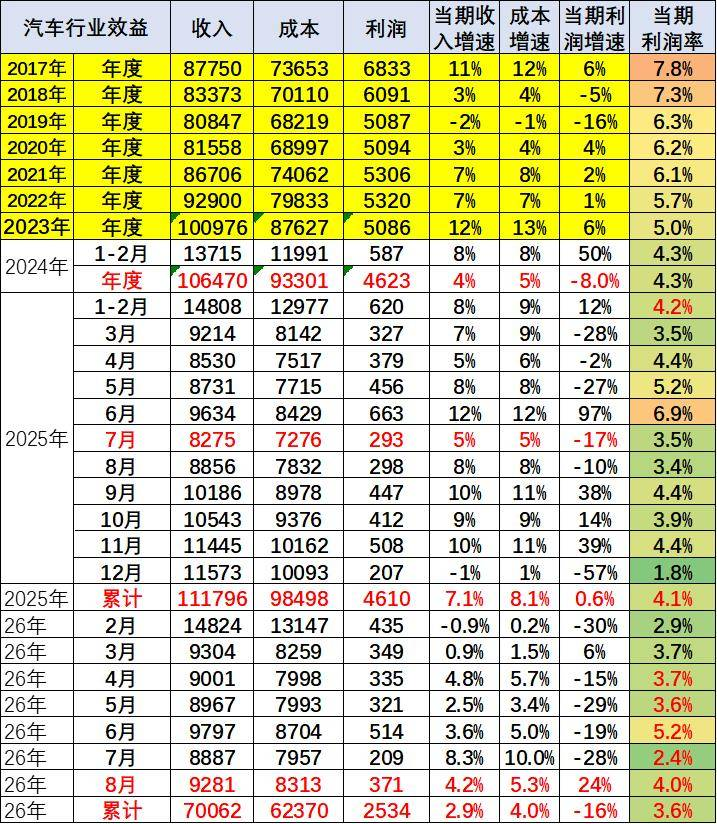

汽车行业盈利持续承压。行业利润率从2017 年7.8% 一路下滑，2025 年全年仅4.1%，2026 年累计进一步降至3.6%。核心矛盾是成本增速持续高于收入增速，呈现典型增收不增利。月度盈利波动剧烈，淡旺季差距悬殊，个别月份利润率甚至跌至2%，行业盈利基础十分脆弱。

2026年1-8月汽车生产2031万台同比降3%，收入70062亿元同比增2.9%，成本62370亿元同比增4%，利润2534亿元同比降16%，销售利润率3.6%；其中8月汽车生产270万台，销售收入9281亿元增4.2%，成本8313亿元增5.3%，利润371亿元增24%，销售利润率4%。

根源在于激烈价格战压制收入端，而原材料、研发、渠道等成本刚性难降。单纯拼销量已经很难赚钱，车企不能继续靠降价走量。行业需要转向供应链优化、精细化成本管控，依靠技术溢价改善单车收益。若价格内卷持续，行业整体盈利水平还有下行压力。

附：近日信息合集
