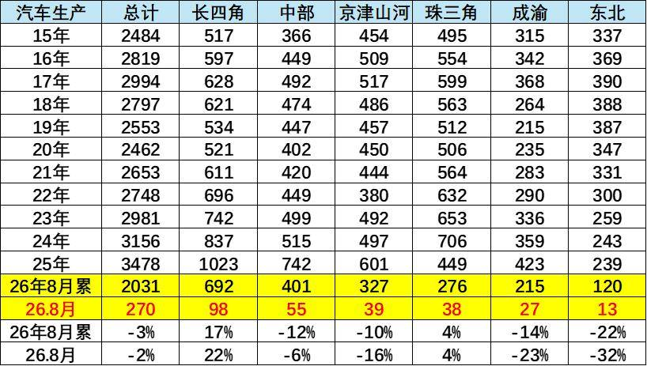
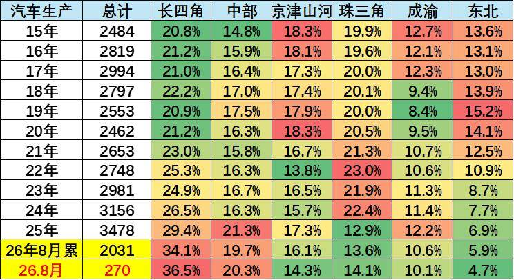
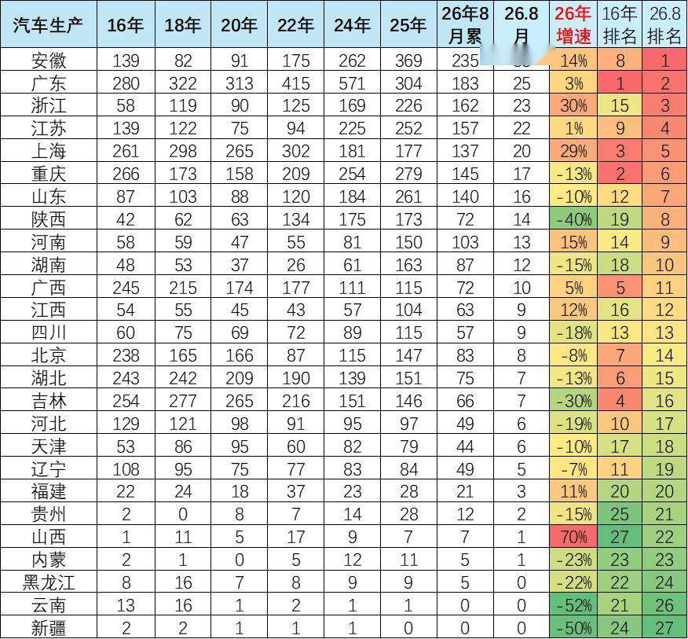
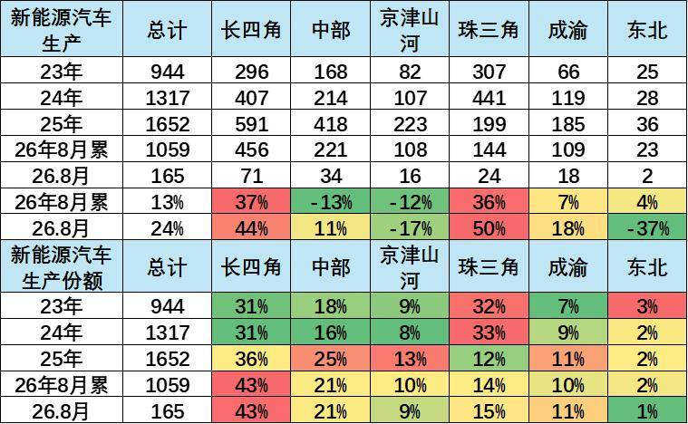
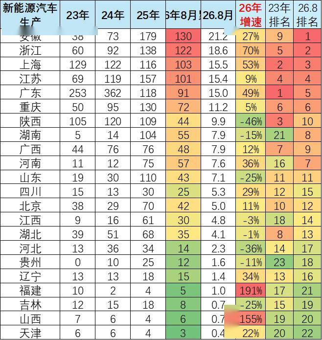
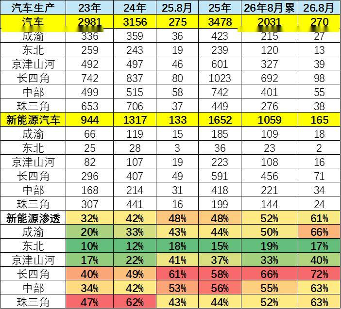

# 全国分省区汽车生产分析-长四角的汽车制造优势凸显

- 公開日時: 2026-10-01 12:30（北京時間）
- 出典: [搜狐号・崔东树](https://www.sohu.com/a/1083062554_115312)
- テーマ（自動判定）: 産業統計
- 画像: 7枚

---

注：本分析文章仅代表崔东树个人观点，如有异议，请留言。

2015-2026年国内汽车产量结构持续重构，新能源转型进一步放大区域产量分化，核心是各地产量此消彼长，并非简单的产能增减。总量上，全国汽车产量历经周期波动后回升，2026 年1-8 月总产量同比小幅下滑3%，增长动力主要依靠新能源拉动。

区域层面，长四角（长三角）产量占比持续走高，传统汽车产量份额从2015 年20.8% 提升至2026 年8 月单月36.5%；新能源产量占比达43%，8 月新能源渗透率72%，产量增速领跑全国，成为汽车产量的核心增长板块。中部板块产量稳步抬升，安徽贡献最大增量，8 月单月新能源产量跃居全国首位。珠三角传统汽车产量收缩，新能源产量仍保持韧性。老牌汽车产区产量明显回落：京津山河、成渝、东北传统汽车产量同比走弱，东北降幅最大；新能源产量基数偏低，8 月新能源渗透率仅17%，产量层面转型偏弱。

分省份看，安徽、浙江、上海新能源产量快速增长，排名大幅前移；陕西、吉林、山东等历史产量较高的传统汽车大省，当前产量持续下滑。各省新能源渗透率差距悬殊，浙江、上海接近80%，吉林仅10%。整体看，国内汽车、新能源汽车产量持续向长三角集中，传统基地产量萎缩，全国汽车产量区域格局加速重塑。

1、长四角的概念与汽车生产总体特征

常规地理概念 “长三角” 仅指江浙沪，为匹配国内汽车产业真实集群格局，我将上海、江苏、浙江、安徽四省市整合命名为 “长四角” 汽车产业集群，区别于传统地理长三角口径。

核心逻辑：安徽合肥、芜湖近年整车与新能源产能爆发，蔚来、比亚迪、大众安徽、奇瑞等项目落地，与江浙沪形成完整协同产业链，整车、零部件、动力电池高度联动，已无法拆分单独统计。

安徽已跃升国内汽车产量第一大省，和江浙沪深度绑定，“长四角” 成为研判国内新能源产能转移、区域竞争格局的核心观测单元。如果安徽放到中部，则无法体现华东的产业聚集变化。

2026 年1-8 月国内汽车生产总量同比小幅下滑3%，区域分化显著。长四角一枝独秀，累计产量692万台，同比增17%，8 月单月增速22%，是核心增长极。珠三角小幅正增4%，韧性尚可。中部、京津山河、成渝、东北均为负增长，东北压力最大，累计下滑22%，8 月单月降幅达32%。产业进一步向长三角集群集中，传统老基地产能收缩明显，区域汽车制造格局持续重构。

从汽车产量占比看，产业集聚趋势极强。长四角份额持续抬升，2026年1-8 月占比达34.1%，8 月单月进一步升至36.5%，已占据国内汽车生产三分之一以上，是绝对核心。中部占比稳步上行至近20%，成为第二大板块。珠三角份额从前期22% 左右回落至13%-14%，产能占比明显萎缩。京津山河、成渝占比小幅回落，东北持续下滑，仅5.9%，8 月单月低至4.7%。国内汽车产能加速向长三角、中部集中，老牌汽车基地权重持续走低，产业版图重塑。

2、汽车分省生产特征

分省份汽车生产格局剧烈重构，安徽8 月单月产量登顶，年增速14%，是最大黑马；浙江、上海增速亮眼（30%、29%），长三角三省一市全面走强。广东前期体量仍居总量首位，但生产较前期高点明显回落。传统汽车大省承压，吉林、陕西大幅下滑（-30%、-40%），湖北、重庆、湖南均负增长。老工业基地产能持续萎缩，中部安徽强势崛起，浙江、上海新能源拉动产量爆发，产业由传统基地向长三角新能源集群转移，省份排名发生重大洗牌。

3、新能源汽车生产总体特征

国内新能源汽车生产保持增长，但区域分化剧烈。2026 年1-8 月总产量同比增13%，长四角强势领跑，累计增速37%、8 月单月44%，份额跃升至43%，成为新能源核心承载区。珠三角韧性突出，8 月单月增速50%。

中部、京津山河累计产量负增，仅8 月单月小幅修复。东北新能源体量极小，8 月单月大幅下滑37%，转型压力巨大。新能源产能持续向长三角集聚，珠三角局部走强，传统基地转型进度分化，产业格局重构加速。

4、新能源汽车分省生产总体特征

新能源汽车省份产能格局深度重构。8 月单月安徽登顶，浙江第二，上海、江苏紧随，长三角四省市强势领跑。浙江增速高达70%，上海53%，广东49%，增长动能强劲。

广东虽累计产量仍靠前，但单月排名下滑。陕西、山东、河北、吉林等地出现明显负增长，传统基地转型承压。福建、山西实现爆发式增长，属于小基数下的快速突破。新能源产能持续向长三角集聚，安徽成为核心增量引擎，老牌汽车省份新能源产能增长乏力，省份排名大幅洗牌。

5、汽车省区生产变化

国内汽车产业新能源渗透率持续走高，8 月单月整体渗透率达61%，区域差异显著。长四角渗透率遥遥领先，8 月达到72%，新能源转型领跑全国；中部、珠三角、成渝均突破60%。京津山河、东北渗透率偏低，东北仅17%，转型短板突出。长四角新能源产量快速扩张，叠加传统车增量，形成产业高地。

东北传统汽车产量萎缩，新能源产能不足，渗透率提升缓慢。产业呈现强者愈强格局，区域新能源转型进度差距持续拉大。

各省新能源汽车渗透率分化明显，全国8 月单月渗透率达61%。浙江、上海领跑，8 月渗透率接近80%；贵州、山西、广西也处于高位，贵州单月渗透率高达94%。安徽、江苏、广东、重庆、陕西等主产区渗透率超过60%。吉林、河北、山东等传统汽车大省渗透率偏低，吉林仅10%，转型压力突出。长三角省份普遍高渗透率，新能源产能与渗透率双高。部分小产量省份渗透率虚高，老牌基地转型滞后，省份间新能源转型差距持续拉大。

附：近日信息合集
