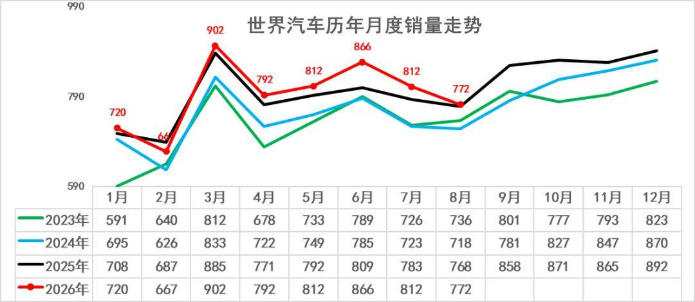
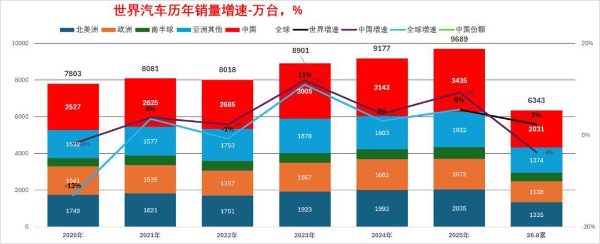
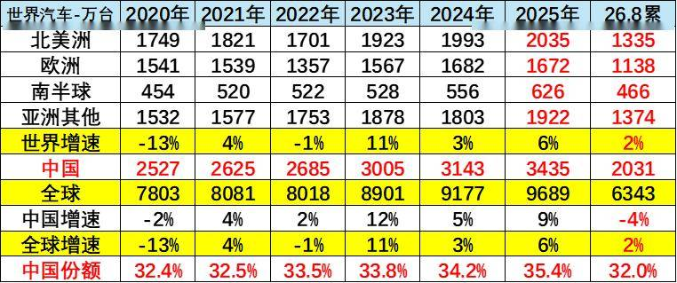
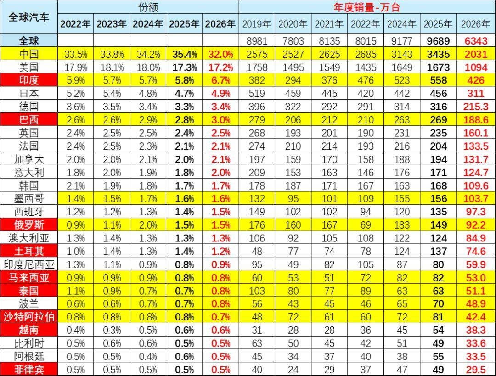
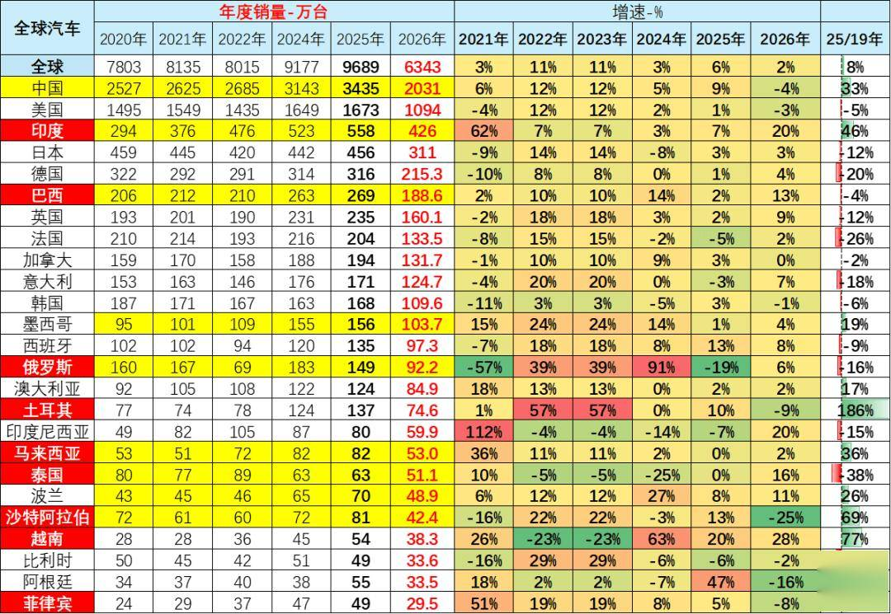
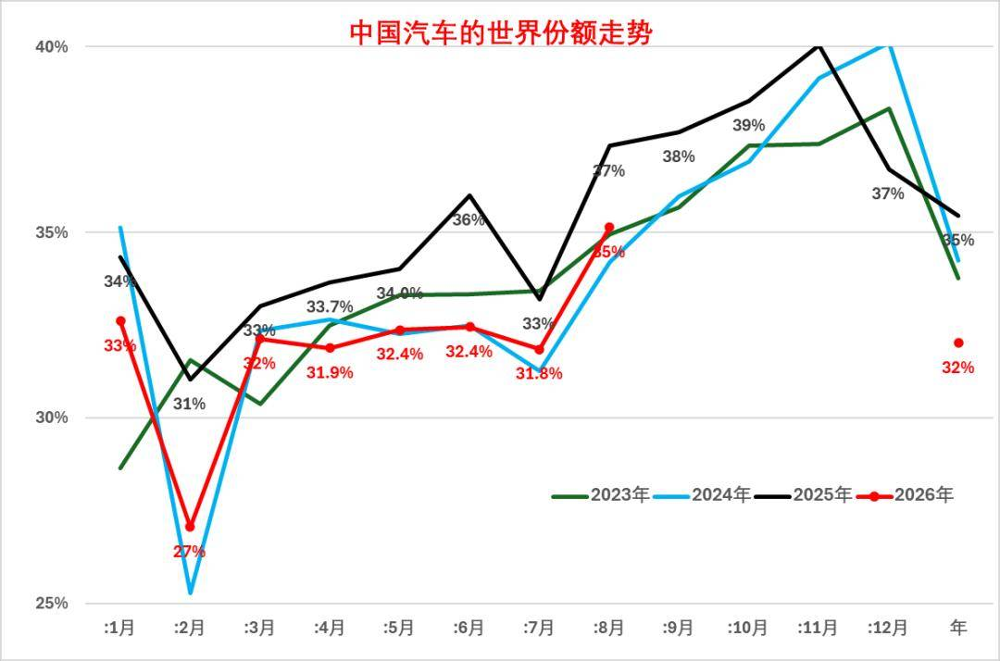
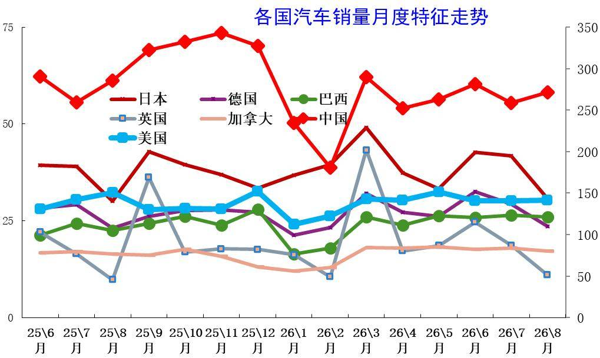
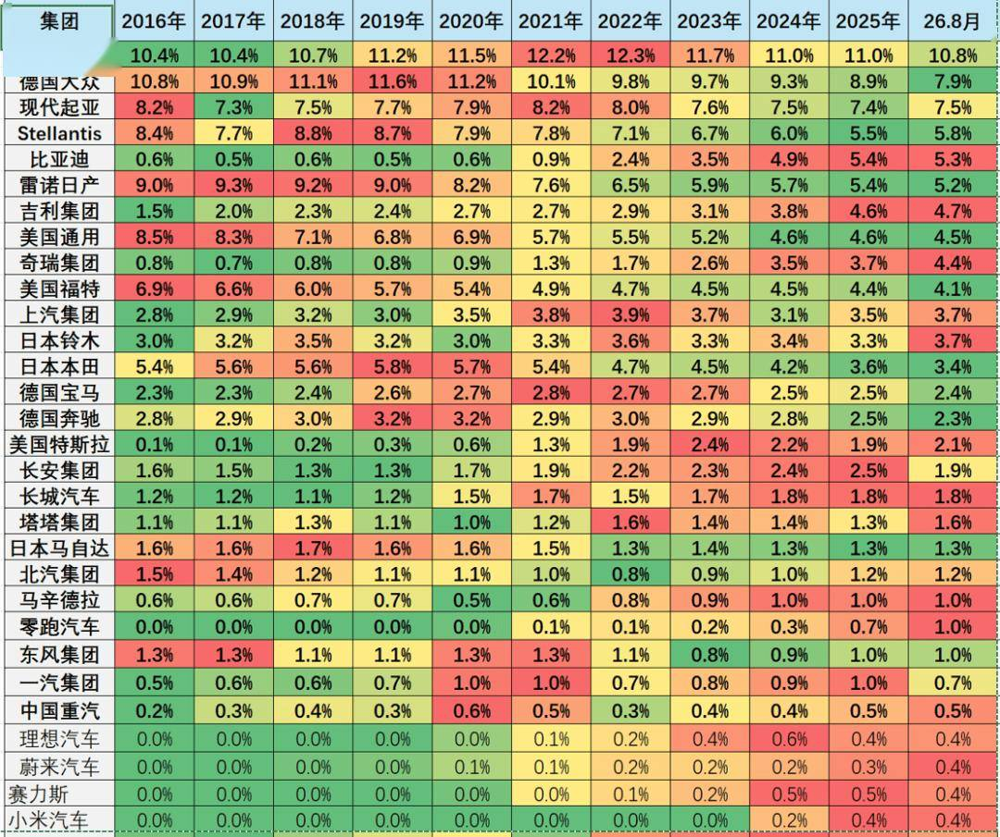
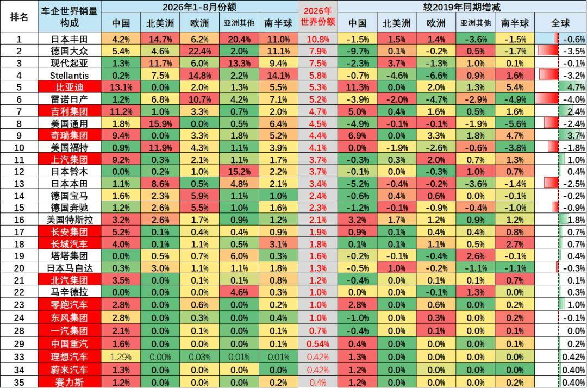

# 2026年1-8月中国占世界汽车份额32%

- 公開日時: 2026-10-02 12:30（北京時間）
- 出典: [搜狐号・崔东树](https://www.sohu.com/a/1083353151_115312)
- テーマ（自動判定）: 世界市場
- 画像: 9枚

---

注：本分析文章仅代表崔东树个人观点，如有异议，请留言。

根据世界汽车组织统计数据，全球汽车生产不断增长，2025年达到9638万台，较2024年的9177万台增6%，中国占世界生产份额35.4%。全球汽车销量不断增长，2025年达到9689万台，增6%，中国占世界销量份额35.4%。2026 年1-8 月，世界汽车累计销量6343 万台，同比增长2%；其中8 月单月销量771.9 万台，同比仅增1%，环比下滑4.9%，全球车市增长动力偏弱。

2026 年1-8 月全球汽车累计销量6343 万台。分国家来看，中国销量2031 万台，份额32.0%，较2025 年35.4% 明显回落；美国销量1094 万台，份额17.2%，小幅下滑；印度表现亮眼，份额提升至6.7%，成为增长亮点。从历年份额变化看，2022-2025 年中国在全球占比持续走高，2025 年达到阶段性高点。欧洲主要国家份额整体稳中有降，巴西、俄罗斯等新兴市场份额保持稳定。2026 年前8 月中国市场销量下滑，是全球份额变动的核心原因，印度等新兴市场的快速增长，一定程度对冲了中、美市场的增长压力，支撑全球车市维持小幅正增长。2026年1-8月的全球汽车销量增2%，其中印度汽车市场销量增20%，泰国汽车市场增16%，俄罗斯市场销量增6%，越南增28%。新兴市场拉动市场表现较好。

东升西降，除了丰田、现代起亚、铃木和塔塔等，其它国际品牌份额2026年出现较大幅下滑。相对于2019年的中国自主品牌全面提升世界份额。吉利、比亚迪、奇瑞、上汽、长安等自主表现较强。电动化发展也导致部分国际车企逐步走向衰落。除了铃木等印度市场较好的因素促进，其它欧美国际品牌份额出现全面较大的下滑。

1、当月世界汽车销量走势

2025年以来世界车市增长总体较好，各月均好于同期水平。2026年世界车市波动较大，因2026年中国春节在2月，中国春节前车市销量平稳导致世界1月增长较好，但2月因春节因素导致中国车市销量剧烈下滑，3-7月走势明显改善，8月回落明显。

2026 年1-8 月，世界汽车累计销量6343 万台，同比增长2%；其中8 月单月销量771.9 万台，同比仅增1%，环比下滑4.9%，全球车市增长动力偏弱。2025 年全球汽车全年销量9689 万台，同比增长6%，是近年较好水平。对比历年数据，2023 年全球车市实现11% 的高复苏增速，2024 年增速回落至3%，2025 年回升至6%，2026 年增长明显放缓。主要受中美两大核心车市年初销量承压拖累。2026 年一季度销量2289 万台，二季度2471 万台，二季度表现优于一季度，但8 月环比回落，四季度市场表现将决定全年增速能否维持正增长。

2、历年世界汽车销量走势

上表中的世界汽车销量主要是70个国家的销量，这70个核心国家在2019年有9000万台左右，这也是基本能跟踪到月度的销量。由于战乱频发，近几个月世界数据偏慢。

其它还有100个国家只能是跟踪到年度的销量，近年总共大约300万台左右，相对8000万台的70家主力国家，这些较小的国家总量也就是3%左右，影响不大。

从主力国家代表的世界销量看，2018年后开始下滑周期，2020年进入谷底；2021年开始回升；2026年的世界销量增速2%的表现较好，其中中国车市下滑4%的影响较大。今年中国车市的综合表现低于预期，世界车市增长压力也在加大。

3、中国2026年销量保持领军地位

中国汽车市场对世界汽车市场影响力极其巨大。2016-2018年中国汽车占世界30%左右；2019年下降到29%，但仍具有绝对优势；2020-2021年份额回升到32%；2022年中国份额上升到33.5%；2023年中国份额保持在33.8%；2024年中国达到世界汽车的34.2%的份额；2025年中国达到世界汽车的35.4%的份额。

2026 年1-8 月全球汽车累计销量6343 万台，同比增长2%；其中中国市场销量2031 万台，同比下降4%，中国销量占全球份额回落至32.0%，拖累全球大盘增长。分区域看，2026 年前8 月北美洲1335 万台、欧洲1138 万台、亚洲其他1374 万台、南半球466 万台。回顾历年，全球销量自2020 年疫情低谷后持续修复，2023 年增速11%，2025 年全球销量9689万台，增速6%，中国市场当年增速9%，份额达到35.4%的高点。2026 年中国车市负增长，是全球增速放缓的核心因素，海外各区域市场保持正增长，对冲部分国内市场压力。

4、发展中国家市场大幅走强

2026 年1-8 月全球汽车累计销量6343 万台。分国家来看，中国销量2031 万台，份额32.0%，较2025 年35.4% 明显回落；美国销量1094 万台，份额17.2%，小幅下滑；印度表现亮眼，份额提升至6.7%，成为增长亮点。从历年份额变化看，2022-2025 年中国在全球占比持续走高，2025 年达到阶段性高点。欧洲主要国家份额整体稳中有降，巴西、俄罗斯等新兴市场份额保持稳定。2026 年前8 月中国市场销量下滑，是全球份额变动的核心原因，印度等新兴市场的快速增长，一定程度对冲了中、美市场的增长压力，支撑全球车市维持小幅正增长。

中国车市近几年走势总体较好，份额持续提升，2020年以来中国的世界份额持续提升，到2023年达到33.8%，2024年中国车市达到34.2%，2025年中国车市达到世界35.4%，2026年中国车市达到世界32%，较2025年下滑3.4个百分点。

5、世界各国市场走势

2026年1-8月的全球汽车销量增2%，其中中国汽车销量下降4%，美国销量下降3%，印度汽车市场销量增20%，泰国汽车市场增16%，俄罗斯市场销量增6%，越南增28%。新兴市场拉动市场表现较好。

6、中国的世界市场份额走势

中国汽车的世界份额近期逐步稳定在34%-36%区间。2026年初，随着两新补贴政策逐步启动的进度平缓，导致中国汽车1-2月销量下滑较大，3月份额回升，8月份额回升到35%，2026年累计份额32%。7、各国汽车销量月度走势特征

从世界各国的月度销量增速走势来看，基本保持月度之间的走势均衡状态。但受到季节因素、年度因素等诸多影响，各国走势仍有较大反差。

由于中国车市仍是私车普及期，呈现年初年末相对较强、年中走势相对偏软的情况，而印度车市呈现年初相对较强，年中相对平稳的特征。

8、国际集团的世界占比表现

本图为各主力汽车集团的世界销量份额走势。从目前集团综合表现来看，国际头部车企份额明显下降，中国车企普遍表现较强。随着印度、巴西、俄罗斯的国际车市地位提升，加之吉利、奇瑞、铃木等亚洲车企的市场表现较好，所以东亚车企产销走势较好。欧洲车企表现普遍较差。

今年1-8月的世界前10车企中3家中国车企的份额是较强的，比亚迪回升到世界第5位。吉利第7位，奇瑞第9位。

9、国际集团的各区域份额表现

东升西降，今年相对于2019年的中国自主品牌全面提升世界份额。吉利、比亚迪、奇瑞、上汽、长安、长城等自主表现较强。

除了丰田、现代起亚、铃木和塔塔等，其它国际品牌份额2026年出现较大幅下滑。

亚洲车企较强，2026年丰田集团表现相对较强，较2019年降0.6%，2026年在世界份额保持在11%左右的水平，这也是因为丰田在欧洲和北美市场总体表现较强。韩国现代汽车的走势较平稳，2026年达到7.5%，较2019年降0.1%，韩国现代集团在北美和亚洲其它市场表现很好，但在中国因产品力不强而持续走势偏弱。铃木的市场表现较强，主要是印度和日本等市场表现较强。本田集团也在今年较2019年下滑2.5%的表现较差，中国市场表现偏弱。

2026年欧洲车企普遍较弱，尤其雷诺日产、stellantis、 大众的表现相对较弱，份额较2019年下降3个点左右，也就是损失近300万台。这些欧洲企业的中国市场压力大，中国市场不能退缩，需要二次创业。电动化转型成功带来中国二线车企的全面增长。
