# 2026年1-8月世界新能源车分析

- 公開日時: 2026-10-07 17:26（北京時間）
- 出典: [搜狐号・崔东树](https://www.sohu.com/a/1084890228_115312)
- テーマ（自動判定）: 世界市場
- 画像: 18枚

---

注：本分析文章仅代表崔东树个人观点，如有异议，请留言。

2026年1-8月世界汽车销量达到6343万台，新能源汽车达到1570万台。2026年1-8月世界新能源乘用车达到1570万台，同比增15%，其中8月新能源车销量223万台增16%，增速回到历史正常水平。2026年1-8月的新能源车份额达到24.5%，其中纯电动车的占比达到17.3%，插电混动达到7.5%的汽车比例。混合动力达到8%的表现优秀。

2025年美国新能源的销量172万台降2%，相对近几年增速较低。由于高关税和新能源补贴取消的涨价因素，美国新能源车2026年8月销量11万台同比降44%，1-8月美国新能源车销量82万台，同比降低31%。欧洲新能源乘用车2025年销量386万台，较去年同期增量96万台，增33%。初步统计欧洲新能源乘用车8月32万台同比增33%，2026年1-8月312万台同比增34%。

世界新能源车渗透率总体呈现快速提升趋势，2022年已经达到13.1%水平，2023年达到15.9%，2024年达到19.5%，2025年渗透率达到23.6%，2026年世界新能源车渗透率24.7%，其中，德国达到33.4%，挪威达到80%，英国36%，而美国仅有7%，日本仅有4%，因此世界新能源发展的不均衡性极为明显。

2026年1-8月中国新能源乘用车世界份额达到62%,2026年7-8月达到65.3%的较好水平。从历年销量份额看，中国的比亚迪世界领先，吉利迅速崛起，特斯拉表现不强，下滑到第三位。近期上汽集团乘用车和上汽五菱两家自主车企海外表现较好。2026年中国在世界纯电动车市场份额59%份额，年初因素的中国纯电动车表现暂时较差，3季度达到63.6%。2026年中国在世界插电混动份额达到71%的高水平，7-8月达到74%，中国在世界插电混动市场呈现超强的表现。

2025年自主新能源乘用车海外市场销量份额达到15.8%，提升6.2个百分点。2026年自主新能源乘用车海外市场销量份额大幅提升，8月达到29%，进一步大幅跃升14个百分点。

一、世界新能源汽车走势

1、2026年世界新能源汽车表现

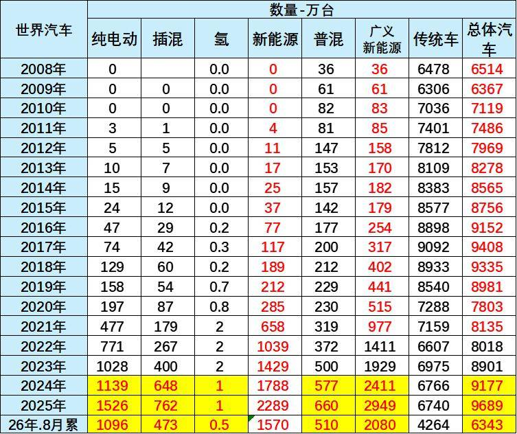

2024年世界汽车销量9177万台，其中新能源汽车销量1788万台，燃油车销量占比相对下降。2025年份世界汽车销量达到9689万台，新能源汽车达到2289万台。

2026年1-8月世界汽车销量达到6343万台，新能源汽车达到1570万台。2026年1-8月普通混合动力超过插混成为增长亮点。

2、世界汽车能源结构

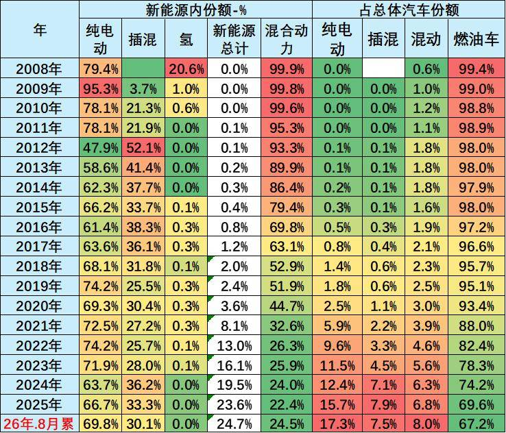

2025年世界广义新能源车销售比例达到世界汽车销量占比为30%，比2024年全年增长4个百分点的水平，而狭义新能源车达到了23.6%的水平，呈现相对较强的状态。

2026年1-8月的新能源车份额达到24.5%，其中纯电动车的占比达到17.3%，插电混动达到7.5%的汽车比例。混合动力达到8%的表现优秀。

二、世界新能源乘用车走势

1、世界新能源乘用车市场走势

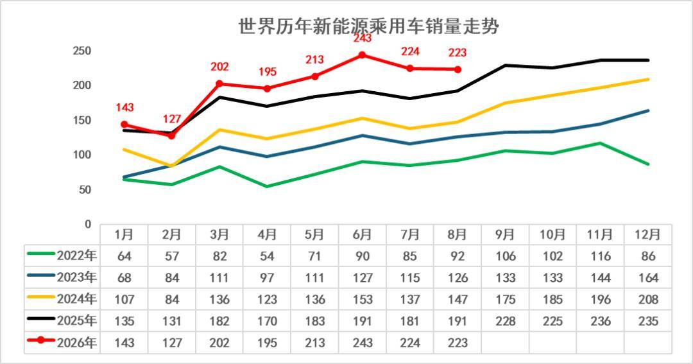

2022-2024年世界新能源车呈现加速上升态势，低基数下的增长更强。2025年世界新能源车起步较低，随后2-9月恢复高增长。

2022-2026 年全球新能源乘用车销量的强劲增长态势：整体规模持续扩张，2025 年月度销量已突破230 万辆，较2022 年近乎翻倍；2026 年前8月延续高增，3-8月同比增量显著提升。

2、世界新能源乘用车表现

2022年世界新能源乘用车走势较强，全年达到1050万台，同比增长65%。2023年世界新能源乘用车走势较强，全年达到1412万台，同比增长34%。

2024年世界新能源乘用车达到1788万台，同比增长27%。因为欧美新能源走势放缓，世界新能源相对前几年的走势放缓较大。2025年世界新能源乘用车达到2289万台，同比增28%。

2026年1-8月世界新能源乘用车达到1570万台，同比增15%，其中8月新能源车销量223万台增16%，增速回到历史正常水平。

3、海外新能源乘用车市场走势

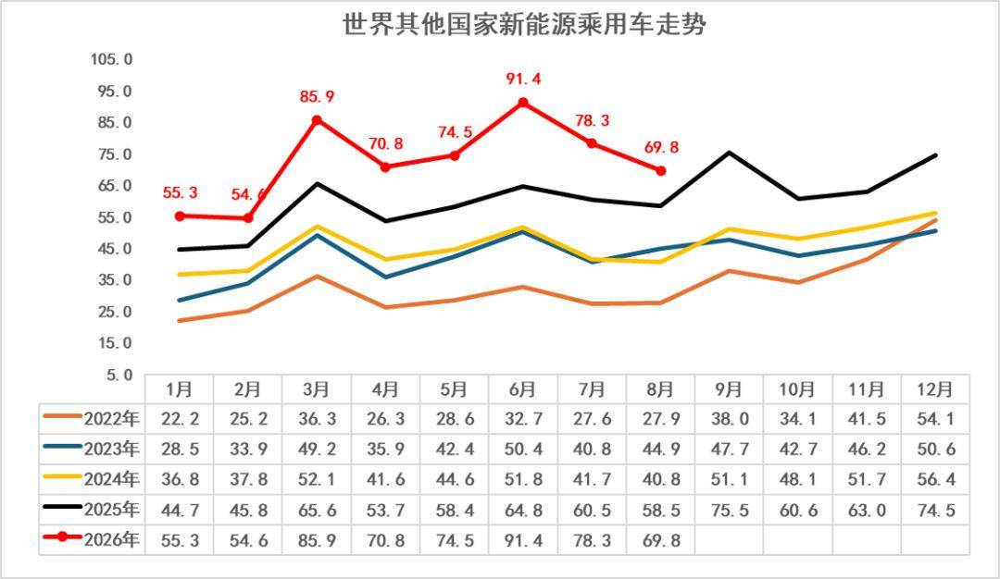

今年8月的海外走势相对波动较大，形成海外新能源市场走势分化的特征。由于欧洲新能源市场较大，因此海外新能源总体表现较好。

中国之外市场的新能源走势总体增长异常，美国新能源近期走势剧烈波动，由于欧洲新能源走势大幅回暖，因此海外其他国家新能源车8月销售70万台增19%，海外新能源车1-8月销量581万台、增速达到28%，接近于前两年平均水平。

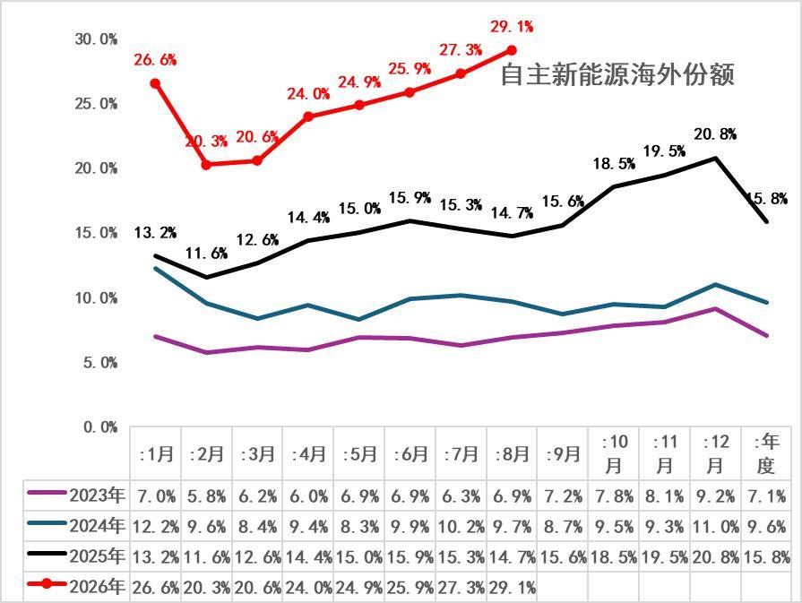

目前海外可统计到的主流市场中，自主品牌新能源的海外市场分析总体表现持续走强。2023年中国自主品牌新能源车在海外市场份额7.1%；2024年自主新能源乘用车海外销量份额9.6%，增2.5个点。2025年自主新能源乘用车海外市场销量份额达到15.8%，提升6.2个百分点。2026年自主新能源乘用车海外市场销量份额大幅提升，8月达到29%，进一步大幅跃升14个百分点。

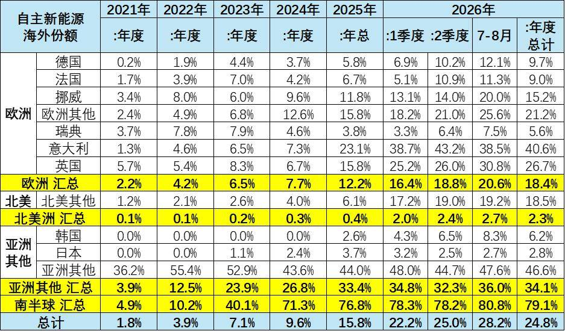

2026年1-8月自主新能源乘用车海外市场销量份额24.8%，同比2025年同期提升9个百分点。由于自主新能源出口表现较好，而美国新能源车市场萎缩严重，因此自主新能源乘用车海外市场销量份额提升较大。目前在南美的新能源份额均超80%,东南亚的新能源份额达到47%。

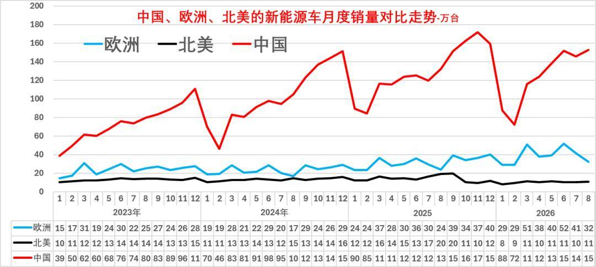

从新能源车的区域市场走势看，2020年欧洲超越中国。2021-2026年的欧洲新能源车市场总体高位平稳增长，而中国新能源车市场近几年持续走势强劲。

中国国内新能源今年1-8月低迷是暂时的，出口是持续增长，而美国新能源走势远弱于中国走势。

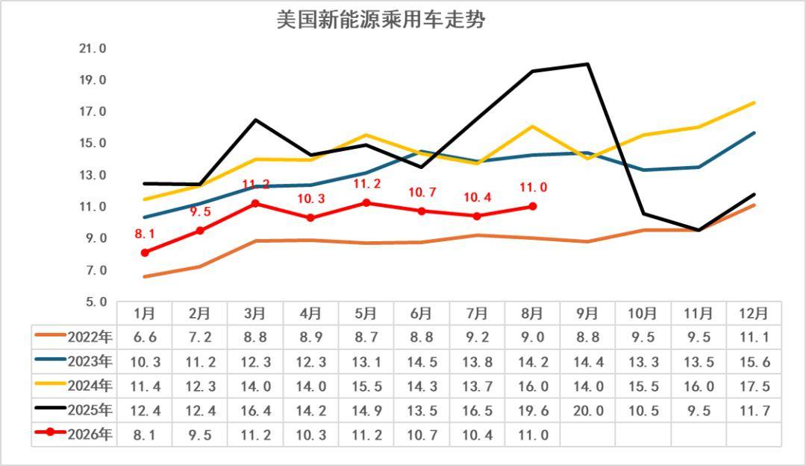

美国新能源乘用车在2025年10月之后走弱。欧美目前的早期尝试者和环保主义者都已经购买了电动汽车，美国政府取消了新能源车的补贴，对美国新能源的影响较大，即使特斯拉放开自动驾驶的使用，但销量渗透率提升没有达到预期。

2025年美国新能源的销量172万台降2%，相对近几年增速较低。由于高关税和新能源补贴取消的涨价因素，美国新能源车2026年8月销量11万台同比降44%，1-8月美国新能源车销量82万台，同比降低31%。

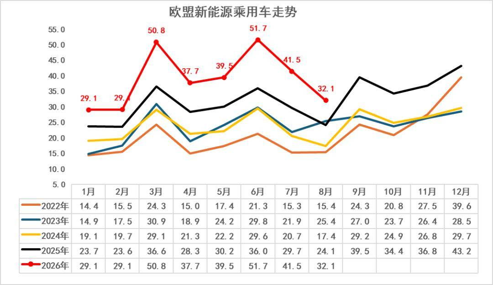

历年8月的欧洲新能源车销量均相对较低，今年市场环比回落，目前在欧洲经济和消费低迷的背景下，欧洲新能源的增长仍是较大的。

欧洲新能源乘用车2025年销量386万台，较去年同期增量96万台，增33%。初步统计欧洲新能源乘用车8月32万台同比增33%，2026年1-8月312万台同比增34%。

4、世界各国新能源渗透率

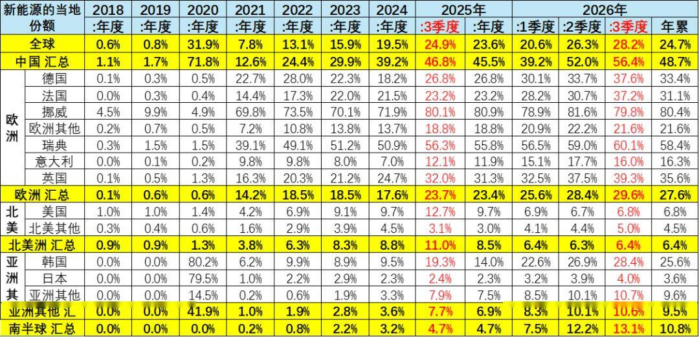

世界新能源车渗透率总体呈现快速提升趋势，2022年已经达到13.1%水平，2023年达到15.9%，2024年达到19.5%，2025年渗透率达到23.6%，2026年世界新能源车渗透率24.7%，其中，德国达到33.4%，挪威达到80%，英国36%，而美国仅有7%，日本仅有4%，因此世界新能源发展的不均衡性极为明显。

随着中国继续强化新能源发展，美国弱化新能源的鼓励政策。欧洲新能源补贴逐步重启，世界新能源车进入分化发展的新阶段。

三、世界新能源乘用车结构特征

1、世界新能源乘用车市场走势

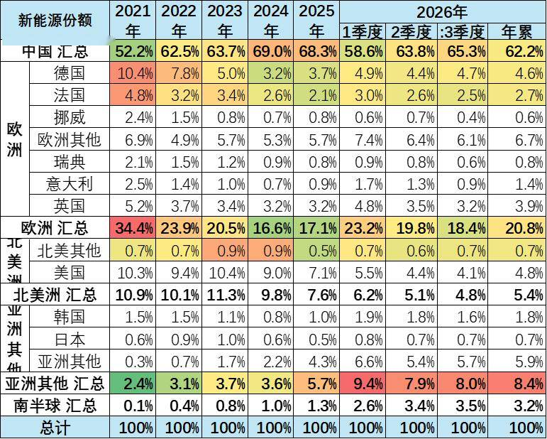

2021年全年的欧洲新能源市场受疫情影响，新能源增长较弱。2022年仍受到疫情影响，欧洲2022年较2021年份额下降较大，2023-2024年欧洲份额继续小幅下降。2025年欧洲新能源的世界份额达到17%，2026年1-8月欧洲新能源的世界份额达到21%，较去年同期的份额大幅提升。

近期中国新能源乘用车的增速强于世界平均增长速度，2020年中国新能源乘用车世界份额较大反转。2021年中国全年保持52%的较强水平；2022年的中国新能源乘用车世界份额超过62%；2023年的中国占世界份额64%；2024年继续冲刺到69%的份额；2025年中国新能源乘用车世界份额68.3%；2026年1-8月中国新能源乘用车世界份额达到62%,2026年7-8月达到65.3%的较好水平。

2、各厂家新能源车份额走势

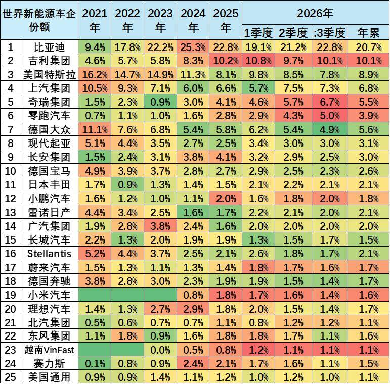

从历年销量份额看，中国的比亚迪世界领先，吉利迅速崛起，特斯拉表现不强，下滑到第三位。近期上汽集团乘用车和上汽五菱两家自主车企海外表现较好。

吉利汽车与奇瑞新能源近期走强明显。德国大众的新能源车表现较平稳，宝马集团、韩国现代等下降到第三梯队水平。

豪华车的新能源化浪潮竞争相对激烈，美国特斯拉表现放缓。目前宝马、奔驰的走势一般。

四、纯电动新能源车结构市场走势

1、纯电动的世界结构

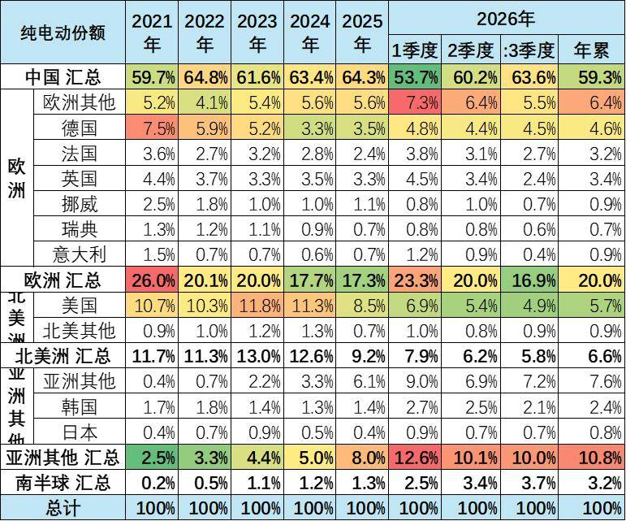

中国在世界纯电动车市场份额表现相对平稳，2023 -2025年的份额在63%的左右份额水平；2026年中国在世界纯电动车市场份额59%份额，年初因素的中国纯电动车表现暂时较差，3季度达到63.6%。

欧洲纯电动车的份额从2021年26%，到2023年下降到20%的水平，2026年1-8月的份额相对回落到20%。2025年美国电动车份额仅有8.5%，而2026年1-8月的5.7%的表现下降巨大。

2、车企份额走势

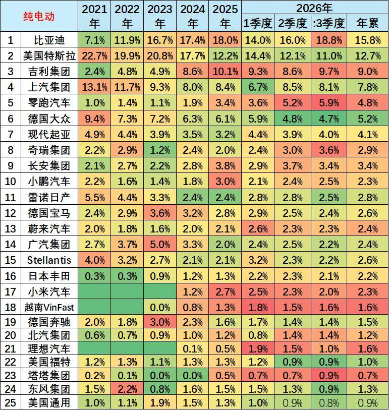

从车企的纯电动份额来看，比亚迪的份额总体来看持续上升。从2021年7%的份额水平， 2023年的份额上升到17%，2024 -2025年的份额达到18%的表现良好。2026年1-8月的比亚迪份额降到16%，7-8月逐步恢复到19%。

纯电动车中的特斯拉份额表现相对较差，特斯拉2021年在23%左右的份额水平，目前保持下滑到13%的较低水平。

吉利集团的份额从2019年的4%上升到2026年9%。上汽的纯电动份额近期较强，广汽集团和长安纯电动相对平稳。

五、插混新能源车结构市场走势

1、插混的世界结构

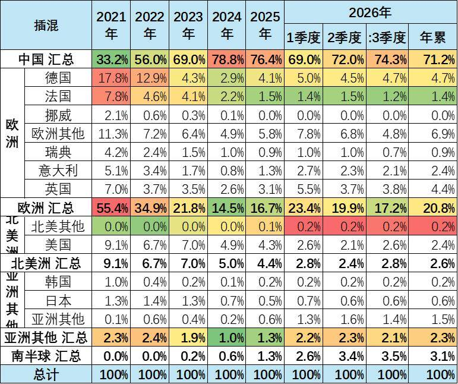

中国在世界插电混动份额表现遥遥领先。2021年中国在世界插电混动份额在33%的水平，2025年中国在世界插电混动份额达到76.4%的超高水平，2026年中国在世界插电混动份额达到71%的高水平，7-8月达到74%，中国在世界插电混动市场呈现超强的表现。

欧洲的插电混动份额从2021年的55%，下降到2026年的21%的水平。

2、车企份额走势

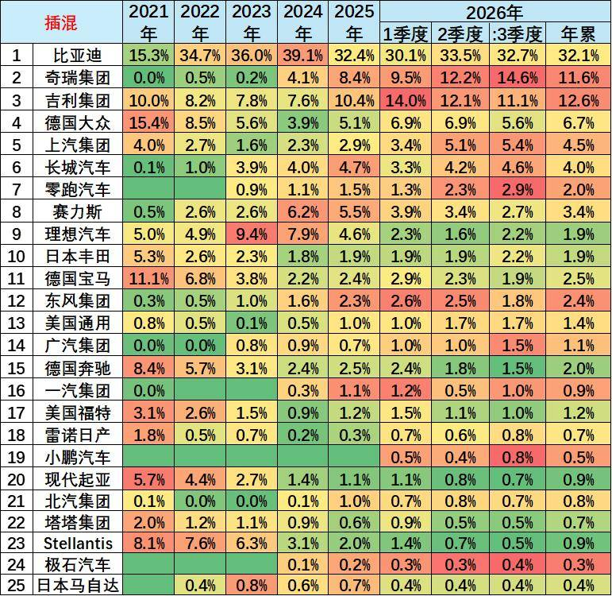

从车企的插电混动份额来看，比亚迪表现最为突出。比亚迪2021年的世界插电混动份额15%，2023年上升到世界插电混动份额36%的水平，2024年的比亚迪插混份额39%很好，今年1-8月份额维持在32%，体现了比亚迪插电混动市场的领军表现。

德国大众的插电混动份额2021年大幅上升到15%，随后下滑到2024年谷底，2026年又回升到7%的份额。宝马的插电混动份额随后下滑到2024年谷底，2026年又回升到2.5%的水平。吉利沃尔沃的插电混动占到世界12.6%的水平。

六、混合动力车结构市场走势

1、普混的世界结构

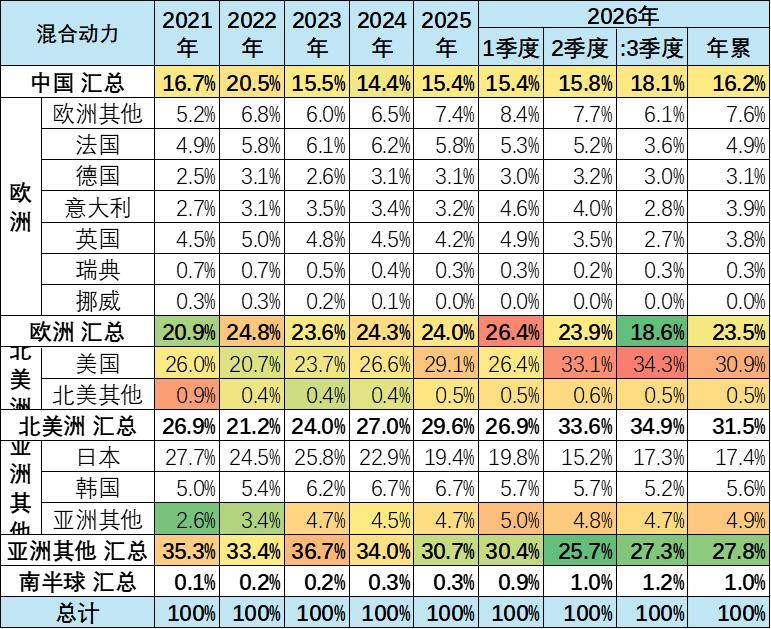

中国前两年混动高速发展，2022年成为世界较大的混动市场。随着插混崛起，2023年以来中国混合动力的世界份额下降，但2026年中国混合动力份额回升到世界的16%。

2024年以来美国的混动市场回升较大。2026年美国的混动市场占全球的31%。

2、普混的企业份额走势

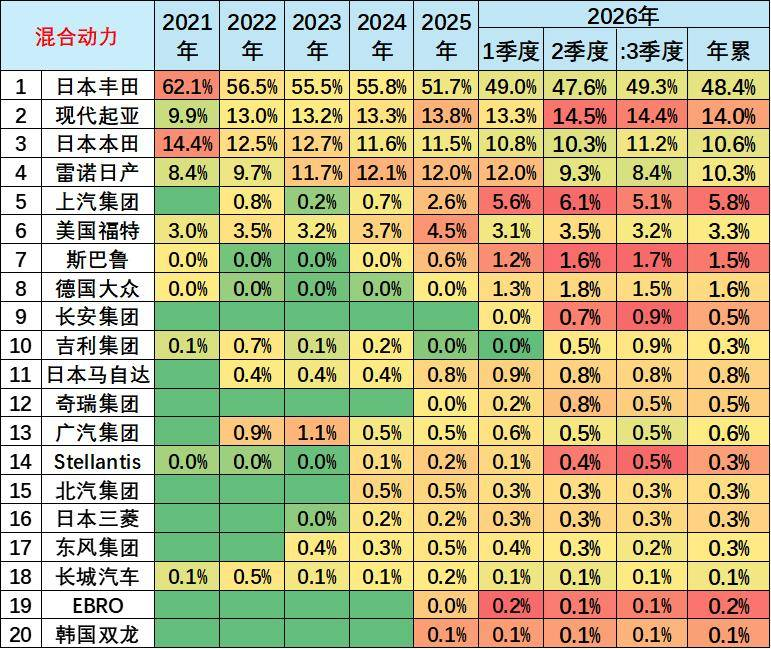

混合动力市场是日韩强势占据，丰田、本田、日产和现代的混动表现很强，2026年占据83%。

随着欧洲打压中国自主车企纯电动车，上汽名爵的混合动力在欧洲市场表现迅速走强到6%的超强水平。

其它大部分企业的混动份额均不超过1%。近期福特和马自达在美国的混动市场份额表现较好。

附：近日信息合集
