# 2026年1-8月中国车企出口流向与海外自主品牌数据跟踪

- 公開日時: 2026-10-08 16:26（北京時間）
- 出典: [搜狐号・崔东树](https://www.sohu.com/a/1085170493_115312)
- テーマ（自動判定）: 自主ブランド 海外販売
- 画像: 16枚

---

注：本分析文章仅代表崔东树个人观点，如有异议，请留言。

自2021年以来，随着世界新冠疫情的爆发，中国汽车产业链的韧性较强的优势充分体现，中国汽车出口市场近两年表现超强增长。中国自主车企在海外部分地区销量特征较强。2025年中国自主车企在海外部分能持续统计的地区的当地销量354万台，同比增长28%；2026年8月的中国海外市场自主品牌销量44.2万台，同比增长52%，1-8月的中国海外市场自主品牌可统计销量336万台，同比增长59%，中国自主的海外部分可统计市场的零售表现很好。

我们总体自主汽车销量2026年1-8月在海外市场的份额7.8%，同比提升2.1个百分点。自主汽车在全球各地销量差异巨大，南半球22%，欧洲12%，东南亚和中东在9%左右，但出口美国、日韩还是很谨慎的。2026年1-8月自主新能源乘用车海外市场销量份额24.8%，同比2025年同期提升9个百分点。其中自主品牌在南半球的新能源份额超79%，在东南亚等地区达到47%，欧洲达到18.4%。

低价是重要基础，技术创新促进新能源持续突破。由于有中国家电等产业出海的经验教训，汽车出海的策略日益清晰完善，从KD组装到本地化生产、海外并购，车企海外战略效果突出。目前我国自主品牌出口进入了强化根据地打造游击区的农村包围城市的战略新阶段。自主品牌在海外以建设KD组装为起步，逐步加大本土化产业链建设，以整车企业为龙头，零部件与整车抱团出海效果显著，上汽、吉利、长城、奇瑞等取得巨大的成功。自主整车出口从买断模式基本全面转向经销模式，比亚迪、长城、奇瑞等自主整车品牌建设海外本土化的商务管控中心，全面监督当地提升销售服务网点的体系能力，自主品牌在当地市场的口碑越来越好。

一、中国自主车企海外表现

1、中国自主车企在海外部分地区月度销量走势

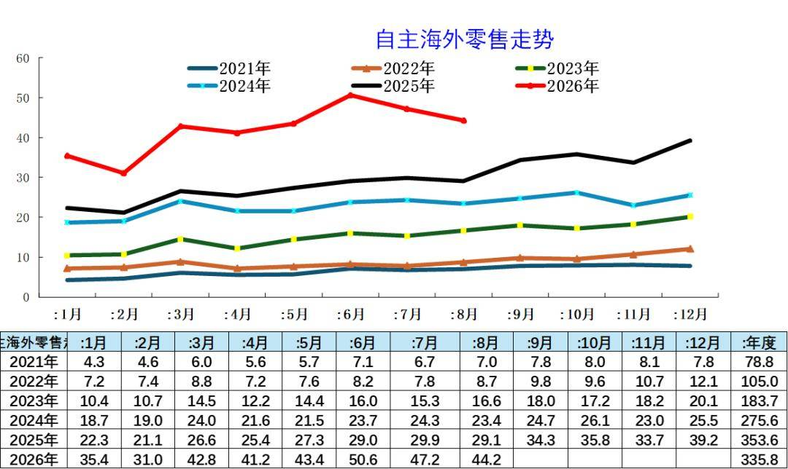

近几年的中国汽车出口不断走强，年内呈现夏季走高过山车的见顶回落走势特征。从中国汽车的海外出口零售数据看，月度走势相对平稳，近期呈现较好的增长态势，尤其2025年开始的拉升速度较快，推动2026年年初的同比超高增长，6月销量历史新高，8月海外销量44.2万台，仍高于1-5月峰值销量。

2、中国自主车企在海外部分地区销量特征

中国自主车企在海外部分地区销量特征较强。2025年中国自主车企在海外部分能持续统计的地区的当地销量354万台，同比增长28%；2026年8月的中国海外市场自主品牌销量44.2万台，同比增长52%，1-8月的中国海外市场自主品牌可统计销量336万台，同比增长59%，中国自主的海外部分可统计市场的零售表现很好。

3、中国出口车海外数据大幅增长

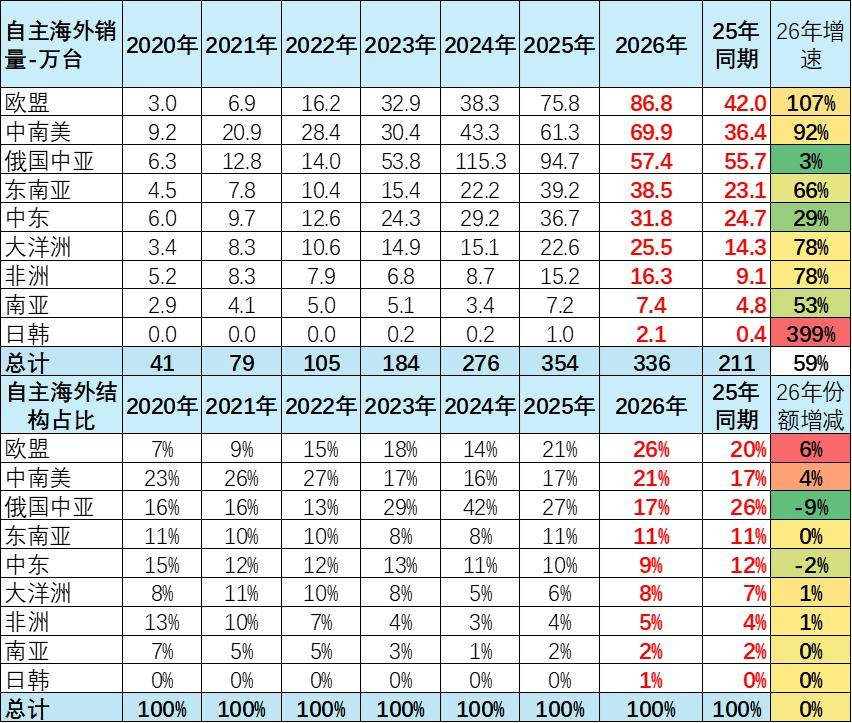

中国汽车出口表现极其优秀，从中国海关数据来看增长极其迅猛。而从海外当地市场的数据统计来看，中国汽车出口也呈现更加强势良好增长局面。中国海外市场波动发展，2026年海外市场零售较强的是东南亚、中南美、欧盟，而出口走势较差的是俄国中亚地区、美国、印度等地区。

海外增速超强的最主要原因是过去我们的汽车出口很多处于非洲等不发达国家，或者是难以统计的市场，因此海外数据体现的并不是很充分，而现在我们出口体现在海外的一些高端市场表现更为突出，所以总体可以看到海外数据的中国汽车出口增长速度在2023-2025年呈现强势增长态势，尤其2022年以来中国汽车出口呈现一轮爆发式增长的态势，在欧洲市场呈现连续3年较强增长，2024年走弱，因此2025-2026年在欧盟的市场较强。

4、自主车企海外份额大幅增长

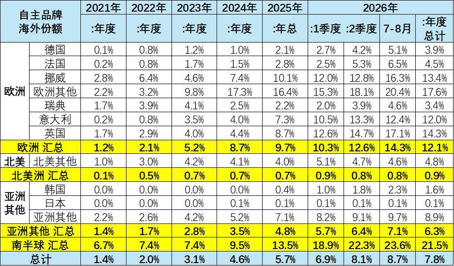

我们总体自主汽车销量2026年1-8月在海外市场的份额7.8%，同比提升2.1个百分点。自主汽车在全球各地销量差异巨大，南半球22%，欧洲12%，东南亚和中东在9%左右，但出口美国、日韩还是很谨慎的。

2026年1-8月自主新能源乘用车海外市场销量份额24.8%，同比2025年同期提升9个百分点。其中自主品牌在南半球的新能源份额超79%，在东南亚等地区达到47%，欧洲达到18.4%。由于自主新能源出口表现较好，而美国新能源车市场萎缩严重，因此自主新能源乘用车海外市场销量份额提升较大。目前在南美的新能源份额均近80%,东南亚的新能源份额达到47%。

5、自主品牌出口车海外数据大幅增长

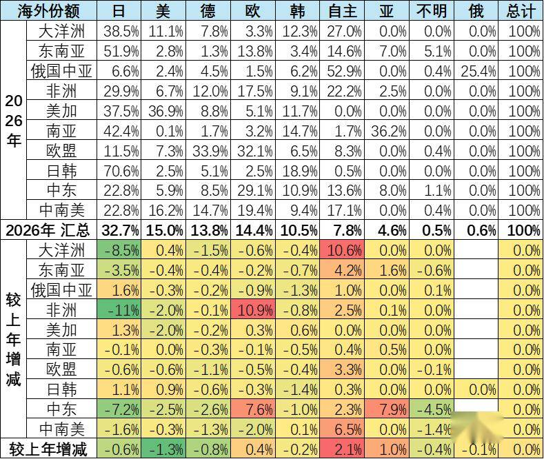

目前2026年1-8月中国自主海外销量份额主要是俄罗斯超强，大洋洲、非洲等地区超22%，中南美、中东、东南亚份额在15%左右，欧盟8%，日韩和美国几乎为零。自主在俄罗斯第一，在大洋洲和非洲、东南亚弱于日系，处于第二。在欧盟、中东、中南美低于欧盟自己车企和日系，处于第三。

印度等部分国家还有自己的汽车工业，世界汽车的多极化特征尚未改变。

6、中国车企出口车海外份额大幅增长

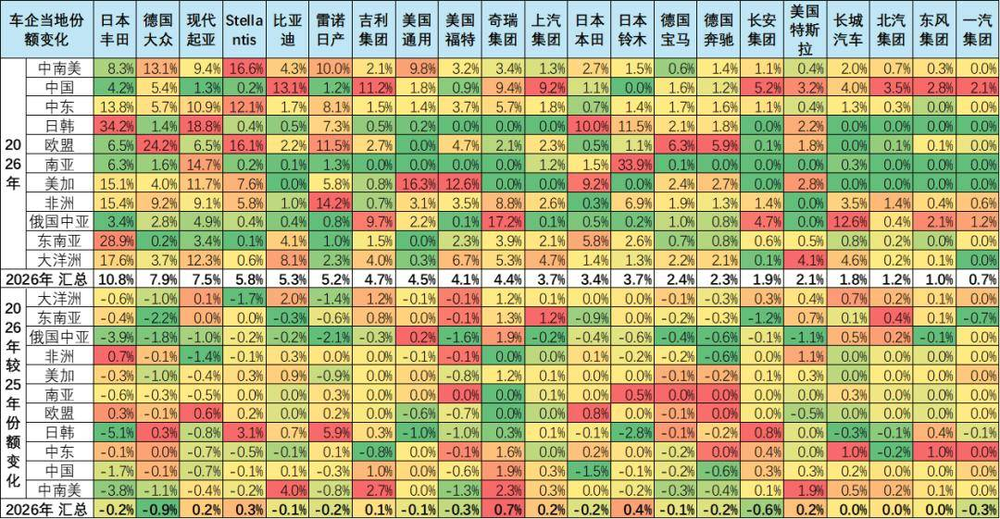

2026年比亚迪等中国车企在大洋洲和南美的份额明显提升。日本丰田、本田、铃木等在大洋洲、非洲、东南亚的压力加大。

二、中国自主车企出口流向跟踪

1.中国车企出口流向数据跟踪-中南美

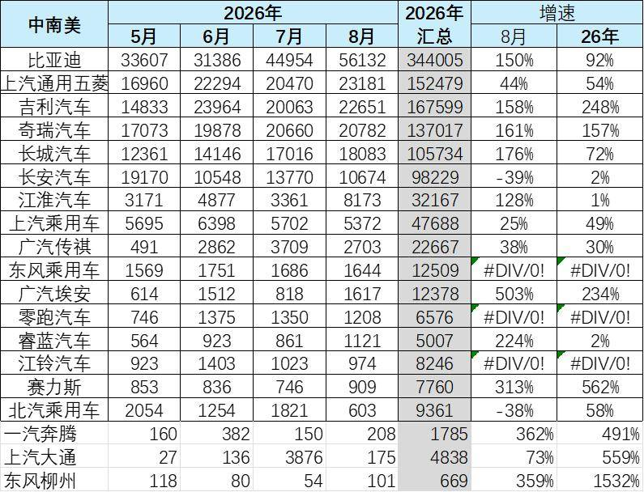

2026年以来中国车企在中南美市场呈现加速渗透态势，比亚迪等同比增长显著。核心驱动力来自三方面：一是比亚迪等头部企业在巴西、墨西哥本地化产能落地，有效规避关税壁垒；二是新能源车型性价比优势凸显，埃安、零跑等新势力年累增速均超200%；三是南美大宗商品回暖带动居民购买力修复，汽车消费需求释放。整体看，中国品牌已从"贸易出口"转向"生态出海"的新阶段。

从竞争格局看，中南美市场"一超多强"特征明显，比亚迪份额遥遥领先，吉利、五菱、奇瑞构成第二梯队。传统燃油车在南美市场正面临中国新能源品牌的强力挤压。未来巴西工业产品税政策调整将是影响出口节奏的关键变量。

2.中国车企的出口流向数据跟踪-欧盟

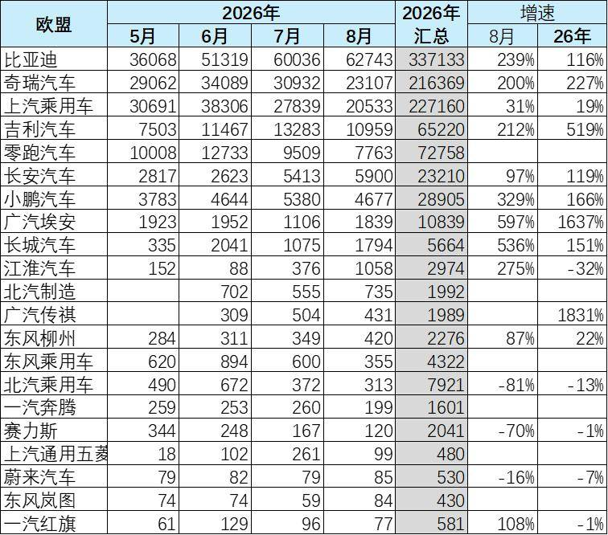

2026年中国在欧盟的电动车的销量中合资与外资品牌占比巨大，特斯拉、欧系车企的电动车大量返销欧洲，有效推动欧洲的电动化进程。自主品牌的混动和插混的出口欧盟暴增。比亚迪、上汽等表现优秀。

3.中国车企的出口流向数据跟踪-俄罗斯中亚

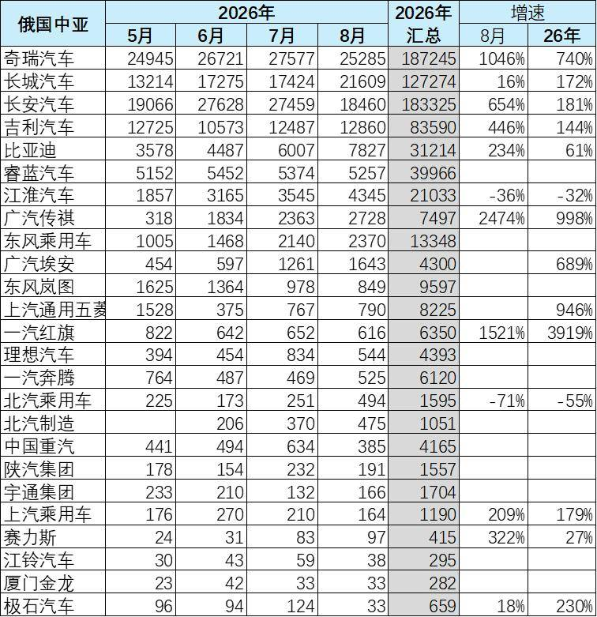

俄罗斯中亚地区是中国车企海外销量的重点区域。长安汽车、长城汽车、奇瑞汽车、吉利汽车和吉利的睿蓝汽车海外表现很好。奇瑞与长安汽车的俄罗斯销量增长突出。

4.中国车企的出口流向数据跟踪-东南亚

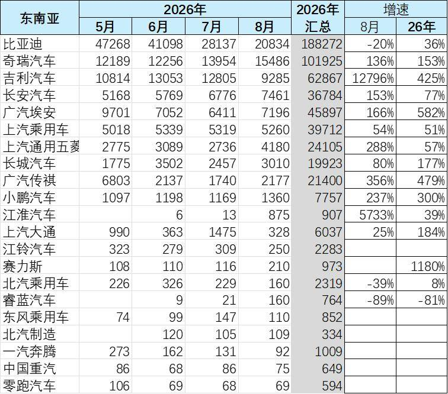

俄罗斯中亚地区是中国车企海外销量的长期重点区域，近几年表现较差。比亚迪、奇瑞汽车、长安汽车、吉利汽车、埃安汽车海外表现很好。8月的吉利与长安汽车的当地销量增长突出。

5.中国车企的出口流向数据跟踪-中东

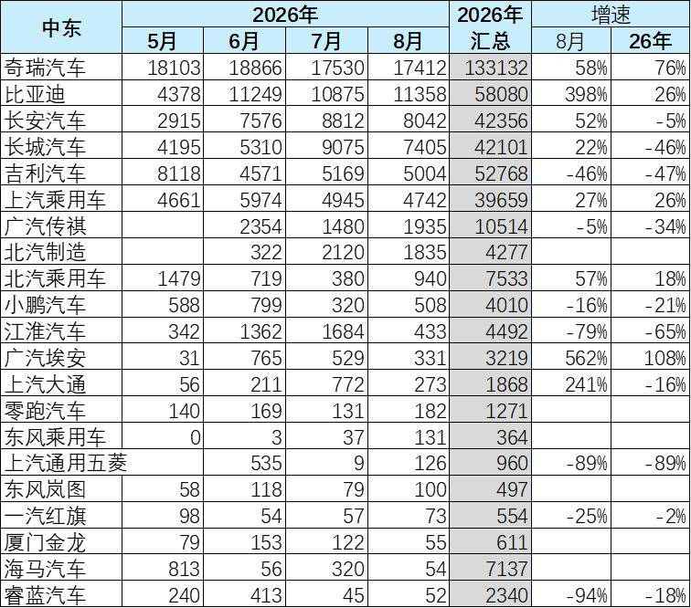

中东是中国车企的海外根据地，伊朗等地区的自主车企销量持续很好，目前伊朗统计的奇瑞、海马等车企表现表现很强。由于受到伊朗危机的影响近期部分车企销量低迷，但比亚迪等加速进入中东市场，迅速跟进奇瑞的销量。

6.中国车企的出口流向数据跟踪-大洋洲

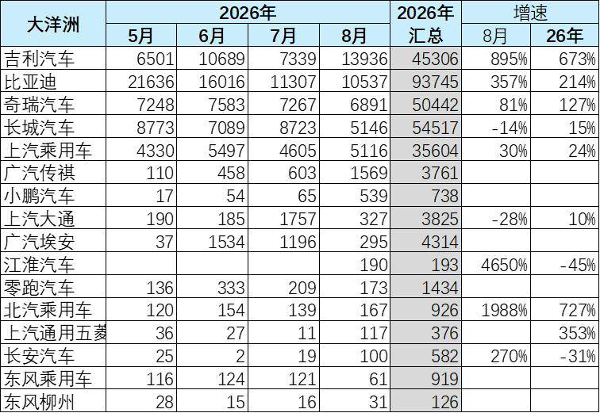

大洋洲市场的友好性明显，中国车企在澳大利亚等市场长期表现很强，比亚迪、近期一枝独秀，奇瑞被长城超越，中国的自主海外市场活力很强。

7.中国车企的出口流向数据跟踪-非洲

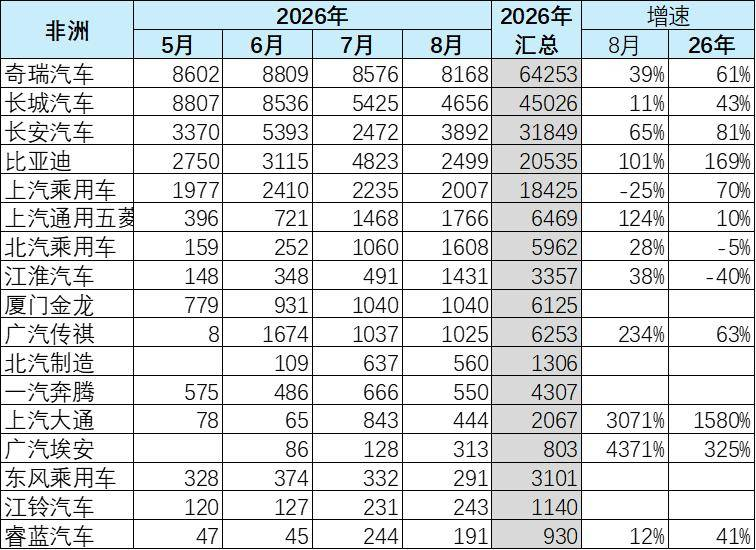

非洲市场长期是中国车企的主要销量区域，大量的贸易和工程项目以及补贴因素推动中国车企布局非洲较充分。奇瑞和长城近期表现一直很好，比亚迪迅速销量暴增。

8.中国车企的海外销量数据跟踪-南亚

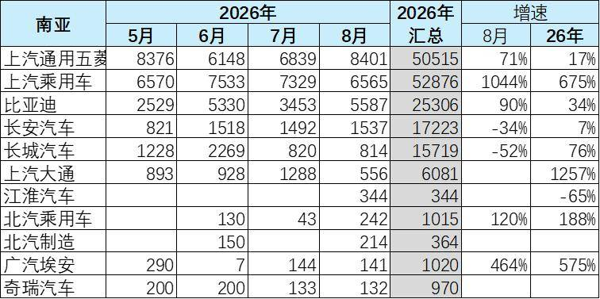

中国车企出口南亚和南亚当地统计的销量均较少，主要的企业是上汽的布局，上汽的出口较多，尤其是上汽五菱的布局较好。今年的上汽乘用车和长城等的表现较强。新进入的广汽和北汽的表现也是不错的。

三、海外销量跟踪

1、自主海外部分国家销量

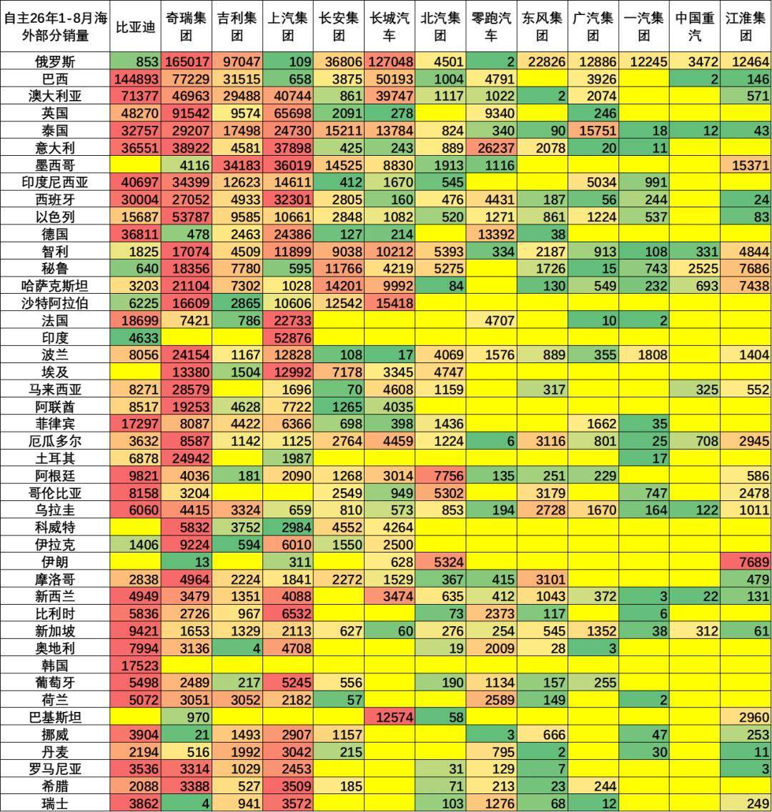

自主车企海外销量主要是全球南方市场和中等发达国家，这些国家缺少综合制造业体系，且没有地成本价制造能力，因此比亚迪、吉利、长城等中国车企表现优秀。

2、自主新能源海外销量

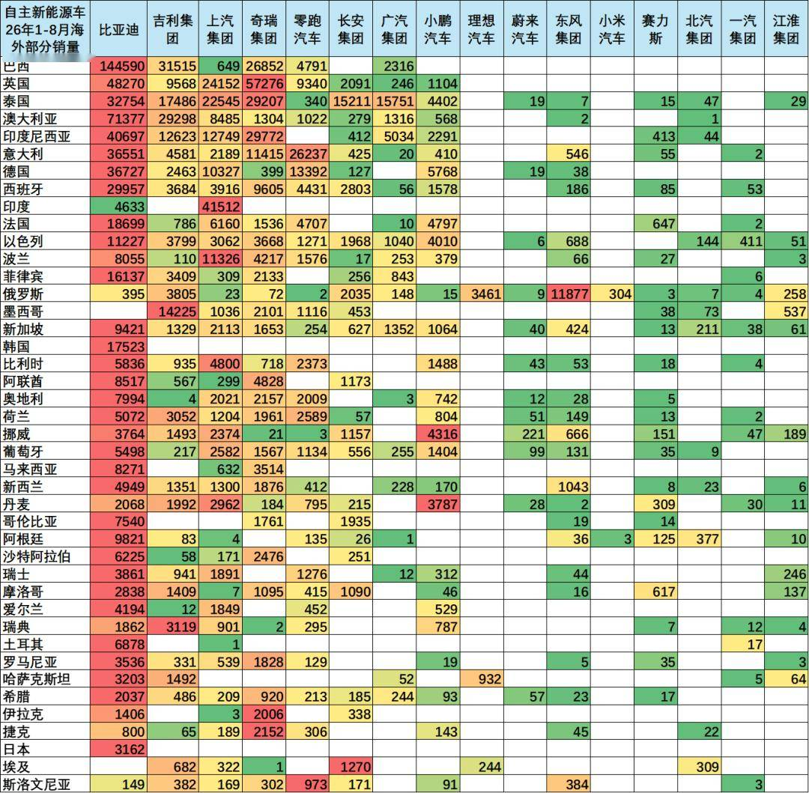

自主新能源的海外市场爆发增长，尤其是纯电动和插混的全面爆发，虽然欧盟制裁中国电动车，但不耽误我们的其它品类的迂回突破，插混等车型的欧盟表现优秀。

附：近日信息合集
