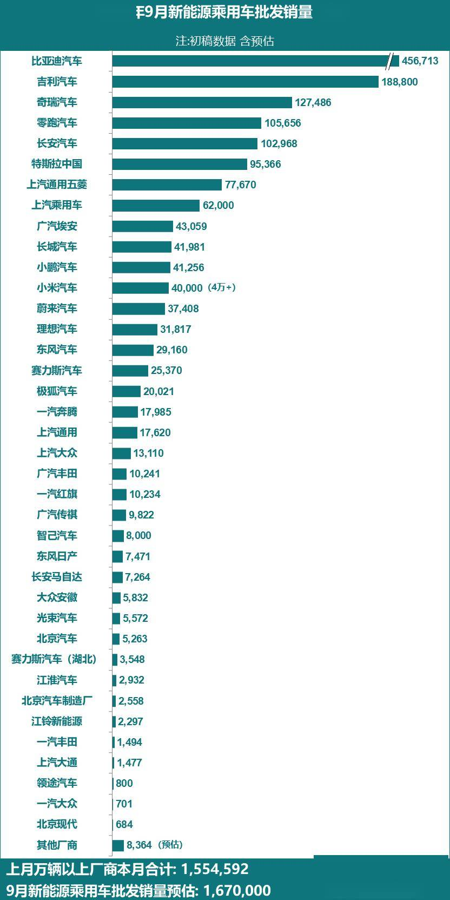

# 【新能源】2026年9月新能源乘用车厂商批发销量快讯

- 公開日時: 2026-10-09 18:34（北京時間）
- 出典: [搜狐号・崔东树](https://www.sohu.com/a/1085751082_115312)
- テーマ（自動判定）: 乗用車市場
- 画像: 1枚

---

本文全文共927字，阅读全文约需3分钟

9月新能源乘用车市场预判

2026年9月，全国新能源乘用车厂商批发销量预估达到167万辆，同比增长12%，环比增长11%，实现双位数双增，标志着新能源板块在经历前期调整后已进入强势筑底的复苏通道。新能源增速显著高于同期整体车市大盘，新能源车成为稳定乘用车市场平稳发展的核心引擎。

2026年9月新能源乘用车批发端呈现“总量温和增长、结构剧烈分化”的格局，外部环境成为主导销量走势的关键变量。高油价持续压制燃油车消费，为新能源替代创造窗口，但海外地缘冲突引发的供应链与贸易环境不确定性，以及去年同期国内“以旧换新”补贴收紧引发抢购效应带来的高基数，共同构成了批发端增速放缓的深层背景。由于中秋假期在9月25日，影响9月下旬的产销波动，也导致9月新能源零售异常偏低。随着海外高油价的趋势延续超预期，新能源车出口表现超强，进一步加剧了分化特征。

受益于头部车企加速电动化转型与消费环境驱动，9月多家主流车企新能源批发销量刷新同期历史纪录，印证国内车企电动化转型成效凸显。9月比亚迪汽车、吉利汽车、奇瑞汽车、零跑汽车、长安汽车是前五名车企，这5家领军车企均实现销量同比、环比较强增长，稳定了新能源车增长态势。上汽大众、上汽通用新能源乘用车同比增速翻倍，长安马自达、奇瑞汽车、零跑汽车、上汽乘用车、广汽埃安等车企同比增速超50%。这些车企覆盖自主、合资及新势力品牌，说明电动化转型已从“少数先行”演变为“全行业共识”，技术迭代与新品投放节奏加快，市场表现持续提升。

2026年8月，全国乘用车市场新能源销量万辆以上厂商批发销量之和，占总体新能源乘用车当月销量的93%。根据目前初步汇总数据，这些8月新能源销量的万辆以上厂商企业的9月销量为155万辆。目前大部分厂商销量基本都已经锁定大数，因此按照8月结构占比结合9月数据，测算9月的全国新能源乘用车批发销量为167万辆。

综上，根据月度初步乘联数据综合：2026年9月全国乘用车厂商新能源批发预估167万辆，同比增长12%，环比增长11%。

注：由于乘联快报数据可能与厂商终稿数据有差异，因此对此版的具体厂商数据不要与历史终稿数据直接对比，以防误导。

9月乘用车主力厂商新能源批发销量快报

