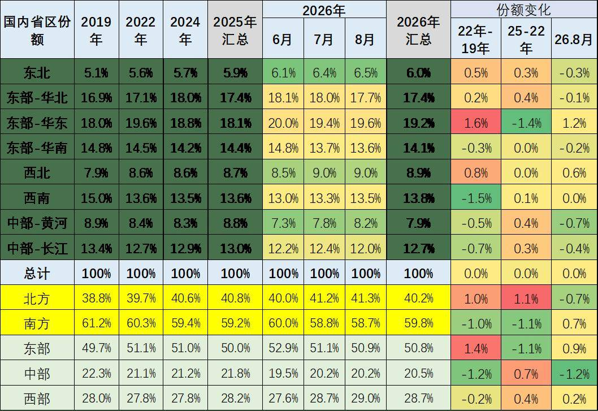
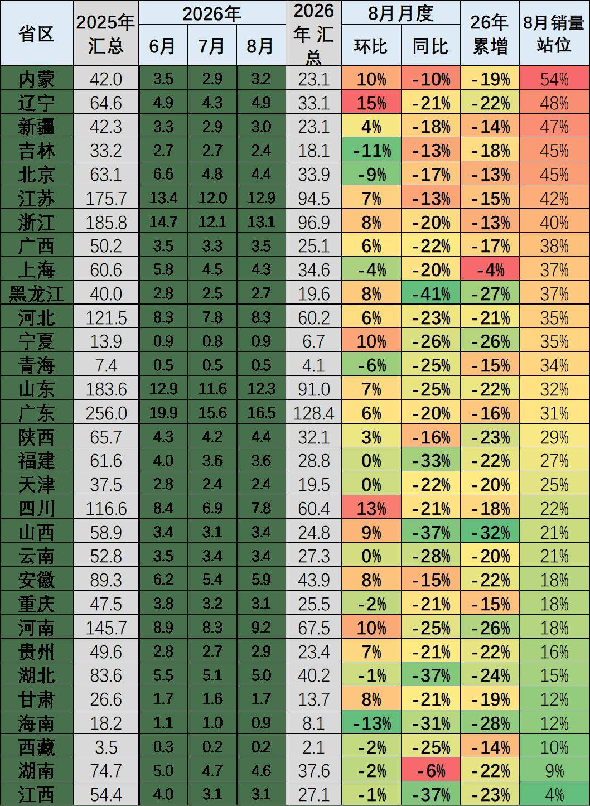
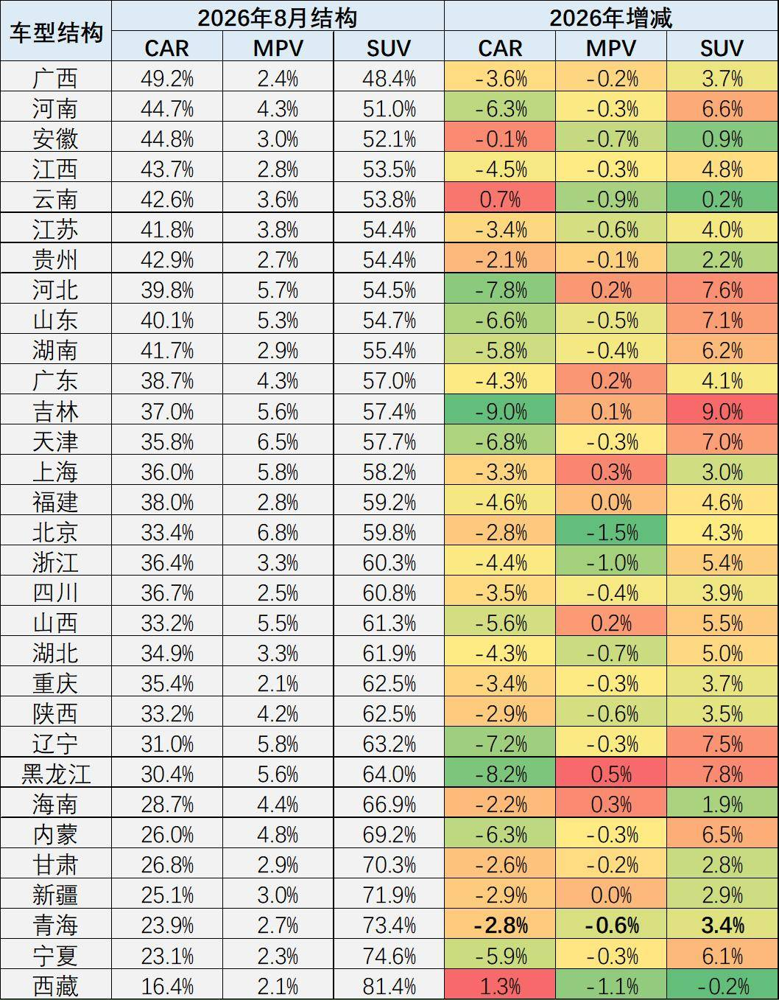
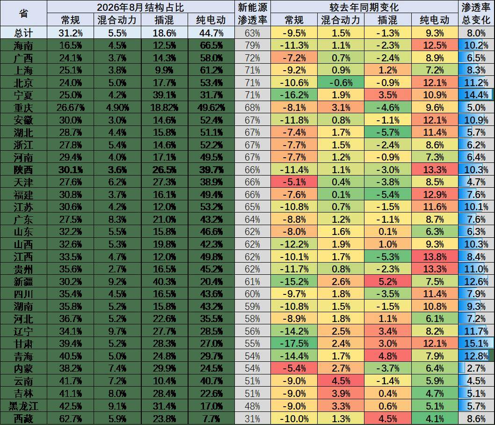
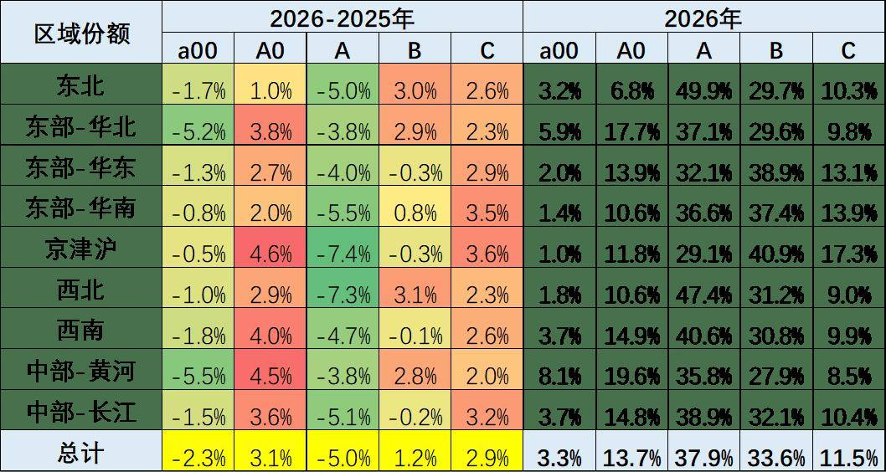
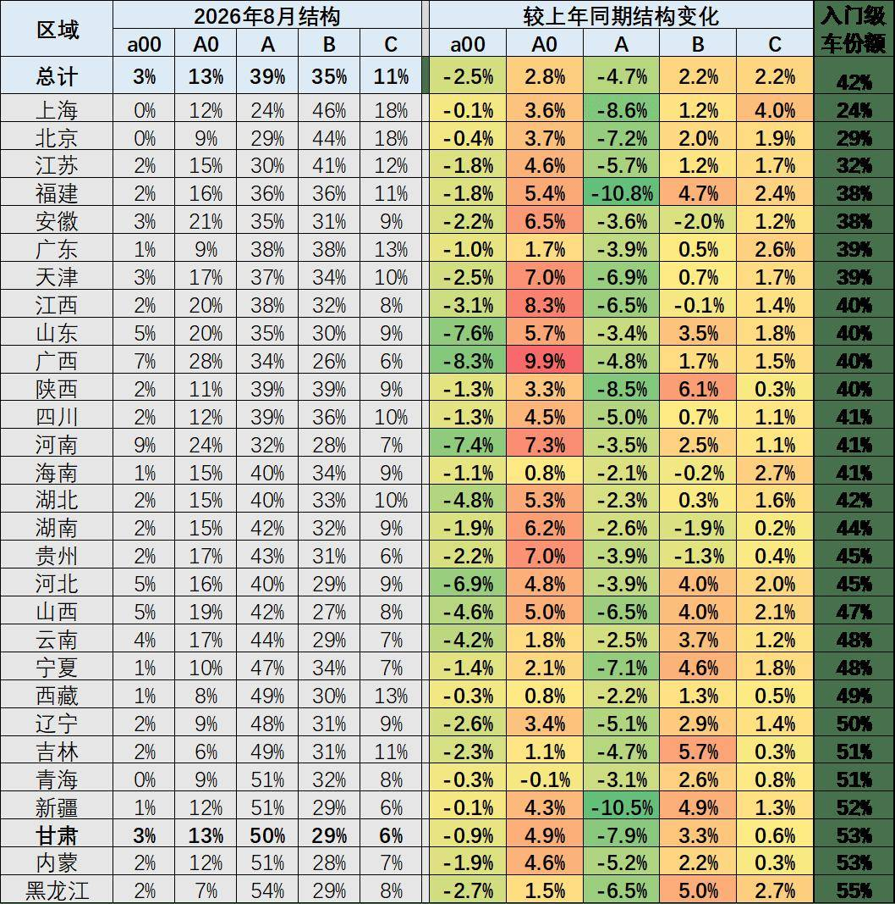
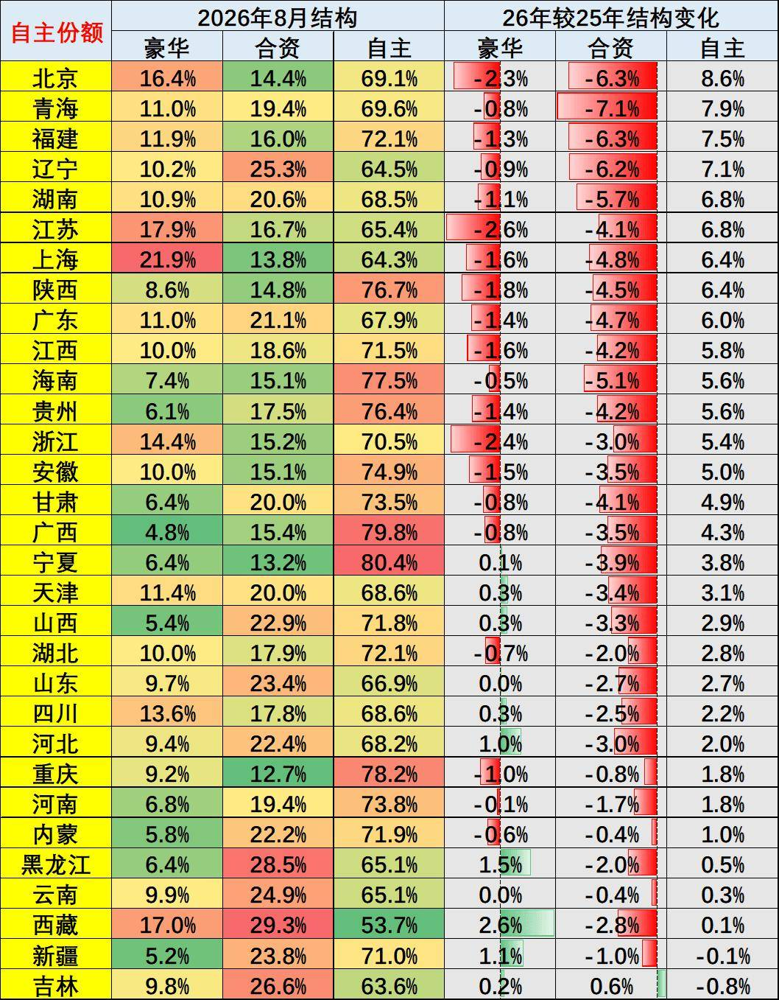

# 【乘联分会论坛】2026年8月乘用车区域市场流向分析

- 公開日時: 2026-10-09 18:34（北京時間）
- 出典: [搜狐号・崔东树](https://www.sohu.com/a/1085753030_115312)
- テーマ（自動判定）: 地域別
- 画像: 7枚

---

本文全文共2275字，阅读全文约需7分钟

国内车市结构性下滑与区域消费政策启动差异化，正深刻重塑国内乘用车区域市场的发展格局。在国家“两新”政策拉动乘用车内需消费的强力调整和高油价冲击环境下，2026年8月全国乘用车零售市场呈现出低端消费萎缩、被动消费升级下的分化增长特殊走势。

各地车市运行呈现四大核心特征：一是补贴政策对高端消费的拉动效应显著，经济型车市场持续低迷，轿车市场出现明显收缩，中西部消费潜力最大的地区总量下滑最大；二是高油价下的区域消费增长分化加剧，北方地区增长潜力可观但当期市场表现偏弱，华东、华南市场明显改善；三是油电混合动力车型成为部分区域市场的增长主力，插电式混动车型走势显著低迷；四是2026年高端车型、大空间三排座车型表现相对较强，北京、上海、广东等省市的中大型车市场增长尤为突出。

1.区域市场的走势特征分析

由于有部分的企业零售难以拆分到地区，因此区域总量和总体零售稍有差异。近几年的车市增长特征是“北强南弱”的新格局。2026年年初的北方市场特别差，南方车市相对不太差，尤其是华东和华南地区表现相对较强，说明车市总体呈现偏弱的增长状态。

从近年区域车市发展轨迹来看，“北强南弱”的格局已基本确立。2025年较2023年，北方区域市场份额累计提升1个百分点，其中东北、西北车市增长势头尤为显著，带动西部车市实现超预期发展。

但这一格局在2026年年初出现阶段性变化：2026年8月，北方车市市场份额较上年同期下降0.7个百分点；南方及东部沿海车市单月表现相对强势，从全年维度来看，南方地区地方财政补贴力度更大、落地效率更高，成为当地车市增长的核心拉动因素。2026年1-8月，受地方补贴政策调整影响，区域车市结构变动更为复杂。消费升级的潜力较小，市场持续萎缩，未来需要北方和中西部地区的占比改善。

2.政策对区域结构的推动分析

从2026年8月各省乘用车销量增速表现来看，上海、辽宁、新疆等省市车市同比表现相对亮眼，湖南、山西、内蒙等中部省份市场表现偏弱。2025年经济发达省市与北方核心区域成为全国车市增长的核心亮点，部分2025年的北方以旧换新受益较大的省份在2026年下滑较大。

综合看，北方车市具备长期增长潜力，目前受到收入下降，购车成本上升压力较大。核心驱动因素来自两方面：一是随着人口老龄化加剧、建筑业规模收缩、出口产业高端化转型，北方人口回流趋势显著，带动本地消费基数扩容；二是体制内群体消费表现保持稳健，对北方地区购车消费形成持续拉动。受抑制的主要因素仍是“K型”分化的影响。

3.车身大类市场结构变化分析

国内乘用车消费的车身结构呈现显著分化态势，SUV品类保持较好的增长势头，且区域表现差异明显。SUV市场的增长主要集中在中西部地区，东部地区表现相对偏弱，其中西北、西南地区SUV需求尤为旺盛。这一特征与区域地形地貌高度相关，中西部地区以山区、丘陵地形为主，对车辆通过性要求更高，叠加新能源SUV动力性能优势突出，共同推动了当地SUV市场的强势表现。

轿车市场则呈现出截然不同的区域特征。2024年以来，国家“两新”政策中新能源相关补贴力度加码，带动入门级轿车市场出现阶段性回升。华北平原地区的山东、河南、河北等省份，纯电动轿车市场发展更为成熟，中低端轿车产品成为当地市场主力，推动私人汽车普及进程持续深化。未来期待政策持续鼓励汽车普及，轿车市场能有改善。

4.新能源动力结构分析

2026年8月，新能源汽车市场整体表现偏弱，其中插电式混动车型走势持续低迷，普通油电混合动力车型则实现逆势增长，成为细分市场的核心亮点。

分区域来看，传统燃油车在中西部、北方地区仍保持较高的市场需求，燃油车市场份额仍维持在50%左右；而东部平原地区、南方省市及一线发达城市，新能源汽车市场份额已达到60%以上，海南、北京、广西、重庆等区域动力结构分化特征显著。

此外，消费需求存在明显季节性差异，历年年初新能源汽车市场表现均相对疲软，叠加2026年车辆购置税免税政策调整，年初新能源汽车市场面临阶段性增长压力大，高油价下的4-8月纯电动市场改善。

5.车型级别结构变化分析

从政策效应来看，国家补贴对中低端车型消费的拉动效果最为直接，而单纯推动高端化的政策导向难以形成长期可持续的增长动力，消费回归理性仍是行业发展的核心主线。

2026年“两新”补贴政策对高端车型的拉动效应显著，而经济型车型的补贴力度大幅收缩，直接导致入门级车型市场份额下滑较大，处于历史低位。同时，随着国家报废更新、以旧换新补贴政策的持续推进，叠加居民收入呈现K型分化，低端消费群体购买力明显下滑，购车需求持续走弱，进一步加剧了车型级别的结构分化。

6.车市品牌结构变化分析

从品牌格局的区域分布来看，上海、北京等一线城市豪华车市场占比稳居高位，上海、北京、浙江、江苏的豪车占比已经高于或接近于合资主流品牌。而全国绝大部分省市市场中，自主品牌份额已占据三分之二市场。

2026年年初，自主品牌市场增长节奏有所放缓，这一特征充分体现出车辆购置税政策调整，对自主品牌市场表现形成了较为显著的阶段性影响。但5-8月自主品牌份额实现同比回升，体现了高油价下，新能源优势明显，豪华车市场份额下降较大，合资品牌剧烈下滑，自主品牌恢复走强。
