# 车市扫描-2026年38期（9月28日-9月30日）

- 公開日時: 2026-10-10 17:34（北京時間）
- 出典: [搜狐号・崔东树](https://www.sohu.com/a/1086043839_115312)
- テーマ（自動判定）: 車市スキャン（週次）
- 画像: 12枚

---

主要信息源自乘联分会每日新闻等

中国汽车流通协会

乘用车市场信息联席分会（乘联分会）

网站：http://www.cpcaauto.com

一、本周车市概述1.2026年9月全国乘用车市场零售相对平稳

【2026年9月1-30日乘联会市场分析要闻】

9月1-30日全国乘用车厂家批发252.8万辆，同比去年同期下降10%，较上月同期增长7%；今年以来乘用车累计批发1971.1万辆，同比去年同期下降6%。9月1-30日市场零售170.2万辆，同比去年同期下降24%，较上月同期增长10%；今年以来乘用车累计零售1341.8万辆，同比去年同期下降21%。

9月1-30日全国乘用车厂家新能源批发167.2万辆，同比去年同期增长11%，较上月同期增长11%；今年以来乘用车累计批发1145万辆，同比去年同期增长9%。9月1-30日新能源车市场零售114.1万辆，同比去年同期下降12%，较上月同期增长14%；今年以来乘用车累计零售781.6万辆，同比去年同期下降12%。

2026年9月1-30日全国新能源市场零售渗透率67.1%；新能源厂家批发渗透率66.1%。

9月前三周全国纯燃料轻型车生产33万辆，同比去年同期下降52%，较上月同期增长47%。9月前三周混合动力与插混总体生产26.5万辆，同比去年同期下降23%，较上月同期增长21%。

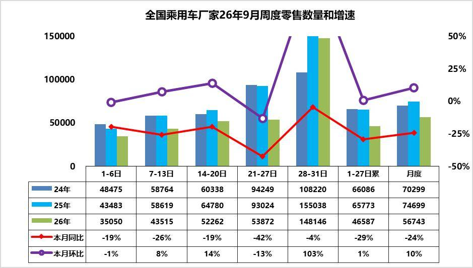

9月第1周乘用车市场日均零售3.5万辆，同比去年同期下降19%，较上月同期降1%。

9月第2周乘用车市场日均零售4.4万辆，同比去年同期下降26%，较上月同期增8%。

9月第3周乘用车市场日均零售5.2万辆，同比去年同期下降19%，较上月同期增14%。

9月第4周乘用车市场日均零售5.4万辆，同比去年同期下降42%，较上月同期降13%。

9月第5周乘用车市场日均零售14.8万辆，同比去年同期下降4%，较上月同期增103%。

9月1-30日市场零售170.2万辆，同比去年同期下降24%，较上月同期增长10%；今年以来乘用车累计零售1341.8万辆，同比去年同期下降21%。

9月市场进入传统“金九银十”消费旺季，终端客流有望持续回暖。宏观层面，8月制造业PMI环比回升、CPI平稳，经济呈现“需求边际回暖、总量低位企稳”的运行特征，为车市回暖提供底部支撑。但9月面临去年同期的超高基数——2025年9月部分地区补贴停发前的抢购热潮推动当月零售创下历史峰值，高基数的效应将进一步抑制今年9月回升效果。上周是中秋假期，假期错峰的零售影响较大，零售同比下降42%也是正常的。本周仅有3天，较8月少一天，且属于季度末，第五周数据较强。

9月，乘用车市场进入传统销售旺季，地方促消费政策与车企促销活动持续，利好消费者需求释放，前期上市的新品持续上量，新车带来人气提升支撑市场表现。往年金九是大盘普涨，首购、换购一起释放，燃油、新能源都能分到增量；今年是存量博弈，此消彼长，增量基本集中在新能源，燃油车似乎没有新增需求。

7月末以来年内汽油累计上调已超830元/吨，而电动车新品魅力愈强，燃油车消费意愿持续受抑制。上游原材料价格有所回落，加之行业“反内卷”共识逐步深化，上游利润暴涨；价格压力从上游向整车端传导，行业上下游矛盾日益尖锐。虽然库存不高，但经销商运营压力仍在持续加大。

2.2026年9月全国乘用车厂家销量平稳

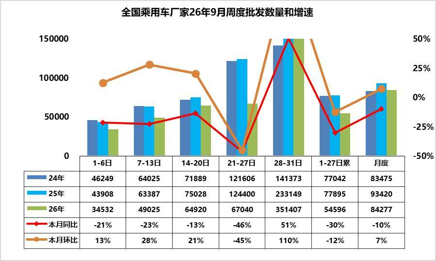

9月第1周批发日均3.5台，同比去年9月同期下降21%，环比上月同期增13%。

9月第2周批发日均4.9台，同比去年9月同期下降23%，环比上月同期增28%。

9月第3周批发日均6.5台，同比去年9月同期下降13%，环比上月同期增21%。

9月第4周批发日均6.7台，同比去年9月同期下降46%，环比上月同期降45%。

9月第5周批发日均35.1台，同比去年9月同期增51%，环比上月同期增110%。

9月1-30日全国乘用车厂家批发252.8万辆，同比去年同期下降10%，较上月同期增长7%；今年以来乘用车累计批发1971.1万辆，同比去年同期下降6%。

往年"金九银十"燃油车能分到的蛋糕，今年高油价下的油车需求会被进一步压缩。由于燃油车零售持续大幅度下降，9月前三周的燃油车内需生产下降52%*（近两周数据未更新），因此厂家销量总体低迷，9月燃油车厂家批发下降41%。新能源车大部分品牌目前缺乏热销车型，但厂家还要稳定的生产节奏，作为庞大的产业链体系，不可能按照订单简单的排产，还要考虑产销目标。大部分厂家销量和直营订单销售已经转为目标销售，没有积压订单也要实现部分车型的销量目标，因此前三周的厂家直营零售稍有改善，新能源渗透率异常偏高。本周是中秋假期后的季度末，假期错峰的产销影响较大，厂家销量同比增51%也是正常的。

3.2026年1-8月中国占世界汽车份额32%

根据世界汽车组织统计数据，全球汽车生产不断增长，2025年达到9638万台，较2024年的9177万台增6%，中国占世界生产份额35.4%。全球汽车销量不断增长，2025年达到9689万台，增6%，中国占世界销量份额35.4%。2026 年1-8 月，世界汽车累计销量6343 万台，同比增长2%；其中8 月单月销量771.9 万台，同比仅增1%，环比下滑4.9%，全球车市增长动力偏弱。

2026 年1-8 月全球汽车累计销量6343 万台。分国家来看，中国销量2031 万台，份额32.0%，较2025 年35.4% 明显回落；美国销量1094 万台，份额17.2%，小幅下滑；印度表现亮眼，份额提升至6.7%，成为增长亮点。从历年份额变化看，2022-2025 年中国在全球占比持续走高，2025 年达到阶段性高点。欧洲主要国家份额整体稳中有降，巴西、俄罗斯等新兴市场份额保持稳定。2026 年前8 月中国市场销量下滑，是全球份额变动的核心原因，印度等新兴市场的快速增长，一定程度对冲了中、美市场的增长压力，支撑全球车市维持小幅正增长。2026年1-8月的全球汽车销量增2%，其中印度汽车市场销量增20%，泰国汽车市场增16%，俄罗斯市场销量增6%，越南增28%。新兴市场拉动市场表现较好。

东升西降，除了丰田、现代起亚、铃木和塔塔等，其它国际品牌份额2026年出现较大幅下滑。相对于2019年的中国自主品牌全面提升世界份额。吉利、比亚迪、奇瑞、上汽、长安等自主表现较强。电动化发展也导致部分国际车企逐步走向衰落。除了铃木等印度市场较好的因素促进，其它欧美国际品牌份额出现全面较大的下滑。

4.2026年1-8月世界新能源车分析

2026年1-8月世界汽车销量达到6343万台，新能源汽车达到1570万台。2026年1-8月世界新能源乘用车达到1570万台，同比增15%，其中8月新能源车销量223万台增16%，增速回到历史正常水平。2026年1-8月的新能源车份额达到24.5%，其中纯电动车的占比达到17.3%，插电混动达到7.5%的汽车比例。混合动力达到8%的表现优秀。

2025年美国新能源的销量172万台降2%，相对近几年增速较低。由于高关税和新能源补贴取消的涨价因素，美国新能源车2026年8月销量11万台同比降44%，1-8月美国新能源车销量82万，降低31%。欧洲新能源乘用车2025年销量386万台，较去年同期增量96万台，增33%。初步统计欧洲新能源乘用车8月32万台同比增33%，2026年1-8月312万台同比增34%。

世界新能源车渗透率总体呈现快速提升趋势，2022年已经达到13.1%水平，2023年达到15.9%，2024年达到19.5%，2025年渗透率达到23.6%。2026年世界新能源车渗透率24.7%，其中，德国达到33.4%，挪威达到80%，英国36%，而美国仅有7%，日本仅有4%，因此世界新能源发展的不均衡性极为明显。

2026年1-8月中国新能源乘用车世界份额达到62%,26年7-8月达到65.3%的较好水平。从历年销量份额看，中国的比亚迪世界领先，吉利迅速崛起，特斯拉表现不强，下滑到第三位。近期上汽集团乘用车和上汽五菱两家自主车企海外表现较好。2026年中国在世界纯电动车市场份额59%份额，年初因素的中国纯电动车表现暂时较差，3季度达到63.6%。2026年中国在世界插电混动份额达到71%的高水平，8月达到74%中国在世界插电混动市场呈现超强的表现。

2025年自主新能源乘用车海外市场销量份额达到15.8%，提升6.2个百分点。2026年自主新能源乘用车海外市场销量份额大幅提升，8月达到29%，进一步大幅跃升14个百分点。

5.2026年1-8月汽车行业利润率3.6%、收入增2.9%、成本增4%、利润降16%

1—8月份，规模以上工业企业实现营业收入93.09万亿元，同比增长6.6%；发生营业成本79.19万亿元，增长6.1%；营业收入利润率为5.66%，同比提高0.44个百分点。2026年1-8月，以人工智能为推动的电子行业利润1.1倍增长，上游原材料行业利润高增长，对行业总体利润改善促进巨大，汽车行业面临成本上涨和需求不强的双重压力，盈利表现较差。2026年8月的汽车生产270万台，销售收入9281亿元增4.2%，成本8313亿元增5.3%，利润371亿元增24%，销售利润率4%。2026年1-8月汽车生产2031万台，同比降3%，收入70062亿元增2.9%，成本62370亿元增4%，利润2534亿元降16%，，销售利润率3.6%。

2026年各地大力度推动“两新”政策落地实施，逐步有效释放内需活力，但汽车行业效益改善明显落后其它消费品。随着国家反内卷工作持续推进，汽车行业受上游挤压严重，价格问题严重，油价暴涨，有色金属、半导体利润暴增，终端用户购车观望心态严重，车企运行压力持续加大，高质量发展受到上游的巨大冲击。

从历年销售利润率走势来看，2024年汽车行业利润表现已显疲软，销售利润率仅4.3%，较历史正常水平大幅下降；2025年行业销售利润率降至4.1%。2026年1-8月行业销售利润率进一步降至3.6%，8月4%，好于2025年12月1.8%的最低月度表现。历年8月一般是利润率较低的时候，今年8月燃油车生产稍有改善，但盈利压力仍巨大。

6.2025年全国结婚年龄与老龄化对车市影响分析

9月30日国家民政部发布了《2025 年民政事业发展统计公报》，2025 年，全年依法办理结婚登记676.5 万对，比上年增长10.8％。结婚率为4.8‰，比上年增长0.5个千分点。从结婚年龄结构看，2025年全国结婚人数为1353万人，其中20—24岁173万人，占比13%；25—29岁499万人，占比37%；30—34岁290万人，占比21%；35—39岁156万人，占比12%；40岁以上235万人，占比17%。截至2025 年底，全国60 周岁及以上老年人口32338 万人，占总人口的23.0%，其中65 周岁及以上老年人口22365 万人，占总人口的15.9%。

2025年结婚人数回升对车市是暂时积极信号，但结婚总量中枢下移、结婚年龄后移、老龄化加速三大趋势不可逆转。车市增长动力正从“新婚首购”转向“换购增购+新能源升级+适老化出行”。车企应抓住25—35岁结婚主力人群的智能化、电动化需求，同时积极布局老年友好型产品和出行服务，才能在人口结构变化中赢得增量。期待政策支持经济型电动车发展，鼓励小型化，给低价车更多补贴。

二、本周上市新车1.新款广汽本田奥德赛上市18.48万-24.18万元

9月28日，新款广汽本田奥德赛上市，新车共推3款，售价区间为18.48万-24.18万元。外观与老款车型基本保持一致。配备Honda CONNECT 3.0、50W无线充电、航空座椅等。搭载2.0L i-MMD锐·混动系统，匹配E-CVT变速箱。

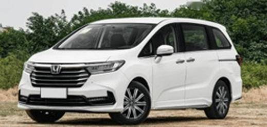

2.深蓝S07 AI激光版上市限时权益价14.99万-16.99万元

9月28日，深蓝S07 AI激光版上市，新车共推4款，售价区间为15.59万-17.59万元，限时权益价14.99万-16.99万元。新车换装全新半隐藏式门把手。接入小蓝同学车载交互屏、深蓝妥妥贴、中控外接物理按键等智能生态件。配备端到端豆包大模型、高通骁龙8295P芯片、前排双零重力座椅、20扬声器等。搭载800V平台，CLTC纯电续航600km，725km。

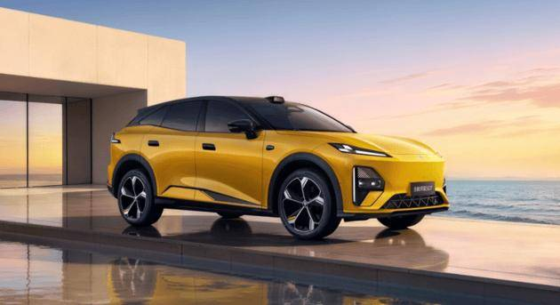

3.智界RX上市-25.98万-38.98万元

9月28日，智界RX上市，新车共推6款，售价区间为25.98万-38.98万元。新车采用10处镂空风道、超宽鸳鸯胎、贯穿式晶钻尾灯、主动式扩散器。内饰采用16.1英寸随动中控屏、8.88英寸副驾屏、26英寸AR‑HUD。配备四激光雷达、智能环抱座椅、双目后视镜、KK尾门等。CLTC续航里程分别为672km、702km、753km、822km、852km。

9月28日，新款智界R7上市，新车共推4款，售价区间为23.98万-31.98万元。新车更换镂空立体智界车标、半隐藏式门把手。内饰采用双17.2英寸全新蝶羽双联屏，中控通道、门板、出风口重新设计。配备乾崑ADS 5、贯穿式天际线环抱氛围灯、前排双零重力座椅等。CLTC续航里程增加至705km，855km，785km。

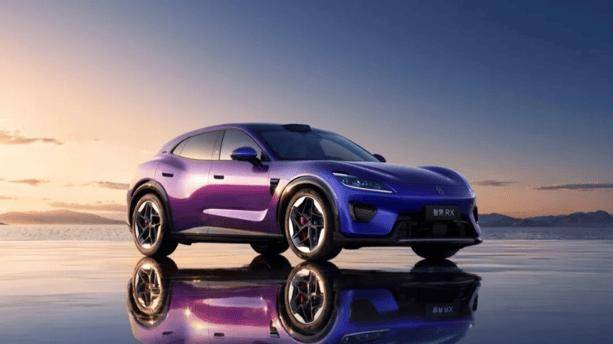

4.长城大狗混动版上市限时换新价10.59万-12.39万元

9月28日，长城大狗混动版上市，新车共推3款，售价区间为11.99万-13.79万元，限时换新价10.59万-12.39万元。新车延续大狗燃油版车身，前脸更换封闭式面板并配备专属装饰件。内饰采用15.6英寸悬浮中控屏、10.25英寸仪表屏、W-HUD。配备Coffee Pilot 3 Lite辅助驾驶、GPS+北斗卫星导航、前排座椅加热/通风等。搭载Hi2电混两驱版与Hi4电混四驱版，匹配2DHT和4DHT变速箱。

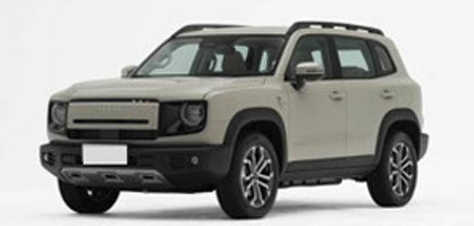

5.领克20上市限时专享价11.88万-15.88万元

9月29日，领克20上市，新车共推5款，售价区间为12.38万-16.38万元，限时专享价11.88万-15.88万元。新车延续The Next Day家族设计语言。内饰采用15.4英寸中控屏、10.2英寸液晶仪表、13.8英寸HUD。配备激光雷达+千里浩瀚H5、AI语音助手“超级Eva”、23扬声器等。采用800V平台+6C超快充，CLTC续航为545km，630km，580km。

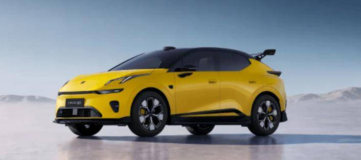

6.现代艾尼氪V上市限时权益价9.99万-13.19万元

9月29日，现代艾尼氪V上市，新车共推5款，售价区间为10.99万-13.99万元，限时权益价9.99万-13.19万元。新车采用凌厉的切面风格，风阻系数低至0.23cd。内饰采用27英寸超薄4K超大中控屏。配备全维着色玻璃、高通骁龙8295芯片、Momenta辅助驾驶系统等。CLTC纯电续航分别为540km和650km。

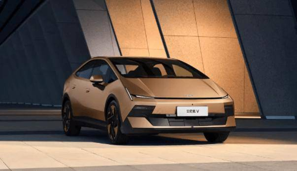

7.新款纵横G700上市限时权益价30.49万-42.29万元

9月29日，新款纵横G700上市，新车共推5款，售价32.99万-44.29万元，限时权益价30.49万-42.29万元。新车针对车头造型进行升级，整体风格从硬派越野转变成偏向城市科技。内饰采用15.6英寸悬浮式中控屏、35.4英寸贯穿式显示屏。配备华为乾崑ADS 5、CDC可变阻尼悬架、前后牙嵌式差速锁等。搭载2.0T插混动力，CLTC纯电续航150km，260km。

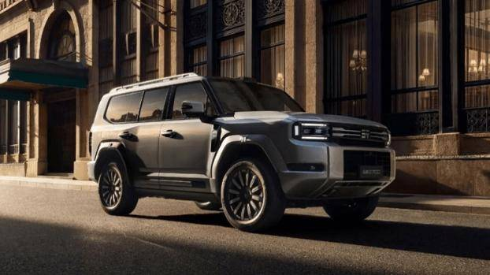

8.新款欧拉好猫上市-6.98万-9.98万元

9月29日，新款欧拉好猫上市，新车共推5款，售价区间为6.98万-9.98万元。新车配备全新样式的黑色轮圈，内部镶嵌彩色刹车卡钳。换装圆形三辐式方向盘。配备前排座椅加热、通风、电动后尾门、自适应远近光灯等。换装98kW电机，CLTC纯电续航335km，430km。

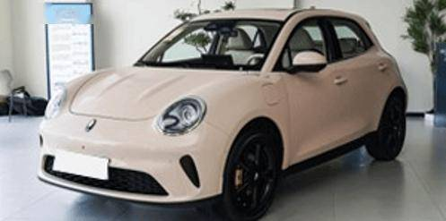

9.iCAR V27长续航版上市售价18.98-20.38万元

9月30日，iCAR V27长续航版正式上市，售价18.98-20.38万元。在现款基础上增加了前排座椅14点按摩/副驾电动腿托、全车静音玻璃、车载香薰等功能配置，升级51.2kWh宁德时代磷酸铁锂增程专用电池，CLTC纯电续航里程300km，综合续航里程1300km。30%-80%充电时间低至17分钟。

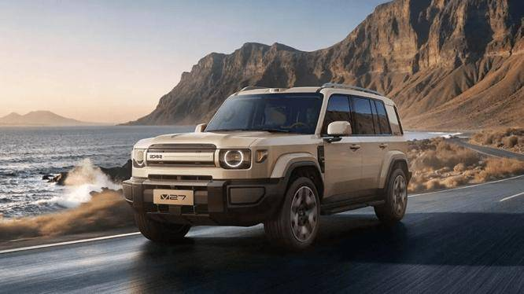

10.新款特斯拉Model 3上市23.55万-33.95万元

10月1日，新款特斯拉Model 3上市，新车共推4款，售价区间为23.55万-33.95万元。新车整体延续现有设计风格。可升级选配浅灰色高级内饰。全系升级16英寸悬浮式中控屏、交流外供电。CLTC续航里程634km，830km，753km，670km。

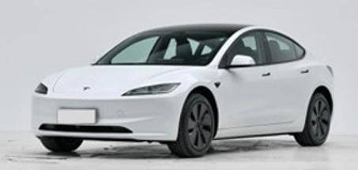

三、宏观经济与政策1.十二部门：2030年新能源货车运输大宗货物比例力争达90%以上

9月29日，交通运输部等十二部门联合印发《推动多式联运高质量发展 优化调整运输结构攻坚行动方案（2026-2030年）》。其中提出，到2030年，多式联运发展取得突破性进展，推动1000个左右主要货运节点提升多式联运功能，“综合货运通道+关键枢纽节点+全域覆盖网络”的国家多式联运基础设施体系基本建成。新能源货车运输大宗货物的比例力争达到90%以上，重点内陆港、大型物流园区和规模化产业园区内部清洁运输比例力争达到80%。

2.国家发展改革委：今年前8月汽车以旧换新535.3万辆

9月30日，据国家发展改革委微信公众号消息，国家发展改革委会同财政部，向地方下达了今年第四批625亿元超长期特别国债支持消费品以旧换新资金。至此，全年2500亿元消费品以旧换新资金已全部下达。今年1-8月，以旧换新相关商品销售额达到1.55万亿元，补贴惠及2.08亿人次。其中，汽车以旧换新535.3万辆。

3.工信部等七部门联合印发电池“十五五”规划

9月28日，工信部、发改委等七部门联合制定印发《新型电池产业发展“十五五”规划》，提出到2030年，我国新型电池产业规模实现稳步增长；全链条创新能力持续增强，先进材料取得新突破，新体系电池研发取得重大进展，头部企业产品缺陷率达到PPB级别；全场景应用生态加速构建，电池技术与清洁能源、用能终端加快融合创新发展；国际贸易投资一体化深入推进，服务全球绿色低碳发展。

4.交通运输部等四部门：支持新能源公交车及动力电池更新

交通运输部、国家发展改革委、财政部、人力资源社会保障部发布《关于促进城市公交企业深化改革的指导意见》，结合实施大规模设备更新政策，支持新能源公交车及动力电池更新。

5.欧盟要求英国提高中国汽车关税

据英国《金融时报》报道，欧盟已向英国政府提出，希望英国提高对进口中国汽车的关税，并在汽车贸易政策上进一步与欧盟保持一致。

6.上海延续实施家电及汽车以旧换新等补贴即时摇号

上海市商务委宣布，继续实施2026年上海市家电以旧换新、数码和智能产品及自主品类购新补贴线上即时摇号，相关活动持续至2026年12月31日；汽车以旧换新即时摇号活动自2026年10月1日起至2026年12月31日。

四、企业信息1.比亚迪西安新项目全面建成投产

比亚迪位于西安西咸新区秦汉自动驾驶产业园的动力电池项目正式全面建成投产。该项目聚焦新能源汽车动力电池领域，主要建设Cell、Pack生产线及相关生产生活配套设施。

2.比亚迪召回超21.5万辆汽车

比亚迪因制动踏板及备胎托盘缺陷，在中国和澳大利亚市场召回超过215,000辆汽车。涉及车型为2024年8月至2026年6月期间生产的比亚迪Shark 6全系车型。

3.东风发布“天净零碳”计划

东风汽车在武汉第十届科技创新周发布“天净零碳”计划。计划以“1331”战略框架为核心，目标联合生态伙伴聚合1000万套以上补能设施，实现年协同减碳超100万吨。同步发布“天际扬帆”计划，明确“125”全球事业布局。其中，商用车板块将氢能作为全球化布局的核心抓手，重点深耕美洲与中北亚市场。

4.广汽集团：拟发行股份购买一汽丰田50%股权

9月28日，广汽集团公告，公司拟通过发行股份购买一汽丰田汽车有限公司50%股权，并募集配套资金，本次发行价格为5.75元/股。

5.吉利智充C12在杭州等五城同步落地

9月29日，吉利智充C12在杭州、上海、宁波、嘉兴、西安五城同步落地。

6.奇瑞汽车公布最新人事调整布局

奇瑞汽车10月7日发布最新公告：为全面推进奇瑞汽车全球化3.0战略落地，奇瑞主品牌整体纳入全球市场体系，由常务副总裁张贵兵直接分管奇瑞品牌国内事业群。

7.上汽大众整车出口首进北美

9月28日，上汽大众宣布，首批出口墨西哥的全新凌渡L已下线并启运。这是上汽大众整车首次进入北美市场，其出口版图由东南亚、中亚进一步延伸至墨西哥。

8.蔚来与吉利达成换电重磅合作

9月28日，蔚来公司与吉利控股集团达成充换电领域全面战略合作。吉利控股集团将以其持有的易易互联100%股权及现金6.4亿元入股蔚来能源，交易完成后，吉利控股集团将持有蔚来能源30%股权，易易互联营运车辆换电业务将并入蔚来能源。

9.小鹏集团碳积分交易收入超10亿元

有报道称小鹏集团已与保时捷及其他数家国际主机厂分别就欧盟、英国、澳大利亚等多地碳排放法规达成碳积分交易合作，总交易收入超10亿元，其中2026年小鹏集团将获得超5亿元碳积分交易收入。对此，小鹏集团回应称：“属实。”

五、行业信息1.国庆假期前3天，高速公路新能源汽车充电近300万次

10月1日0时至10月3日24时，通过对纳入国家充电设施监测服务平台的6.27万个高速公路充电设施（枪）进行统计分析，今年国庆假期前三天全国高速公路新能源汽车充电次数共计296.86万次，日均98.95万次，较去年国庆假期同期增长48.41%；充电量达到7161.93万千瓦时，日均2387.31万千瓦时，较去年国庆假期同期增长9.39%。

2.中国一汽与广汽工业签署战略合作框架协议

9月29日，中国一汽与广汽工业正式签署战略合作框架协议，双方将依托资产资本联动，以科技创新为驱动力，逐步深化拓展合作边界，推动产业资源跨区域高效协同。

3.国轩高科：拟与大众汽车集团共同投资建设电池与材料项目

9月28日，国轩高科公告称，公司及全资下属企业与大众汽车集团及其下属企业拟签署《投资协议》，在西班牙、斯洛伐克、摩洛哥组建三家合资公司，投资建设锂电池和正极材料生产基地，预计项目总投资约32.22亿欧元，其中国轩方投资约15.98亿欧元。

4.华为、赛力斯续签五年战略合作

10月1日，鸿蒙智行、问界同时宣布，鸿蒙智行问界业务升级，华为与赛力斯达成新五年合作。双方将联合组建问界业务专属团队，进一步升级问界业务。

六、跨国集团与国际市场1.宝马借AI大裁员

据媒体报道，宝马计划在明年年中前，精简五分之一的管理职位。官方表示，将借助人工智能提升运营效率，计划在集团内部进一步全面落地AI 技术，赋能整车研发、原材料采购、市场营销以及售后业务。将减少管理层级，并对业务部门进行重组。

2.本田敲定Momenta高阶智驾上车

本田明确将搭载Momenta高阶智驾方案，相关技术将从2027年上市车型开始逐步落地，这套方案覆盖高速NOA、城区NOA 以及自动泊车等全场景辅助驾驶。

3.保时捷发布2035“主动收缩”战略

10月7日，保时捷股份公司在魏斯阿赫研发中心举行的资本市场日上，正式发布聚焦中期目标的“Sportwagenschmiede’35”战略，核心是围绕品牌、产品与组织三个维度推进降本增效，将盈利重心从销量转向单车价值创造。已完成出售Rimac及Bugatti Rimac股权、签署出售MHP咨询子公司协议等一系列聚焦核心业务的举措。

4.丰田8月全球销量同比下降6.4%

9月29日，丰田汽车表示，其8月全球汽车销量和产量连续第二个月下滑，此前美国和中东等市场的销量持续下滑，已拖累上月业绩。8月全球销量同比下降6.4%，至790743辆；产量同比下降5.9%，至700860辆。作为丰田最大市场的美国销量下滑4.4%，中东地区销量则暴跌37.5%，抵消了日本市场9.1%的增幅。

5.雷诺未来五年将在法国再投超100亿欧元

雷诺集团首席执行官弗朗索瓦 · 普罗沃（François Provost）表示，集团计划在未来五年内向法国本土投资超100亿欧元，重点布局电动汽车及更具性价比的经济型汽车。

6.美国大幅放松新车油耗标准

当地时间9月29日，美国交通部出台针对乘用车和轻型卡车的燃油新标，推翻上届政府政策，大幅放松油耗标准。

7.Stellantis由于长续航电池供应短缺部分工厂已暂停生产

Stellantis表示，由于长续航电池供应短缺，其部分工厂已暂停生产。

8.特斯拉三季度交付超48.6万辆

特斯拉发布2026年第三季度全球生产与交付报告。本季度特斯拉全球共生产纯电动车超46.4万辆，环比增长2.7%，交付量超48.6万辆，环比增长1.3%。

9.印度：2032财年乘用车燃油效率将提升16.7%

9月30日，印度政府已发布乘用车新的企业平均燃油经济性（CAFE）标准，目标是在2032年3月前将燃油消耗改善16.7%。燃油消耗基准将从2027-2028财年的3.996升/100公里，收紧至2031-2032财年的3.3273升/100公里。参考车辆重量从1082公斤提高约13.6%至1229公斤。该规定将于2027年4月1日起生效，并持续适用至2032年3月31日。

附：近日信息合集
